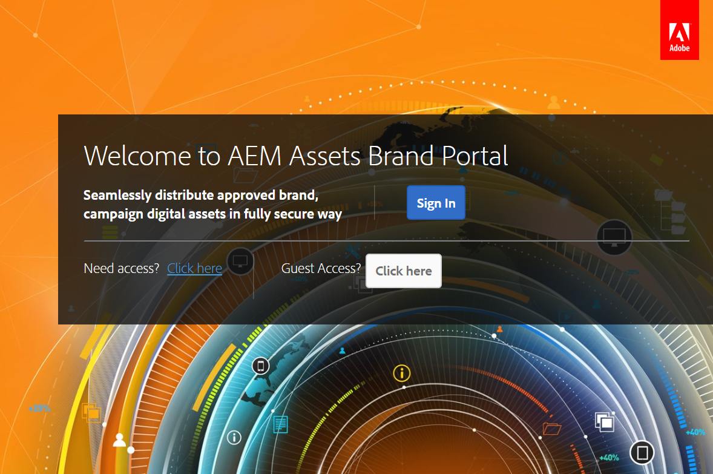
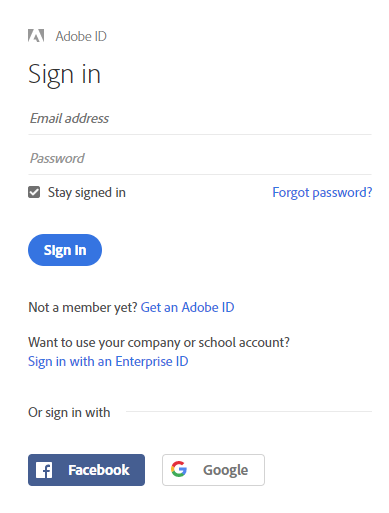
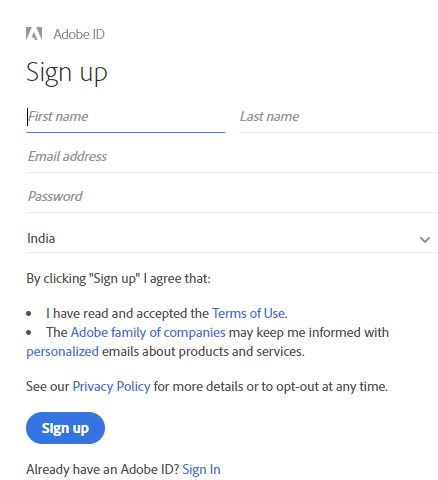
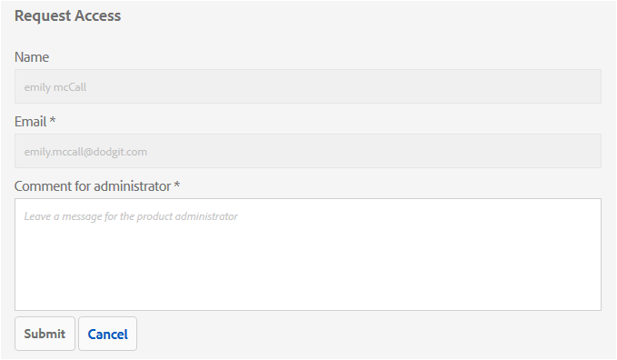
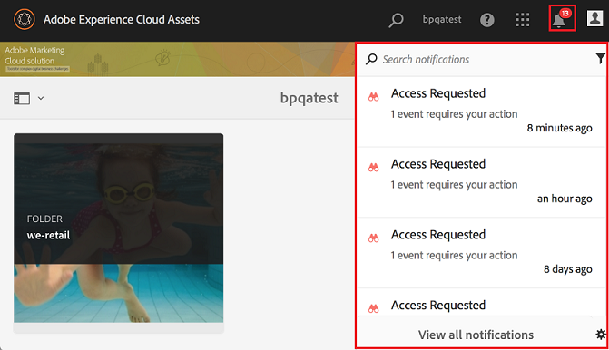
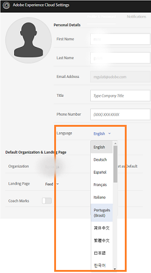
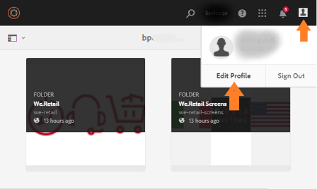
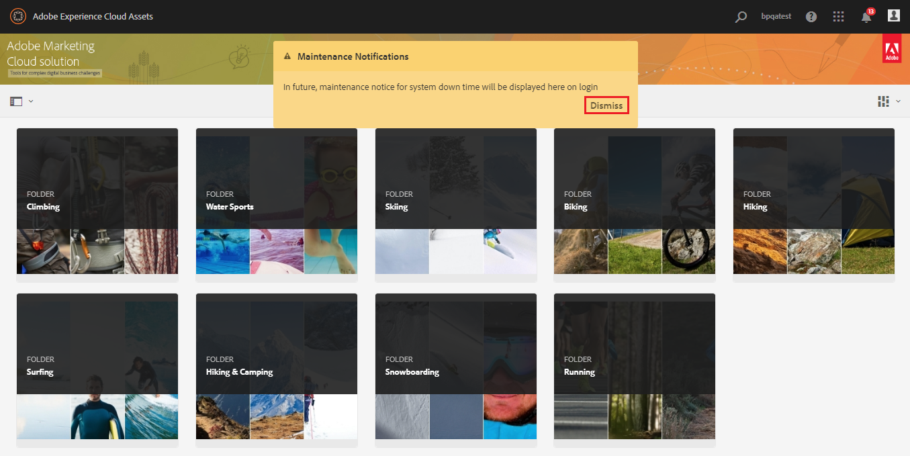

# Overview of AEM Assets Brand Portal {#overview-of-aem-assets-brand-portal}

As a marketer, you sometimes need to collaborate with channel partners and internal business users to quickly create, manage, and deliver relevant digital content to customers. Timely delivery of relevant content across the entire customer journey is critical to driving greater demand, conversion, engagement, and customer loyalty.

However, it is a challenge to develop solutions that support efficient and secure sharing of approved brand logos, guidelines, campaign assets, or product shots with extended internal teams, partners, and resellers.

**Adobe Experience Manager (AEM) Assets Brand Portal** focuses on the marketer’s need to effectively collaborate with the globally distributed Brand Portal users by providing asset distribution and asset contribution capabilities.

Asset distribution allows you to easily acquire, control, and securely distribute approved creative assets to external parties and internal business users across devices. 但是，資產貢獻可讓品牌入口網站使用者將資產上傳至品牌入口網站並發佈至AEM資產，而不需存取作者環境。 The contribution feature is called as **Assets Sourcing in Brand Portal**. And together, it improves the overall Brand Portal experience of asset distribution and contribution from the Brand Portal users (external agencies/teams), accelerates the time-to-market for assets, and reduces the risk of non-compliance and unauthorized access.
See, [Asset Sourcing in Brand Portal](brand-portal-asset-sourcing.md).

The browser-based portal environment enables you to easily upload, browse, search, preview, and export assets in approved formats.

## 使用 Brand Portal 設定 AEM Assets {#configure-brand-portal}

Adobe Experience Manager(AEM)Assets是透過Adobe Developer Console以品牌入口網站設定，Adobe Developer Console會購買IMS Token以授權您的品牌入口網站租用戶。

>[!NOTE]
>
>Configuring AEM Assets with Brand Portal via Adobe Developer Console is supported on AEM Assets cloud service, AEM Assets 6.3 and above.

### Prerequisites to configure AEM Assets with Brand Portal {#prerequisites}

您需要下列項目才能使用 Brand Portal 設定 AEM Assets：

* 啟動並執行AEM Assets例項。
* Brand Portal 租用戶 URL。
* 在 Brand Portal 租用戶的 IMS 組織具有系統管理員權限的使用者。

For more information, see [configuring AEM Assets with Brand Poral](../using/configure-aem-assets-with-brand-portal.md).

## User personas in Brand Portal {#Personas}

Brand Portal supports the following user roles:

* 來賓用戶
* 檢視者
* 編輯者
* 管理員

下表列出了這些角色中的用戶可以執行的任務：

|  | **瀏覽** | **搜尋** | **下載** | **共用資料夾** | **共用集合** | **以連結方式共用資產** | **存取管理工具** |
|--- |--- |--- |--- |--- |--- |--- |--- |
| **來賓用戶** | ✓* | ✓* | ✓* | x | x | x | x |
| **檢視者** | ✓ | ✓ | ✓ | x | x | x | x |
| **編輯者** | ✓ | ✓ | ✓ | ✓ | ✓ | ✓ | x |
| **管理員** | ✓ | ✓ | ✓ | ✓ | ✓ | ✓ | ✓ |

*訪客使用者只能瀏覽、存取和搜尋公用資料夾和系列中的資產。

### Guest user {#guest-user}

Any user having limited access to assets on Brand Portal without undergoing authentication is a guest user. The guest session allows users access to public folders and collections. As a guest user, you can browse through asset details and have full asset view of members of public folders and collections. You can search, download, and add public assets to [!UICONTROL Lightbox] collection.

However, guest session restricts you from creating collections and saved searches, and share them further. 來賓作業中的使用者無法存取資料夾和系列設定，也無法將資產共用為連結。 以下是來賓用戶可以執行的任務清單：

[瀏覽及存取公共資產](browse-assets-brand-portal.md)

[搜尋公共資產](brand-portal-searching.md)

[下載公用資產](brand-portal-download-users.md)

[Add assets to [!UICONTROL Lightbox]](brand-portal-light-box.md#add-assets-to-lightbox)

### 檢視者 {#viewer}

A standard user in Brand Portal is typically a user with the role of Viewer. A user with this role can access permitted folders, collections, and assets. The user can also browse, preview, download, and export assets (original or specific renditions), configure account settings, and search for assets. Here is a list of tasks that a Viewer can perform:

[瀏覽資產](browse-assets-brand-portal.md)

[Search for assets](brand-portal-searching.md)

[下載資產](brand-portal-download-users.md)

### 編輯者 {#editor}

A user with the role of Editor can perform all tasks that a Viewer can perform. In addition, and Editor can view the files and folders that an administrator shares. The user with the role of an Editor can also share content (files, folders, collections) with others.

Apart from the tasks that a Viewer can perform, an Editor can perform the following additional tasks:

[共用資料夾](brand-portal-sharing-folders.md)

[共用集合](brand-portal-share-collection.md)

[以連結方式共用資產](brand-portal-link-share.md)

### 管理員 {#administrator}

An administrator includes a user marked as system administrator or Brand Portal product administrator in [!UICONTROL Admin Console]. 管理員可以新增和移除系統管理員和使用者、定義預設集、傳送電子郵件給使用者，以及檢視入口網站的使用情況和儲存報告。

An administrator can perform all tasks that an Editor can perform the following additional tasks:

[管理使用者、群組和使用者角色](brand-portal-adding-users.md)

[Customize wallpaper, page headers, and emails](brand-portal-branding.md)

[使用自訂搜尋 Facet](brand-portal-search-facets.md)

[使用中繼資料結構表單](brand-portal-metadata-schemas.md)

[套用影像預設集或動態轉譯](brand-portal-image-presets.md)

[使用報表](brand-portal-reports.md)

In addition to the above tasks, an Author in AEM Assets can perform the following tasks:

[使用 Brand Portal 設定 AEM Assets](../using/configure-aem-assets-with-brand-portal.md)

[將資料夾發佈至 Brand Portal](https://helpx.adobe.com/experience-manager/6-5/assets/using/brand-portal-publish-folder.html)

[將集合發佈至 Brand Portal](https://helpx.adobe.com/experience-manager/6-5/assets/using/brand-portal-publish-collection.html)

## Alternate alias for Brand Portal url {#tenant-alias-for-portal-url}

Brand Portal 6.4.3 onwards, organizations can have one alternate (alias) URL for existing URL of their Brand Portal tenant. The alias URL can be created by having an alternate prefix in the URL.\
Note that only the prefix of the Brand Portal URL can be customized and not the entire URL. 例如，現有網域 **[!UICONTROL geometrix.brand-portal.adobe.com的組織可取得]** geomettrixinc.brand-portal.adobe.com **** 。

不過，AEM Author例項只能以租 [用戶ID](../using/configure-aem-assets-with-brand-portal.md) URL設定，而不能以租用戶別名（替代）URL設定。

>[!NOTE]
>
>To get an alias for tenant name in existing portal URL, organizations need to contact Adobe support with a new tenant alias creation request. This request is processed by first checking if the alias is available and then creating the alias.
>
>To replace the old or delete the old alias, the same process needs to be followed.

## Request access to Brand Portal {#request-access-to-brand-portal}

Users can request access to Brand Portal from the login screen. 這些請求會傳送至品牌入口網站管理員，這些管理員會透過Adobe [!UICONTROL Admin Console授與使用者存取權]。 在授予存取權後，使用者會收到通知電子郵件。

若要申請存取權，請執行下列動作：

1. 從「品牌入口網站」登入頁面，選取「 **[!UICONTROL 按一下此處]** 」與「需 **[!UICONTROL 要存取？」]**. 但是，要進入來賓會話，請選擇 **[!UICONTROL Click here]** (按一下這裡 **[!UICONTROL )與]** Guest Access?（來賓訪問）。

   

   「請 [!UICONTROL 求存取] 」頁面隨即開啟。

1. 若要要求存取組織的品牌入口網站，您必須擁有有效的 [!UICONTROL Adobe ID]、 [!UICONTROL Enterprise ID]或 [!UICONTROL Federated ID]。

   在「請 [!UICONTROL 求存取] 」頁面中，使用您的ID（藍本1）登入或建立 [!UICONTROL Adobe ID] （藍本2）: 
   ![[!UICONTROL 請求存取]](assets/bplogin_request_access_2.png)

   **方案1**
   1. 如果您有 [!UICONTROL Adobe ID]、 [!UICONTROL Enterprise ID][!UICONTROL 或]Federated ID **[!UICONTROL ，請按一]**下登入Chropt。
「登 [!UICONTROL 入] 」頁面隨即開啟。
   1. 提供您 [!UICONTROL 的Adobe ID認證] ，然後按一 **[!UICONTROL 下登入]**。 
   

   您會被重新導向至「請 [!UICONTROL 求存取] 」頁面。 
   **方案2**
   1. 如果您沒有 [!UICONTROL Adobe ID]，請按一下「請求存取」頁面中的「取得Adobe ID **[!UICONTROL 」(取得Adobe ID]** )。
「登 [!UICONTROL 入] 」頁面隨即開啟。
   1. Click **[!UICONTROL Get an Adobe ID]**.
「注 [!UICONTROL 冊] 」頁面隨即開啟。
   1. 輸入您的名字和姓氏、電子郵件ID和密碼。
   1. 選擇 **[!UICONTROL 註冊]**。 
   

   您會被重新導向至「請 [!UICONTROL 求存取] 」頁面。

1. 下一頁會顯示您的姓名和電子郵件ID，以要求存取權。 保留管理員的注釋，然後按一下「提 **[!UICONTROL 交」]**。 

   

## 產品管理員授與存取權 {#grant-access-to-brand-portal}

品牌入口網站產品管理員會在其品牌入口網站通知區域，以及透過其收件匣中的電子郵件，收到存取要求。

若要授與存取權，產品管理員必須按一下品牌入口網站通知區中的相關通知，然後按一下「授 **[!UICONTROL 與存取權]**」。
或者，產品管理員可依存取要求電子郵件中提供的連結，造訪Adobe [!UICONTROL Admin Console] ，並將使用者新增至相關的產品設定。

您會被重新導向 [至Adobe [!UICONTROL Admin Console]](https://adminconsole.adobe.com/enterprise/overview) 首頁。 使用Adobe [!UICONTROL Admin Console] ，建立使用者並將他們指派至產品設定檔（先前稱為產品設定），這些設定檔在品牌入口網站中顯示為群組。 如需有關在 [!UICONTROL Admin Console中新增使用者的詳細資訊]，請參閱  新增使用者（請依照新增使用者的程式中的步驟4-7）。

## 品牌入口網站語言 {#brand-portal-language}

您可以從「Adobe [!UICONTROL Experience Cloud設定」變更品牌入口]網站語言。

要更改語言，請執行以下操作：

1. 從頂 [!UICONTROL 部菜單中選] 擇「用戶  」>「編輯配置檔案」。 
   

1. 在「 [!UICONTROL Experience Cloud設定] 」頁面上，從「語言  」下拉式選單中選取語言。

## 品牌入口網站維護通知 {#brand-portal-maintenance-notification}

在計畫關閉品牌入口網站以進行維護之前，當您登入品牌入口網站後，通知會顯示為橫幅。 範例通知：

您可以關閉此通知並繼續使用品牌入口網站。 此通知會顯示在每個新作業中。

## 發行和系統資訊 {#release-and-system-information}

* [新功能](whats-new.md)
* [發行說明](brand-portal-release-notes.md)
* [支援的檔案格式](brand-portal-supported-formats.md)

## Related resources {#related-resources}

* [Adobe客戶服務](https://helpx.adobe.com/tw/marketing-cloud/contact-support.html)
* [AEM論壇](https://www.adobe.com/go/aod_forums_en)