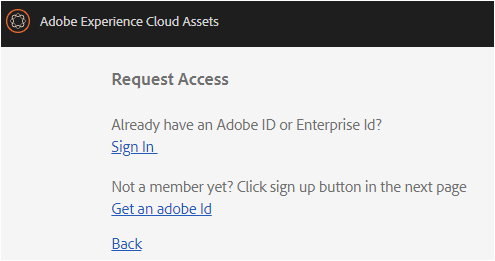
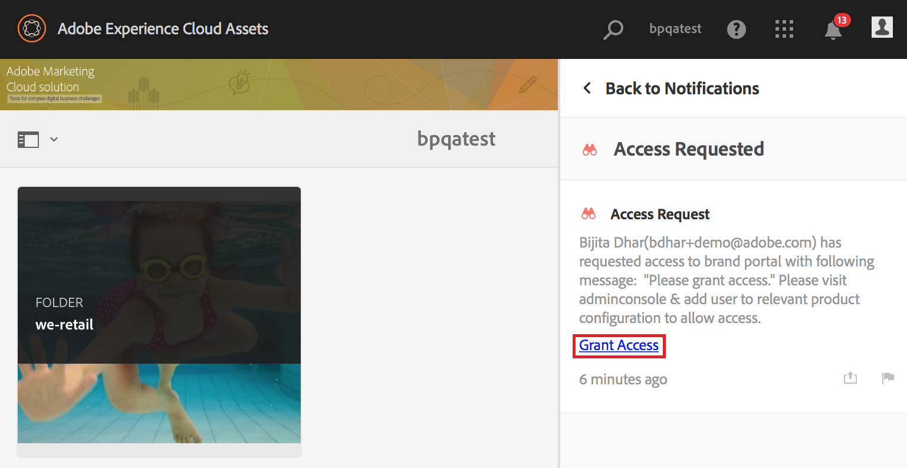

# AEM Assets品牌入口網站簡介 {#overview-of-aem-assets-brand-portal}

身為行銷人員，您有時需要與通路合作夥伴和內部業務使用者協作，以便快速建立、管理和傳遞相關的數位內容給客戶。在整個客戶歷程中即時傳遞相關內容對於推動更大的需求、轉化、吸引力和客戶忠誠度至關重要。

不過，開發解決方案的挑戰在於，開發能夠有效與安全地共用已核准品牌標誌、准則、宣傳資產或產品像片的解決方案，並與內部團隊、合作夥伴和經銷商共享。

**[!DNL Adobe Experience Manager (AEM) Assets Brand Portal]** 可協助您輕鬆地取得、控制並安全地將已核准的創意資產發佈給外部廠商和內部業務使用者。它有助於提高資產共用的效率、加快資產的上市時間，並降低不符合規定和未經授權存取的風險。

以瀏覽器為主的入口網站環境可讓您輕鬆上傳、瀏覽、搜尋、預覽和匯出已核准格式的資產。

## 品牌入口網站中的使用者角色 {#Personas}

[!DNL Brand Portal] 支援下列使用者角色：

* 來賓使用者
* 檢視者
* 編輯者
* 管理員

下表列出這些角色中使用者可執行的工作：

|  | **瀏覽** | **搜尋** | **下載** | **共用資料夾** | **共用系列** | **將資產共用為連結** | **存取管理工具** |
|--- |--- |--- |--- |--- |--- |--- |--- |
| **來賓使用者** | ✓* | ✓* | ✓* | x | x | x | x |
| **檢視者** | ✓ | ✓ | ✓ | x | x | x | x |
| **編輯者** | ✓ | ✓ | ✓ | ✓ | ✓ | ✓ | x |
| **管理員** | ✓ | ✓ | ✓ | ✓ | ✓ | ✓ | ✓ |

*來賓使用者只能瀏覽、存取和搜尋公開資料夾和系列中的資產。

### Guest user {#guest-user}

任何在未執行驗證的 [!DNL Brand Portal] 情況下限制存取資產的使用者，都是訪客使用者。來賓作業可讓使用者存取公開資料夾和系列。身為來賓使用者，您可以瀏覽資產詳細資料，並擁有公開資料夾和系列成員的完整資產檢視。您可以搜尋、下載和新增公開資產至 [!UICONTROL 燈箱集合]。

不過，來賓作業會限制您建立系列和儲存的搜尋，並進一步分享。來賓作業中的使用者無法存取資料夾和系列設定，且無法將資產共用為連結。以下是訪客使用者可執行的任務清單：

[瀏覽和存取公開資產](browse-assets-brand-portal.md)

[搜尋公開資產](brand-portal-searching.md)

[下載公共資產](brand-portal-download-users.md)

[新增資產至[！UICOHTROL燈箱]](brand-portal-light-box.md#add-assets-to-lightbox)

### 檢視者 {#viewer}

標準使用者通常 [!DNL Brand Portal] 是具有檢視器角色的使用者。具有此角色的使用者可以存取允許的資料夾、系列和資產。使用者也可以瀏覽、預覽、下載和匯出資產(原始或特定轉譯)、設定帳戶設定，以及搜尋資產。以下是檢視器可執行的任務清單：

[瀏覽資產](browse-assets-brand-portal.md)

[搜尋資產](brand-portal-searching.md)

[下載資產](brand-portal-download-users.md)

### 編輯者 {#editor}

具有編輯者角色的使用者可以執行檢視器可執行的所有工作。此外，編輯者可以檢視管理員分享的檔案和資料夾。具有編輯者角色的使用者也可以與其他人共用內容(檔案、檔案夾、系列)。

除了檢視器可執行的工作之外，編輯者也可以執行下列額外工作：

[共用資料夾](brand-portal-sharing-folders.md)

[共用系列](brand-portal-share-collection.md)

[將資產共用為連結](brand-portal-link-share.md)

### 管理員 {#administrator}

管理員包括在管理控制台中標示為系統管理員或 [!DNL Brand Portal] 產品管理員的 [!UICONTROL 使用者]。管理員可以新增和移除系統管理員和使用者、定義預設集、傳送電子郵件給使用者，以及檢視入口網站使用情況和儲存報告。

管理員可以執行編輯者可以執行的所有工作以及下列額外工作：

[管理使用者、群組和使用者角色](brand-portal-adding-users.md)

[自訂桌布、頁首和電子郵件](brand-portal-branding.md)

[使用自訂搜尋Facet](brand-portal-search-facets.md)

[使用中繼資料結構表單](brand-portal-metadata-schemas.md)

[套用影像預設集或動態轉譯](brand-portal-image-presets.md)

[使用報表](brand-portal-reports.md)

除了上述工作外，「作者」中 [!DNL AEM Assets] 的「作者」可執行下列工作：

[設定[！DNL AEM Assets]與[！DNL品牌入口網站]](https://helpx.adobe.com/experience-manager/6-5/assets/using/brand-portal-configuring-integration.html)

[發佈資料夾至[！DNL品牌入口網站]](https://helpx.adobe.com/experience-manager/6-5/assets/using/brand-portal-publish-folder.html)

[將系列發佈至[！DNL品牌入口網站]](https://helpx.adobe.com/experience-manager/6-5/assets/using/brand-portal-publish-collection.html)

## 品牌入口網站URL的替代別名 {#tenant-alias-for-portal-url}

[!DNL Brand Portal] 6.4.3公司可為其租用戶現有的URL提供一個替代(別名) [!DNL Brand Portal] URL。別名URL可透過URL中的替代首碼來建立。\
請注意，只能自訂 [!DNL Brand Portal] URL的前置詞，而不是整個URL。例如，具有現有網域 **[!UICONTROL geomettrix.brand-portal.adobe.com]** 的組織可以取得 **[!UICONTROL 在請求上建立的geomettrixinc.brand-portal.adobe.com]** 。

不過，**[!DNL AEM] 作者實例只能 [透過](https://helpx.adobe.com/experience-manager/6-5/assets/using/brand-portal-configuring-integration.html) 租用戶id URL設定，而不能使用租用戶別名(替代) URL設定。

>[!NOTE]
>
>若要在現有入口網站URL中取得用戶名稱別名，組織必須與**[!DNL Adobe support] 搭配新的租用戶別名建立請求。此請求會先檢查別名是否可用，然後建立別名來處理。
>
>若要取代舊別名或刪除舊別名，必須遵循相同的程序。

## 要求存取品牌入口網站 {#request-access-to-brand-portal}

使用者可以要求從登入 [!DNL Brand Portal] 畫面存取存取權。這些要求會傳送 [!DNL Brand Portal] 給管理員，管理員可透過Adobe Admin Console授予使用者存取權。在授予存取權後，使用者會收到通知電子郵件。

若要申請存取，請執行下列動作：

1. 從 [!DNL Brand Portal] 登入頁面中，選擇按一 **下此處** 對應 **的「需要存取」嗎？**. 但是，若要進入來賓作業，請選取與 ******「訪客存取」對應的**「按一下這裡」。

   

   **「請求存取權** 」頁面隨即開啓。

2. 若要申請存取組織的 [!DNL Brand Portal]存取權，您必須擁有有效 [!UICONTROL 的Adobe ID]、 [!UICONTROL Enterprise ID]或 [!UICONTROL Federated ID]。

   在 **「請求存取** 」頁面中，使用您的ID(案例1)登入或建立 [!UICONTROL Adobe ID] (案例2)：
   

   **方案1**
   1. 如果您有 [!UICONTROL Adobe ID]、 [!UICONTROL Enterprise ID]或 [!UICONTROL Federated ID]，請按一下 **「登入**」。
**登入** 頁面隨即開啓。
   2. 提供您的 [!UICONTROL Adobe ID] 認證，然後按一下 **「登入**」。
      
   您會重新導向至 **「請求存取」** 頁面。
   **方案2**
   1. 如果您沒有 [!UICONTROL Adobe ID]，請在「請求存取」頁面中按一下 **「取得Adobe** **ID** 」。
**登入** 頁面隨即開啓。
   2. Click **Get an Adobe ID**.
**「註冊」** 頁面隨即開啓。
   3. 輸入您的名字和姓氏、電子郵件ID和密碼。按一下 **「註冊**」。
      
   您會重新導向至 **「請求存取」** 頁面。

3. 下一頁會顯示用於請求存取的名稱和電子郵件ID。保留管理員的留言，然後按一下 **「送出**」。

   

## 產品管理員授與存取權 {#grant-access-to-brand-portal}

[!DNL Brand Portal] 產品管理員會收到 [!DNL Brand Portal] 通知區域中的存取要求，以及收件匣中的電子郵件。

若要授與存取權，產品管理員必須按一下通知區域中 [!DNL Brand Portal] 的相關通知，然後按一下 **「授予存取權**」。
或者，產品管理員可以依照存取要求電子郵件中提供的連結進行存取 [!DNL Adobe Admin Console] ，並將使用者新增至相關的產品設定。

您被重新導向至[ [！DNL Adobe Admin Console]](https://adminconsole.adobe.com/enterprise/overview) 首頁。用 [!DNL Adobe Admin Console] 以建立使用者並指派給產品描述檔(先前稱為產品設定)，以顯示 [!DNL Brand Portal]為群組。如需新增使用者的 [!DNL Admin Console]詳細資訊，請參閱 [新增使用者](brand-portal-adding-users.md#add-a-user) (在程序中新增使用者的步驟4-7)。

## 品牌入口網站維護通知 {#brand-portal-maintenance-notification}

在 [!DNL Brand Portal] 排程進行維護之前，會在您登入後顯示一個通知作為橫幅 [!DNL Brand Portal]。範例通知：

您可以關閉此通知並繼續使用 [!DNL Brand Portal]。此通知會出現在每個新的工作階段中。

## 版本與系統資訊 {#release-and-system-information}

<!--* [What's new](../using/whats-new.md)-->
* [發行說明](brand-portal-release-notes.md)
* [支援的檔案格式](brand-portal-supported-formats.md)

## 相關資源 {#related-resources}

* [Adobe客戶服務](https://helpx.adobe.com/marketing-cloud/contact-support.html)
* [AEM論壇](https://www.adobe.com/go/aod_forums_en)