# 在品牌入口網站上瀏覽資產 {#browsing-assets-on-brand-portal}

AEM Assets Brand Portal提供多種功能和使用者介面元素，可協助您瀏覽各種資源、遍歷資產階層，以及在使用不同檢視選項時搜尋資產。

頂端AEM工具列中的AEM標誌可協助管理員使用者存取管理工具面板。

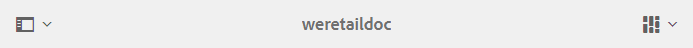

品牌入口網站左上角的邊欄選擇器會下拉式清單，以顯示導覽至資產階層、簡化搜尋並顯示資源的選項。

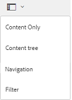

您可以使用品牌入口網站右上角的檢視選擇器中的任何可用檢視（卡片、欄和清單）來檢視、瀏覽及選取資產。

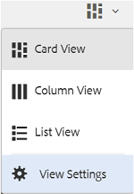

## 查看和選擇資源 {#viewing-and-selecting-resources}

檢視、導覽和選取每個檢視在概念上都相同，但處理方式的變化較小，視您使用的檢視而定。

您可以使用任何可用的檢視來檢視、瀏覽及選擇（以執行進一步動作）您的資源：

* 欄檢視
* 卡片檢視
* 清單檢視

### 卡片檢視

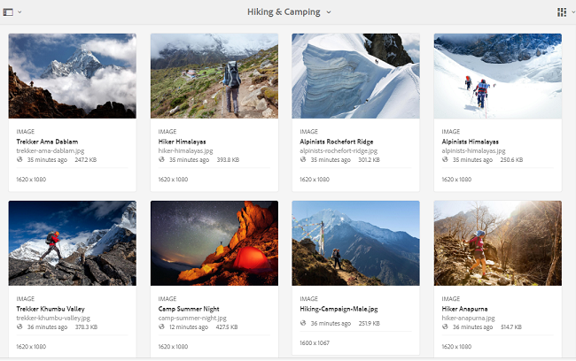

卡片檢視會顯示目前層級上每個項目的資訊卡。 這些卡片提供下列詳細資訊：

* 資產／資料夾的視覺呈現。
* 類型
* 標題
* 名稱
* 資產從AEM發佈至品牌入口網站的日期和時間
* 大小
* 尺寸

您可以點選／按一下卡片（小心以避免快速動作），或使用標題中的階層連結再次 [向上導覽](https://helpx.adobe.com/experience-manager/6-5/sites/authoring/using/basic-handling.html#TheHeader)。

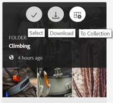

#### 非管理員使用者的資訊卡檢視

資料夾的卡片在「卡片檢視」中，會向非管理員使用者（編輯者、檢視器和來賓使用者）顯示資料夾階層資訊。 此功能可讓使用者得知資料夾的位置，以及他們存取的上層階層。
資料夾層次結構資訊對於區分具有與從不同資料夾層次結構共用的其他資料夾相似名稱的資料夾特別有用。 如果非管理員使用者不知道與他們共用之資產的檔案夾結構，則名稱相似的資產／檔案夾似乎會令人困惑。

* 各卡片上顯示的路徑會被截斷以符合卡片大小。 不過，使用者可將完整路徑視為將滑鼠暫留在截斷路徑上的工具提示。

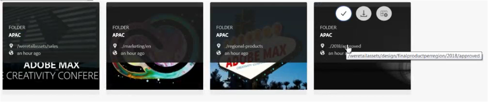

**檢視資產屬性的概述選項**

「概述」選項可供非管理員使用者（編輯者、檢視者、來賓使用者）檢視選取資產／檔案夾的「資產屬性」。 「概述」(Overview)選項可見：

* 在工具列上，選擇資產／資料夾。
* 在下拉式清單中，選取邊欄選擇器。

在選取資 [!UICONTROL 產] /資料夾時選取「概述」選項時，使用者可以看到資產建立的標題、路徑和時間。 但是，在資產詳細資料頁面上，選取「概述」選項可讓使用者查看資產的中繼資料。

#### 在卡片檢視中檢視設定

[!UICONTROL 在從視圖選擇器中選] 擇「查看設定 **** 」時，將開啟「查看設定」對話框。 它可讓您調整卡片檢視中資產縮圖的大小。 這樣，您就可以個人化檢視，並控制顯示的縮圖數。

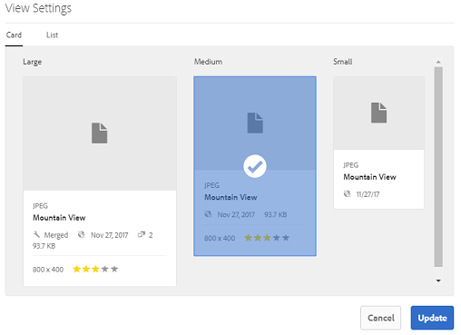

### 清單檢視

清單視圖顯示當前級別上每個資源的資訊。 清單檢視提供下列詳細資訊：

* 資產的縮圖影像
* 名稱
* 標題
* 地區設定
* 類型
* 維
* 大小
* 評等
* 顯示資產階層的資料夾路徑*
* 在品牌入口網站上發佈資產的日期

*路徑欄可讓您輕鬆識別資料夾階層中的資產位置。 您可以點選／按一下資源名稱，向下導覽階層，並使用標題中的階層 [連結進行備份](https://helpx.adobe.com/experience-manager/6-5/sites/authoring/using/basic-handling.html#TheHeader)。

<!--
Comment Type: draft lastmodifiedby="mgulati" lastmodifieddate="2018-08-17T03:12:05.096-0400" type="annotation">Removed:- "Selecting assets in list view To select all items in the list, use the checkbox at the upper left of the list. When all items in the list are selected, this check box appears checked. To deselect all, click or tap the checkbox. When only some items are selected, it appears with a minus sign. To select all, click or tap the checkbox. To deselect all, click or tap the checkbox again. You can change the order of items using the dotted vertical bar at the far right of each item in the list. Tap/click the vertical selection bar and drag the item to a new position in the list."
 -->

### 在清單檢視中檢視設定

清單檢視預設 [!UICONTROL 會將資產] 「名稱」顯示為第一欄。 另外還顯示了其他資訊，如 [!UICONTROL 資產]、地區設定 [!UICONTROL 、]DimensionsType [!UICONTROL 、]Dimensions SizeSize、Rating RatingPublish狀態。 不過，您可以使用「檢視設定」來選取要顯 [!UICONTROL 示的欄]。

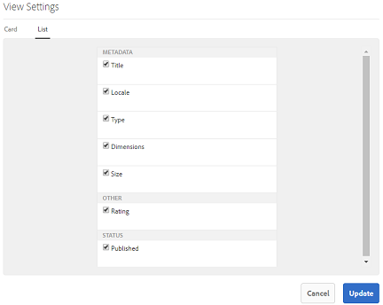

### 欄檢視

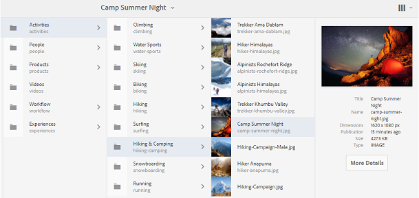

使用列視圖可以在一系列級聯列中導航內容樹。 此檢視可協助您視覺化並遍歷資產階層。

在第一列（最左側）中選擇資源時，右側第二列中的子資源會顯示。 在第二欄中選擇資源時，右側第三欄會顯示子資源，依此類推。

通過點選或按一下資源名稱或資源名稱右側的雪佛龍，可以在樹中上下導航。

* 點選或點選資源名稱和Chevron時會反白顯示。
* 點選或按一下縮圖會選取資源。
* 選中後，複選標籤會覆蓋在縮略圖上，並加亮資源名稱。
* 選定資源的詳細資訊顯示在最終列中。

在欄檢視中選取資產時，資產的視覺化表示會顯示在最終欄中，並包含下列詳細資訊：

* 標題
* 名稱
* 尺寸
* 資產從AEM發佈至品牌入口網站的日期和時間
* 大小
* 類型
* 「更多詳細資訊」選項，以前往資產的詳細資訊頁面

<!--
Comment Type: draft

<h3>Selecting Resources</h3>
-->

<!--
Comment Type: draft

Selecting a specific resource depends on a combination of the view and the device:

-->

<!--
Comment Type: draft

<table border="1" cellpadding="1" cellspacing="0" width="100%">
<tbody>
<tr>
<td> </td>
<td>Select</td>
<td>Deselect</td>
</tr>
<tr>
<td>Column View  </td>
<td>
<ul>
<li>Desktop:  Mouseover, then use the check mark quick action</li>
<li>Mobile device:  Tap the thumbnail</li>
</ul> </td>
<td>
<ul>
<li>Desktop:  Click the thumbnail</li>
<li>Mobile device:  Tap the thumbnail</li>
</ul> </td>
</tr>
<tr>
<td>Card View  </td>
<td>
<ul>
<li>Desktop:  Mouseover, then use the check mark quick action</li>
<li>Mobile device:  Tap-and-hold the card</li>
</ul> </td>
<td>
<ul>
<li>Desktop:  Click the card</li>
<li>Mobile device:  Tap the card</li>
</ul> </td>
</tr>
<tr>
<td>List View</td>
<td>
<ul>
<li>Desktop:  Mouseover, then use the check mark quick action</li>
<li>Mobile device:  Tap the thumbnail</li>
</ul> </td>
<td>
<ul>
<li>Desktop:  Click the thumbnail</li>
<li>Mobile device:  Tap the thumbnail</li>
</ul> </td>
</tr>
</tbody>
</table>
-->

<!--
Comment Type: draft

<h4>Deselecting All</h4>
-->

<!--
Comment Type: draft

In all cases, as you select items the count of the items selected is displayed at the upper right of the toolbar.

You can deselect all items and exit selection mode by clicking or tapping the X next to the count.

-->

<!--
Comment Type: draft

In all views, all items can be deselected by tapping escape on the keyboard if you are using a desktop device.

-->

## 內容樹 {#content-tree}

除了這些檢視外，在您檢視並選取所需資產或檔案夾時，使用樹狀檢視來下鑽資產階層。

若要開啟樹狀檢視，請點選／按一下左上角的邊欄選擇器，然後從選單中選 **[!UICONTROL 取「內容]** 」樹狀結構。

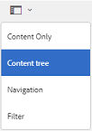

從內容階層，導覽至所要的資產。

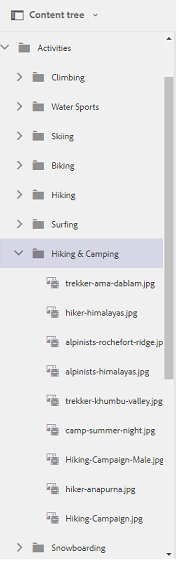

## 資產詳細內容 {#asset-details}

資產詳細資料頁面可讓您檢視資產、下載、共用資產的連結、將資產移至系列或檢視其屬性頁面。 它還允許您連續瀏覽同一資料夾中其他資產的詳細資訊頁面。

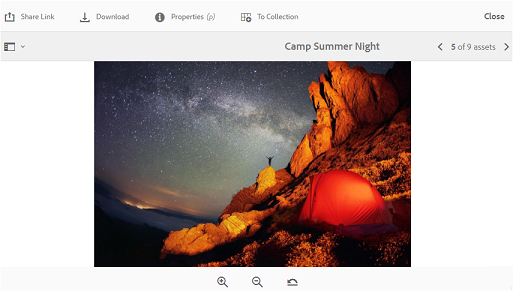

若要檢視資產的中繼資料或檢視其各種轉譯，請使用資產詳細資料頁面上的邊欄選擇器。

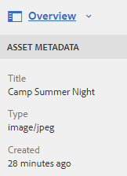

您可以在資產詳細資料頁面上檢視資產的所有可用轉譯，並選取要預覽的轉譯。

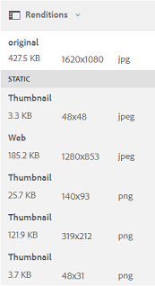

若要開啟資產屬性頁面，請使 **[!UICONTROL 用頂端列的「屬性(p)]** 」選項。

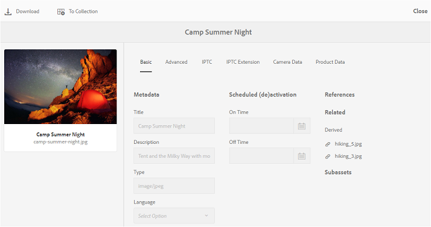

您也可以在資產屬性頁面上檢視其所有相關資產（AEM上的來源或衍生資產）的清單，因為資產關係也會從AEM發佈至品牌入口網站。
