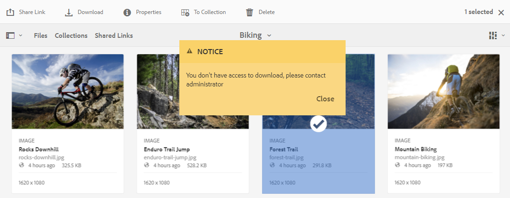
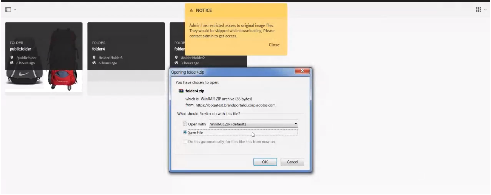
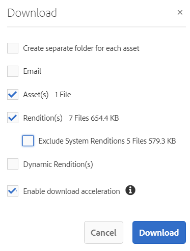

# 下載資產 {#download-assets-from-bp}

<!-- Before update in Download experience - 26th Aug 2020 comment by Vishabh.
 All users can simultaneously download multiple assets and folders accessible to them from Brand Portal. This way, approved brand assets can be securely distributed for offline use. Read on to know how to download approved assets from Brand Portal, and what to expect from the [download performance](../using/download-assets.md#main-pars-header).
-->

Adobe Experience Manager Assets Brand Portal公司通過允許用戶同時從Brand Portal下載可供他們訪問的資產和資料夾來增強下載體驗。 這樣，可安全地分發經批准的品牌資產供離線使用。 閱讀以瞭解如何從Brand Portal下載資產（批准的資產），以及從 [下載效能](../using/download-assets.md#expected-download-performance)。

>[!NOTE]
>
>在Brand Portal2020.10.0（及以上）, **[!UICONTROL 快速下載]** 預設情況下啟用設定，該設定使用IBMAspera Connect來加速資產下載。 安裝IBMAspera Connect 3.9.9(`https://www.ibm.com/docs/en/aspera-connect/3.9.9`)，然後從Brand Portal下載資產。 有關詳細資訊，請參閱 [指南，加速從Brand Portal下載](../using/accelerated-download.md)。
>
>如果您不想使用IBMAspera連接並繼續正常下載過程，請與Brand Portal管理員聯繫以關閉 **[!UICONTROL 快速下載]** 的子菜單。

## 配置資產下載 {#configure-download}

Brand Portal管理員可以為Brand Portal用戶配置資產下載和用戶組設定，允許他們從Brand Portal介面訪問和下載資產格式副本。

>[!NOTE]
>
>在用戶介面上應用的下載設定方便了Brand Portal用戶的自助服務體驗，以便輕鬆配置和下載資產格式副本。 它不限制在應用層下載資產，例如，用戶仍然可以訪問和下載具有完整URL路徑的資產格式副本。

從Brand Portal介面訪問和下載資產格式副本由以下配置定義：

* 啟用下載設定
* 配置用戶組設定

### 啟用下載設定 {#enable-download-settings}

管理員可以啟用資產 **[!UICONTROL 下載設定]** 定義可供Brand Portal用戶下載的格式副本集。

可用設定包括：

* **[!UICONTROL 快速下載]**

   它使用IBMAspera Connect提供資產的快速下載。 預設情況下， **[!UICONTROL 快速下載]** 設定在 **[!UICONTROL 下載設定]**。

* **[!UICONTROL 自訂轉譯]**

   允許下載資產的自定義和（或）動態格式副本。

   除原始資產和系統生成的格式副本之外的所有資產格式副本都稱為自定義格式副本。 它包括可用於資產的靜態格式副本和動態格式副本。 任何用戶都可以在Experience Manager Assets建立自定義靜態格式副本，而只有管理員才能建立自定義動態格式副本。 有關詳細資訊，請參閱 [如何應用影像預設或動態格式副本](../using/brand-portal-image-presets.md)。

* **[!UICONTROL 系統轉譯]**

   允許下載系統生成的資產格式副本。

   這些縮略圖是根據「DAM更新資產」工作流在Experience Manager Assets自動生成的。

* **[!UICONTROL 資產下載]**

   允許將格式副本下載到每個資產的單獨資料夾中。 該設定適用於資料夾、收集和大量下載資產（20多個資產）。

以管理員身份登錄到您的Brand Portal租戶並導航到 **[!UICONTROL 工具]** > **[!UICONTROL 下載]**。

管理員可以啟用Brand Portal用戶訪問和下載資產格式副本的任何設定組合。

>[!NOTE]
>
>只有管理員才能下載過期的資產。 有關過期資產的詳細資訊，請參閱 [管理資產的數字權利](../using/manage-digital-rights-of-assets.md)。

### 配置用戶組設定 {#configure-user-group-settings}

除 **[!UICONTROL 下載設定]**,Brand Portal管理員可以進一步配置不同用戶組的設定，以查看和（或）下載原始資產及其格式副本。

以管理員身份登錄到您的Brand Portal租戶並導航到 **[!UICONTROL 工具]** > **[!UICONTROL 用戶]**。 在 **[!UICONTROL 用戶角色]** 頁，導航到 **[!UICONTROL 組]** 頁籤，以配置用戶組的視圖和（或）下載設定。

>[!NOTE]
>
>如果將用戶添加到多個組，並且其中一個組具有限制，則限制將適用於用戶。

根據配置，下載工作流對於獨立資產、多個資產、包含資產的資料夾、許可或未授權資產以及使用共用連結下載資產保持恆定。

下面的矩陣根據 [下載配置](#configure-download):

| **下載設定：自定義格式副本** | **下載設定：系統格式副本** | **用戶組設定：下載原始** | **用戶組設定：下載格式副本** | **結果** |
|---|---|---|---|---|
| 開啟 | 開啟 | 開啟 | 開啟 | 查看和下載所有格式副本 |
| 開啟 | 開啟 | 關閉 | 關閉 | 查看原始資產 |
| 關閉 | 關閉 | 開啟 | 開啟 | 查看和下載原始資產 |
| 開啟 | 關閉 | 開啟 | 開啟 | 查看和下載原始資產和自定義格式副本 |
| 關閉 | 開啟 | 開啟 | 開啟 | 查看和下載原始資產和系統格式副本 |
| 開啟 | 關閉 | 關閉 | 關閉 | 查看原始資產 |
| 關閉 | 開啟 | 關閉 | 關閉 | 查看原始資產 |
| 關閉 | 關閉 | 關閉 | 開啟 | 查看原始資產 |
| 關閉 | 關閉 | 開啟 | 關閉 | 查看和下載原始資產 |
| 關閉 | 關閉 | 關閉 | 關閉 | 查看原始資產 |

## 下載資產 {#download-assets}

Brand Portal用戶可以從Brand Portal介面下載多個資產、包含資產的資料夾和集合。

>[!NOTE]
>
>如果您沒有訪問或下載資產格式副本的權限，請與Brand Portal管理員聯繫。

如果用戶有權訪問格式副本，則用戶將獲得增強的 **[!UICONTROL 下載]** 對話框，具有以下功能：

* 查看下載清單中任何資產的所有可用格式副本。
* 排除下載不需要的資產的格式副本。
* 一次按一下將同一組格式副本應用於所有類似的資產類型。
* 為不同的資產類型應用不同的格式副本集。
* 為每個資產建立單獨的資料夾。
* 下載所選資產及其格式副本。

>[!NOTE]
>
>的 **[!UICONTROL 下載]** 僅當 **[!UICONTROL 自定義格式副本]** 和（或） **[!UICONTROL 系統格式副本]** 在 **[!UICONTROL 下載設定]**。

### 下載資產的步驟 {#bulk-download}

以下是從Brand Portal介面下載包含資產的資產或資料夾的步驟：

1. 登錄到你的Brand Portal租客。 預設情況下， **[!UICONTROL 檔案]** 將開啟包含所有已發佈資產和資料夾的視圖。

   執行下列操作之一：

   * 選擇要下載的資產或資料夾。 在頂部的工具欄中，按一下 **[!UICONTROL 下載]** 表徵圖

      

   * 要下載資產的特定資產格式副本，請將指針懸停在資產上，然後按一下 **[!UICONTROL 下載]** 表徵圖在快速操作縮略圖中可用。

      

      >[!NOTE]
      >
      >如果您是首次下載資產，且瀏覽器中未安裝IBMAspera Connect，它將提示您安裝Aspera下載加速器(`https://www.ibm.com/docs/en/aspera-connect/3.9.9`)。

      >[!NOTE]
      >
      >如果您正在下載的資產也包括許可資產，則會將您重定向到 **[!UICONTROL 版權管理]** 的子菜單。 在此頁中，選擇資產，按一下 **[!UICONTROL 同意]**，然後按一下 **[!UICONTROL 下載]**。 如果您選擇不同意，則不下載許可資產。
      > 
      >受許可證保護的資產 [附加的許可協定](https://experienceleague.adobe.com/docs/experience-manager-65/assets/administer/drm.html) 通過設定資產 [元資料屬性](https://experienceleague.adobe.com/docs/experience-manager-65/assets/administer/drm.html) 在Experience Manager Assets。

      

1. 的 **[!UICONTROL 下載]** 列出所有選定資產的對話框。

   按一下任何資產以查看可用的格式副本，並選中與要下載的格式副本對應的複選框。

   您可以手動選擇或排除單個資產的格式副本，或按一下 **應用** 表徵圖，選擇要為類似資產類型下載的相同格式副本集（此示例中的所有影像檔案）。 在 **[!UICONTROL 全部應用]** 對話框，按一下 **[!UICONTROL 完成]** 將規則應用於所有類似資產。

   

   您還可以通過按一下 **刪除** 表徵圖

   

   要在下載資產時保留Brand Portal資料夾層次結構，請選擇 **[!UICONTROL 為每個資產建立單獨的資料夾]** 的子菜單。

   下載按鈕反映所選項的計數。 完成應用規則後，按一下 **[!UICONTROL 下載項目]**。

   

1. 預設情況下， **[!UICONTROL 快速下載]** 設定在 **[!UICONTROL 下載設定]**。 因此，出現確認框，允許使用IBMAspera Connect加速下載。

   繼續使用 **[!UICONTROL 快速下載]**&#x200B;按一下 **[!UICONTROL 允許]**。 所有選定的格式副本都使用IBMAspera Connect下載到一個zip資料夾中。

   如果不想使用IBM·阿斯佩拉連接，請按一下 **[!UICONTROL 拒絕]**。 如果 **[!UICONTROL 快速下載]** 被拒絕或失敗，系統將填充錯誤消息。 按一下 **[!UICONTROL 正常下載]** 按鈕繼續下載資產。

<!-- removed the known issue from step 2 as it is fixed in 2022.02.0 release.
   >[!CAUTION]
   >
   >(**Experience Manager Assets as a Cloud Service** only) The following known issue will be fixed in the upcoming release:
   >
   >The download dialog lists the smart crop renditions of the selected asset, however, the user cannot download the smart crop renditions.
-->

>[!NOTE]
>
>如果 **[!UICONTROL 快速下載]** 設定由管理員關閉，選定的格式副本將直接下載到zip資料夾中，而不使用IBMAspera連接。

>[!NOTE]
>
>如果 **[!UICONTROL 資產下載]** 設定在 **[!UICONTROL 下載設定]**，資產格式副本將下載到zip資料夾中每個資產的單獨資料夾中。
>  
>如果從共用連結下載資產，則資產格式副本將下載到zip資料夾內每個資產的單獨資料夾中。
>
>如果選擇了資料夾、集合或20個以上的資產供下載， **[!UICONTROL 下載]** 對話框被跳過，用戶可訪問的所有資產格式副本（不包括動態格式副本）都下載到zip資料夾中。

>[!NOTE]
>
>Brand Portal支援在混合模式和場景7模式下配置Dynamic Media。
>
>(*如果Experience Manager Assets作者實例正在運行&#x200B;**Dynamic Media混合模式***)
>
>要預覽或下載資產的動態格式副本，請確保已啟用動態媒體，且資產的「金字塔」格式副本存在於資產發佈所在的Experience Manager Assets作者實例中。 從Experience Manager Assets到Brand Portal，當一項資產被公佈時，其「傳銷」版本也會被公佈。

如果你不 [經管理員授權，可以訪問原始格式副本](../using/brand-portal-adding-users.md#main-pars-procedure-202029708)，不下載選定資產的原始格式副本。

<!-- This issue has been resolved, check with engineering.
>[!NOTE]
>
>Once you have downloaded the asset renditions, the **[!UICONTROL Download]** button is disabled to avoid creating duplicate copies of the renditions. To download more (missing or another copy of renditions), refresh the browser to re-enable the download button.
-->

### 從資產詳細資訊頁面下載資產 {#download-assets-from-asset-details-page}

除了下載工作流之外，還有一種方法可以直接從資產詳細資訊頁面下載單個資產的格式副本。

用戶可以預覽不同的資產格式副本，選擇特定的格式副本，並直接從 **[!UICONTROL 格式副本]** 在資產詳細資訊頁面中顯示面板，而無需開啟 **[!UICONTROL 下載]** 對話框。

以下步驟可從資產詳細資訊頁面下載資產格式副本：

1. 登錄到您的Brand Portal租戶，然後按一下資產以開啟資產詳細資訊頁面。
1. 按一下左側的覆蓋表徵圖，然後按一下 **[!UICONTROL 格式副本]**。

   

1. 的 **[!UICONTROL 格式副本]** 面板列出基於資產的所有可訪問資產格式副本 [下載配置](#configure-download)。

   選擇要下載的特定格式副本，然後按一下 **[!UICONTROL 下載項目]**。

   

1. 預設情況下， **[!UICONTROL 快速下載]** 設定在 **[!UICONTROL 下載設定]**。 因此，出現確認框，允許使用IBMAspera Connect加速下載。

   繼續使用 **[!UICONTROL 快速下載]**&#x200B;按一下 **[!UICONTROL 允許]**。 所有選定的格式副本都使用IBMAspera Connect下載到一個zip資料夾中。

   如果拒絕使用 **[!UICONTROL 快速下載]**，系統將填充Error消息。 按一下 **[!UICONTROL 正常下載]** 按鈕繼續下載資產。

<!-- removed the known issue from step 3 as it is fixed in 2022.02.0 release.
   >[!CAUTION]
   >
   >(**Experience Manager Assets as a Cloud Service** only) The following known issues will be fixed in the upcoming release:
   >
   >The **[!UICONTROL Renditions]** panel does not list all the static renditions of the assets that are published to Brand Portal after December 16, 2021.
   >
   >The **[!UICONTROL Renditions]** panel lists the smart crop renditions of the asset, however, the user cannot preview or download the smart crop renditions.
-->

>[!NOTE]
>
>如果 **[!UICONTROL 快速下載]** 設定由管理員關閉，選定的格式副本將直接下載到zip資料夾中，而不使用IBMAspera連接。

>[!NOTE]
>
>單獨下載的資產可在資產下載報告中看到。 但是，如果下載了包含資產的資料夾，則該資料夾和資產不會顯示在資產下載報告中。

<!--
>[!NOTE]
>
>Assets that are individually downloaded are visible in the assets download report. However, if a folder containing assets is downloaded, the folder and assets are not displayed in the assets download report.
-->

<!-- Backup of content before updating the new feature docs.
## Configure asset download {#configure-download}

The download configuration allows the Brand Portal administrators to define the set of renditions available to the Brand Portal users for downloading the assets. The administrator can configure the asset **[!UICONTROL Download]** settings from the Brand Portal interface. 

The available configurations are:

* **[!UICONTROL Fast Download]** 

  Enables high-speed download of the assets. To know more, see [guide to accelerate downloads from Brand Portal](../using/accelerated-download.md).

* **[!UICONTROL Custom Renditions]** 
  
  Download custom and (or) dynamic renditions of the assets. 
  All the asset renditions other than the original asset and system-generated renditions are called as custom renditions. It includes static as well as dynamic renditions available for the asset. Any user can create a custom static rendition in AEM Assets, whereas, only the AEM administrator can create custom dynamic renditions. To know more, see [how to apply image presets or dynamic renditions](../using/brand-portal-image-presets.md)

* **[!UICONTROL System Renditions]** 

  Download system-generated renditions of the assets. These are the thumbnails which are automatically generated in AEM Assets based on the "DAM update asset" workflow. 

Log in to your Brand Portal tenant as an administrator and navigate to **[!UICONTROL Tools]** > **[!UICONTROL Download]**. By default, the **[!UICONTROL Fast Download]** configuration is enabled in the **[!UICONTROL Download Settings]**. 

The administrators can enable any combination to configure the asset download process.

Based on the configuration, the download workflow remains constant for stand-alone assets, multiple assets, folders containing assets, licensed or unlicensed assets, and downloading assets using share link. 

* If both **[!UICONTROL Custom Renditions]** and **[!UICONTROL System Renditions]** configurations are turned-off, the original renditions of the assets are downloaded without any additional dialog being presented to the users.    

* If any of the **[!UICONTROL Custom Renditions]** or **[!UICONTROL System Renditions]** configuration is enabled, an additional **[!UICONTROL Download]** dialog box appears wherein you can choose whether to download the original asset along with its renditions, or download only specific renditions. 

>[!NOTE]
>
>Only the administrators can download the expired assets. For more information about expired assets, see [manage digital rights of assets](../using/manage-digital-rights-of-assets.md).

## Steps to download assets {#steps-to-download-assets}

Following are the steps to download assets or folders containing assets from Brand Portal:

1. From the Brand Portal interface, do one of the following:

   * Select the folders or assets you want to download. From the toolbar at the top, click the **[!UICONTROL Download]** icon.

     

   * To download a specific asset or folder, hover the pointer over the asset or folder and click the **[!UICONTROL Download]** icon available in the quick action thumbnails.

     

     >[!NOTE]
     >
     >If you are downloading the assets for the first time and do not have IBM Aspera Connect installed in your browser, it will prompt you to install the Aspera download accelerator. 

     >[!NOTE]
     >
     >If the assets you are downloading also include licensed assets, you are redirected to the **[!UICONTROL Copyright Management]** page. In this page, select the assets, click **[!UICONTROL Agree]**, and then click **[!UICONTROL Download]**. If you choose to disagree, licensed assets are not downloaded. 
     > 
     >License-protected assets have [license agreement attached]() to them, which is done by setting asset's [metadata property]() in Experience Manager Assets.

     

     
     >[!NOTE]
     >
     >Ensure to select all the required asset renditions while downloading them from the asset details page, and click **[!UICONTROL Download]**. The selected renditions are downloaded to your local machine.
     > 
     >Once you download, the **[!UICONTROL Download]** button is disabled to avoid creating duplicate copies of the downloaded renditions. To download more (missing or another copy of renditions), refresh the browser to re-enable the download button.

     If any of the **[!UICONTROL Custom Renditions]** or **[!UICONTROL System Renditions]** configuration is enabled in the **[!UICONTROL Download Settings]**, the **[!UICONTROL Download]** dialog appears with the **[!UICONTROL Asset(s)]** check box selected by default. If the **[!UICONTROL Fast Download]** configuration is enabled, the **[!UICONTROL Enable download acceleration]** check box is selected by default.

     

     >[!NOTE]
     >
     >If the downloading assets are image files, and you select only the **[!UICONTROL Asset(s)]** check box in the **[!UICONTROL Download]** dialog but are not [authorized by the administrator to have access to the original renditions of image files](../using/brand-portal-adding-users.md#main-pars-procedure-202029708) then no image files are downloaded and a notification appears, stating that you have been restricted by the administrator to access original renditions.

     

1. To download the renditions in addition to the original assets, select the **[!UICONTROL Rendition(s)]** check box. However, if you want to download the system-generated renditions along with the custom renditions, clear the **[!UICONTROL Exclude System Renditions]** check box.

   

   * To download only the renditions, clear the **[!UICONTROL Asset(s)]** check box.

     >[!NOTE]
     >
     >By default, only the assets are downloaded. However, original renditions of image files are not downloaded if you are not [authorized by the administrator to have access to the original renditions of image files](../using/brand-portal-adding-users.md#main-pars-procedure-202029708).

    * To share the selected assets with other users through a link, select the **[!UICONTROL Email]** check box. An email notification is sent to the users with the download link. To know how to download assets from shared links, see [downloading assets from shared links](../using/brand-portal-link-share.md#main-pars-header-1703469193).  

      

      >[!NOTE]
      >
      >The download link on email notification expires after 45 days.
      >
      >The administrators can customize email messages, that is, logo, description, and footer, using the [Branding](../using/brand-portal-branding.md) feature.

    * You can select a predefined image preset or create a custom dynamic rendition from the **[!UICONTROL Download]** dialog box. 

      To apply a [custom image preset to the asset and its renditions](../using/brand-portal-image-presets.md#applyimagepresetswhendownloadingimages), select the **[!UICONTROL Dynamic Rendition(s)]** check box. Specify the image preset properties (such as size, format, color space, resolution, and image modifier) to apply the custom image preset while downloading the asset and its renditions. To download only the dynamic renditions, clear the **[!UICONTROL Asset(s)]** check box.

      

      >[!NOTE]
      >
      >Brand Portal supports configuring Dynamic Media in both - Hybird and Scene 7 mode. 
      >
      >(*If AEM author instance is running on **Dynamic Media Hybrid mode***)
      >
      >To preview or download dynamic renditions of an asset, ensure that the dynamic media is enabled and the asset's Pyramid tiff rendition exists at the AEM Assets author instance from where the assets have been published. When an asset is published to Brand Portal, its Pyramid tiff rendition is also published.
      
  
    * To preserve the Brand Portal folder hierarchy while downloading assets, select the **[!UICONTROL Create separate folder for each asset]** check box. By default, the Brand Portal folder hierarchy is ignored and all the assets are downloaded in one folder in your local system.

1. Click **[!UICONTROL Download]**.

   The assets (and renditions if selected) are downloaded as a zip file to your local folder. However, no zip file is created if a single asset is downloaded without any of the renditions. 

   If you are not [authorized by the administrator to have access to the original renditions](../using/brand-portal-adding-users.md#main-pars-procedure-202029708), the original renditions of the selected assets are not downloaded. 

   >[!NOTE]
   >
   >Assets that are individually downloaded are visible in the assets download report. However, if a folder containing assets is downloaded, the folder and assets are not displayed in the assets download report.
-->

## 預期下載效能 {#expected-download-performance}

不同客戶端位置的用戶的檔案下載體驗可能不同，具體取決於本地Internet連接和伺服器延遲等因素。 在不同客戶端位置觀察到的2 GB檔案的預期下載效能如下，Brand Portal伺服器位於美國俄勒岡州：

| 客戶端位置 | 客戶端和伺服器之間的延遲 | 預期下載速度 | 下載2 GB檔案所花的時間 |
|-------------------------|-----------------------------------|-------------------------|------------------------------------|
| 美國西部（北美）加利福尼亞) | 18毫秒 | 7.68 MB/秒 | 4分鐘 |
| 美國西部（俄勒岡） | 42毫秒 | 3.84 MB/秒 | 9分鐘 |
| 美國東部（北部）維吉尼亞) | 85毫秒 | 1.61 MB/秒 | 21分鐘 |
| APAC（東京） | 124毫秒 | 1.13 MB/秒 | 30 分鐘 |
| 諾伊達 | 275毫秒 | 0.5 MB/秒 | 68分鐘 |
| 雪梨 | 175毫秒 | 0.49 MB/秒 | 69分鐘 |
| 倫敦 | 179毫秒 | 0.32 MB/秒 | 106分鐘 |
| 新加坡 | 196毫秒 | 0.5 MB/秒 | 68分鐘 |

>[!NOTE]
>
>在test條件下觀察引用的資料，對於在不同位置目睹不同延遲和頻寬的用戶來說，該資料可能不同。
