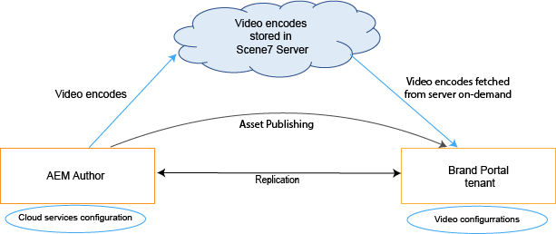
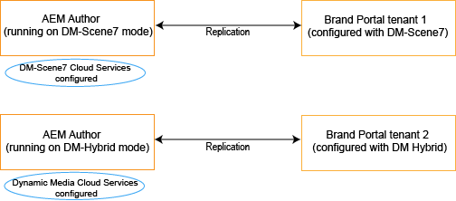
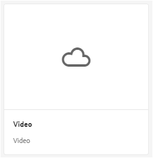
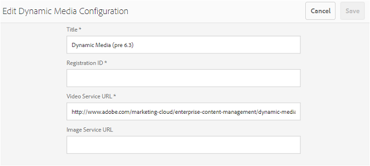
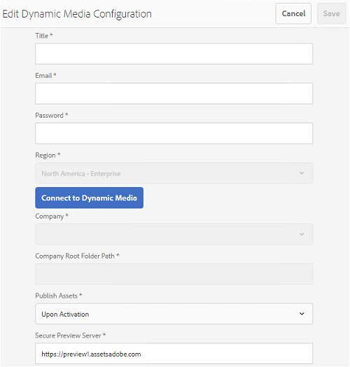

# Brand Portal 上的動態視訊支援 {#dynamic-video-support-on-brand-portal}

運用動態媒體支援，在品牌入口網站上自適應地預覽和播放視訊。 也可從入口網站和共用連結下載動態轉譯。
品牌入口網站使用者可以：

* 在「資產詳細資料」頁面、「卡片檢視」和連結共用預覽頁面中預覽影片。
* 在「資產詳細資料」頁面上播放視訊編碼。
* 在「資產詳細資料」頁面的「轉譯」索引標籤中檢視動態轉譯。
* 下載視訊編碼和包含視訊的資料夾。

>[!NOTE]
>
>若要處理視訊並將其發佈至品牌入口網站，請確定您的AEM Author例項已設定在動態媒體混合模式或動態媒體模 **[!DNL Scene 7]**式。

若要預覽、播放和下載視訊，品牌入口網站會向管理員公開下列兩種設定：

* [動態媒體混合設定](#configure-dm-hybrid-settings)如果AEM Author例項是在動態媒體混合模式上執行。
* [動態媒體[!DNL Scene 7]設定](#configure-dm-scene7-settings)如果AEM Author例項是在動態媒體模式上&#x200B;**[!DNL Scene 7]**執行。
根據您在AEM Author實例中設定的設定來設定其中一個設定，此實例會複製品牌入口網站租用戶。

>[!NOTE]
>
>與在 **[!UICONTROL Scene7Connect執行模式上執行的AEM Author整合的品牌入口網站租戶不支援動態視訊]**。

## 動態視訊如何播放？ {#how-are-dynamic-videos-played}

如果在品牌入口網站上設定了動態媒體設定([Hybrid](../using/dynamic-video-brand-portal.md#configure-dm-hybrid-settings) 或 [[!DNL Scene 7]](../using/dynamic-video-brand-portal.md#configure-dm-scene7-settings) )，則會從伺服器擷取動態轉譯 **[!DNL Scene 7]**。 因此，視訊編碼是預覽和播放時不會延遲和品質失真。

由於視訊編碼不會儲存在品牌入口網站存放庫中，而且會從伺服器擷取，請確 **[!DNL Scene 7]**定AEM作者實例和品牌入口網站上的動態媒體設定是相同的。

>[!NOTE]
>
>品牌入口網站不支援視訊檢視器和檢視器預設集。 視訊會在品牌入口網站的預設檢視器上預覽和播放。

## 必備條件 {#prerequisites}

若要在品牌入口網站上處理動態視訊，請確定：

* **在DM(Dynamic Media)模式上啟動AEM Author**（與其整合品牌入口網站）例項(在 [Dynamic Media Hybrid模式或](https://helpx.adobe.com/experience-manager/6-5/assets/using/config-dynamic.html#EnablingDynamicMedia) Dynamic Media [!DNL Scene 7]模式上啟動AEM Author) 。
* **在AEM Author上設定Dynamic Media cloud服務** Based the Dynamic Media Mode AEM Author is running on, set of [Dynamic Media cloud services](https://helpx.adobe.com/experience-manager/6-5/assets/using/config-dynamic.html#ConfiguringDynamicMediaCloudServices) or [[!DNL Scene 7] cloud services on AEM Author from](https://helpx.adobe.com/experience-manager/6-5/assets/using/config-dms7.html#ConfiguringDynamicMediaCloudServices) Tools **** |雲 **端服務** |動 **態媒體**。
* **在品牌入口網站上設定動態媒體**&#x200B;根據AEM Author上的Dynamic Media cloud設定，從品牌入口網站管理工具設定 [Dynamic Media設定或](#configure-dm-hybrid-settings) [!DNL Scene 7]設定  。
如果您使用 [Dynamic Media Hybrid和Dynamic Media](#separate-tenants) Scene7模式，請確定個別的Brand Portal租戶會用於AEM Author執行個體 ********。
* **使用視訊編碼發佈檔案夾**&#x200B;套用 [至品牌入口網站套](https://helpx.adobe.com/experience-manager/6-5/assets/using/video-profiles.html) 用視訊編碼，並將包含AEM Author例項之多媒體資產的檔案夾發佈至品牌入口網站。
* **安全預覽的SPS中的白名單****[!DNL Scene 7]**[如果使用Dynamic Media-](https://docs.adobe.com/content/help/en/dynamic-media-classic/using/upload-publish/testing-assets-making-them-public.html)（公司可安全預覽），建議公司使用SPS Publishing Flash Administrator(Spscene Flash Publishing System Administrator)，為各自的SPS地區建立公開出口IP**[!DNL Scene 7]******。
出口IP如下：

| **區域** | **出口IP** |
|--- |--- |
| 不適用 | 192.243.237.86 |
| EMEA | 185.34.189.4 |
| APAC | 63.140.44.54 |

若要將這些出口IP列入白名單，請參 [閱為安全測試服務準備您的帳戶](https://docs.adobe.com/content/help/en/dynamic-media-classic/using/upload-publish/testing-assets-making-them-public.html#testing-the-secure-testing-service)。

## 最佳實務

若要確保您的動態視訊資產能夠從品牌入口網站（和共用連結）成功預覽、播放和下載，請遵循下列實務：

### 動態媒體混合與動態媒體場景7模式的分隔租戶 {#separate-tenants}

如果您同時使用Dynamic Media和 **[!DNL Scene 7]**Dynamic Media Hybrid功能，建議您針對使用Dynamic Media Hybrid和Dynamic Media模式設定的AEM Author例項，使用不同的品牌入口**[!DNL Scene 7]** 網站。 

### 在AEM Author例項和品牌入口網站的設定詳細資訊相同

確保諸如 **[!UICONTROL Chrid]**,****Id,Video Service **[!UICONTROL ID(Video Service IR)中的配置——如Sham Design]************************[!DNL Scene 7]******In The Dynamic Region Chrid Align Chrid Ad Samig Mad Mad Man入口和AEM雲配置。

### 動態媒體場景7模式的白名單公開出口IP

如果使用Dynamic Media **[!UICONTROL Scene 7]**-[aving secure preview enabled](https://docs.adobe.com/content/help/en/dynamic-media-classic/using/upload-publish/testing-assets-making-them-public.html)-來將視訊資產提供給品牌入口網站，**[!UICONTROL  Scene 7]** 會針對測試環境或內部應用程式建立專用的影像伺服器。 對此伺服器的任何請求都會檢查源IP地址。 如果傳入請求不在已核准的IP位址清單中，則會傳回失敗回應。
因此， **[!UICONTROL Scene-7]**Company Administrator會透過**[!UICONTROL  SPS]** (Scene-7 Publishing System)flash UI，為其公司的 **[!UICONTROL Secure Testing]**Environment設定核准的IP位址清單。 請確定您各自地區的出口IP（來自下列）已新增至核准清單。
若要將這些出口IP列入白名單，請參[閱為安全測試服務準備您的帳戶](https://docs.adobe.com/content/help/en/dynamic-media-classic/using/upload-publish/testing-assets-making-them-public.html#testing-the-secure-testing-service)。
出口IP如下：

| **區域** | **出口IP** |
|--- |--- |
| 不適用 | 192.243.237.86 |
| EMEA | 185.34.189.4 |
| APAC | 63.140.44.54 |

## 設定動態媒體（混合）設定 {#configure-dm-hybrid-settings}

如果AEM Author例項是在動態媒體混合模式上執行，請使用「管理工具」面板中的 **[!UICONTROL Video]**tile來設定「動態媒體」閘道設定。
>[!NOTE]
>
>視訊 [編碼設定檔](https://helpx.adobe.com/experience-manager/6-5/assets/using/video-profiles.html) ，不會發佈至品牌入口網站，而是從 **[!UICONTROL Scene 7伺服器擷取]**。 因此，若要在品牌入口網站中成功播放視訊編碼，請確定設定詳細資訊與AEM Author例項中的[[!UICONTROL Scene7雲端設定相同]](https://helpx.adobe.com/experience-manager/6-5/assets/using/config-dms7.html#ConfiguringDynamicMediaCloudServices)。
若要在品牌入口網站租戶上設定動態媒體設定：

1. 選取AEM標誌，從品牌入口網站頂端的工具列存取管理工具。

2. 從管理工具面板中，選取「視 **[!UICONTROL 訊」圖格]**。    
   **[!UICONTROL 「編輯動態媒體設定]**」頁面隨即開啟。    

3. 指 **[!UICONTROL 定註冊ID]****[!UICONTROL &#x200B;和視訊服務URL]** （DM閘道URL）。 請確定這些詳細資訊與您AEM Author例項中 **[!UICONTROL 「工具>雲端服務]**」中的相同。

4. 選擇 **保存** ，保存配置。

## 設定動態媒體Scene7設定 {#configure-dm-scene7-settings}

如果AEM Author例項是在Dynamic Media- **[!UICONTROL Scene 7]**模式上執行，請使用管理工具面板中的「動態媒體設定」圖格來設定**[!UICONTROL  Scene 7]******伺服器設定。

若要在品牌入口網站 **[!UICONTROL 租戶上設定]**Dynamic Media Scene 7設定：

1. 選取AEM標誌，從品牌入口網站頂端的工具列存取管理工具。

2. 從管理工具面板中，選取「動態媒 **[!UICONTROL 體設定」方塊]**。    ![品牌 [!UICONTROL 入口網站] 上的DM Scene 7設定](assets/DMS7-Tile.png)
   **[!UICONTROL 「編輯動態媒體設定]**」頁面隨即開啟。    

3. 提供：
   * **[!UICONTROL 標題]**
   * 存取Scene 7 **[!UICONTROL 伺服器]**(電子郵**[!UICONTROL &#x200B;件ID和密碼]**)的認證
   * **[!UICONTROL 地區]**：請確定這些值與您AEM Author例項中的值相同。

4. Select **[!UICONTROL Connect to Dynamic Media]**.

5. 提供公 **[!UICONTROL 司名稱]**，並**[!UICONTROL &#x200B;儲存設定]** 。
