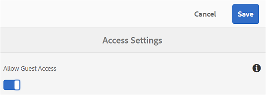
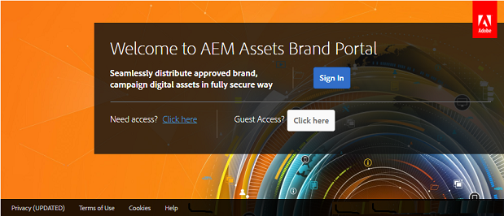
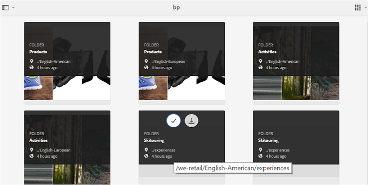
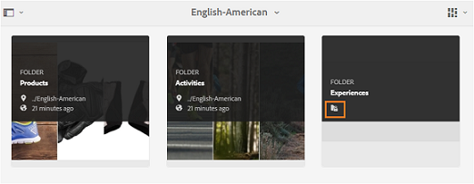
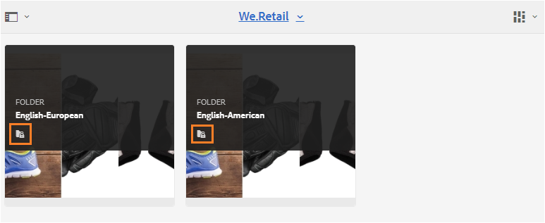
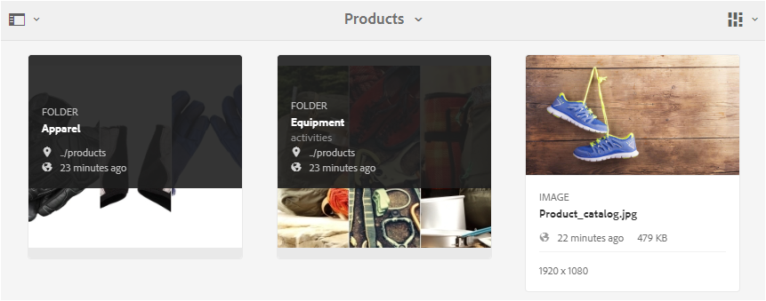
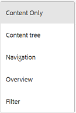
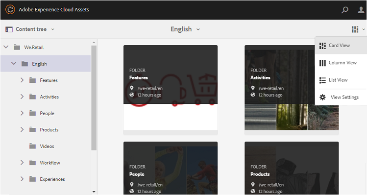
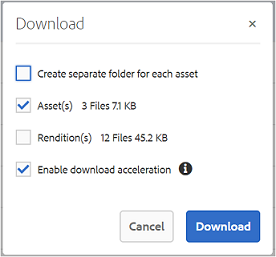
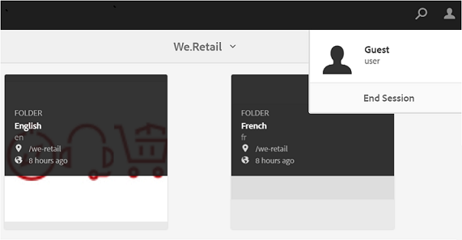

# Brand Portal 的訪客存取 {#guest-access-to-brand-portal}

AEM Brand入口網站可讓訪客存取入口網站。 訪客使用者不需要憑證即可進入入口網站，並可存取入口網站的公用資產（和系列）。 來賓作業中的使用者可將資產新增至燈箱（私人系列）並下載資產，直到作業持續為止，除非來賓使用者選擇「結束作業」，否則作業從作業開始算起2 [[!UICONTROL 小時]](#exit-guest-session)。

訪客存取功能可讓組織 [快速地與目標對象共用已核准的資產](../using/brand-portal-sharing-folders.md#how-to-share-folders) ，而不需將其上線。 Brand Portal 6.4.2版之後，已配備為多個並行來賓用戶提供服務，這是每個組織的用戶配額總量的10%。 允許訪客存取可節省管理和載入大量需要在品牌入口網站上使用有限功能的使用者的時間。\
組織可以使用管理工具面板中「存取」設定的「允許來賓存取 **[!UICONTROL 」選項，啟用（或停用）組織的品牌入口網站帳戶]****** 上的來賓存取。

<!--
Comment Type: annotation
Last Modified By: mgulati
Last Modified Date: 2018-08-17T10:42:59.879-0400
Removed the first para: "AEM Assets Brand Portal allows public users to enter the portal anonymously and have restricted access to the allowed public resources as guests. Organization users with guest role need not seek access and authentication from administrators."
-->

## 開始來賓會話 {#begin-guest-session}

若要匿名輸入品牌入口網站，請選取 **[!UICONTROL 按一下此處]**，以**[!UICONTROL &#x200B;取得訪客存取？]** 在品牌入口網站歡迎畫面上。 使用者不需要尋找存取權，並等待管理員驗證他們，以授與使用品牌入口網站的存取權。

## 來賓會話持續時間 {#guest-session-duration}

來賓用戶會話保持活動狀態2小時。 這表示燈箱的狀態會保留到 **[!UICONTROL Lightbox]**1小時後開始，而在2小時後，目前的來賓作業會重新啟動，因此燈箱狀態會遺失。\
例如，訪客使用者於15時登入品牌入口網站，並將資產新增至Lightbox，於16時50分下載。 如果使用者未在17:00之前下載 **[!UICONTROL Lightbox]**集合（或其資產）,**[!UICONTROL  Lightbox]** 將會變成空白，因為使用者必須在1小時結束時（即1700小時）重新啟動工作階段。

## 允許併發來賓會話 {#concurrent-guest-sessions-allowed}

並行來賓會話的數量限制為每個組織的用戶配額總量的10%。 這表示，對於使用者配額為200的組織，最多可同時使用20位來賓使用者。 第21位用戶被拒絕訪問，並且僅當20位活動來賓用戶的會話結束時才能作為來賓訪問。

## Guest使用者與品牌入口網站的互動 {#guest-user-interaction-with-brand-portal}

### 訪客UI導覽

在以來賓身分進入品牌入口網站時，使用者可以看到所有公 [開共用的資產和資料夾](../using/brand-portal-sharing-folders.md#sharefolders) ，或只與來賓使用者共用。 此檢視是僅限內容的檢視，會在卡片、清單或欄版面中顯示資產。

但是，如果管理員已啟用「啟用資料夾層次結構」配置，來賓用戶在登錄到Brand Portal時會看到資料夾樹（從根資料夾開始）和在各自父資料夾內排列的共用資料夾  。

這些父資料夾是虛擬資料夾，不能對其執行任何操作。 您可以使用鎖定表徵圖來識別這些虛擬資料夾。

與共用資料夾不同，暫留或在「卡片檢視」中選取動作 **[!UICONTROL 工作時]**，不會顯示任何動作工作。**[!UICONTROL &#x200B;在「列視圖]** 」和「清單視圖」中選擇虛擬資料夾時， **[!UICONTROL 將顯示「概述]**」**[!UICONTROL &#x200B;按鈕]**。

>[!NOTE]
>
>請注意，虛擬資料夾的預設縮略圖是第一個共用資料夾的縮略圖。

   

**[!UICONTROL 「檢視設定]**」選項可讓訪客使用者調整「卡片檢視」中的卡片大小，**[!UICONTROL &#x200B;或欄位可顯示]** 在「清單檢視」中 ****。

「內 **[!UICONTROL 容」樹狀結構]**，可讓您在資產階層中移動。

品牌入口網站 **[!UICONTROL 提供]**「概述」選項給來賓用戶，**[!UICONTROL &#x200B;以檢視所選資產]** /資料夾的資產屬性。 「概 **[!UICONTROL 述]**」選項可見：

* 在頂端的工具列中，選取資產／資料夾時。
* 在下拉式清單中，選取「軌道選擇器」。
在選取資 **[!UICONTROL 產]**/資料夾時選取「概述」選項時，使用者可以看到資產建立的標題、路徑和時間。 但是，在資產詳細資料頁面上，選取「**[!UICONTROL &#x200B;概述]** 」選項可讓使用者查看資產的中繼資料。

 

**[!UICONTROL 左側導覽]**(Navigation)選項可讓使用者從檔案導覽至系列，然後在來賓工作階段中返回，讓使用者瀏覽檔案或系列中的資產。

**[!UICONTROL Filter]**選項允許來賓用戶使用管理員設定的搜索謂語來過濾資產檔案和資料夾。

### 來賓用戶功能

訪客使用者可以存取品牌入口網站上的公開資產，也沒有進一步討論的限制。

**來賓用戶可以**:

* 存取所有品牌入口網站使用者專用的公開資料夾和系列。
* 瀏覽成員、詳細資料頁，並擁有所有公共資料夾和集合成員的完整資產視圖。
* 在公共資料夾和系列間搜尋資產。
* 將資產新增至燈箱集合。 系列的這些變更會在工作階段期間持續存在。
* 直接下載資產或透過燈箱集合。

**來賓用戶不能**:

* 建立系列和已儲存的搜尋，或進一步共用。
* 存取檔案夾和系列設定。
* 將資產共用為連結。

### 在來賓作業階段中下載資產

來賓使用者可直接在品牌入口網站上公開或獨家下載與來賓使用者共用的資產。 來賓使用者也可以將資產新增至 **[!UICONTROL Lightbox]**（公開系列），並在工作階段過期前下載**[!UICONTROL  Lightbox]** 系列。

若要下載資產和系列，請使用下列網址的下載圖示：

* 快速動作縮圖，此縮圖會顯示在暫留在資產或系列上
* 頂端的工具列，在選取資產或系列時會出現

在「 **[!UICONTROL 下載]**」對話方[!UICONTROL 塊中選取「啟用下載加]速」，可[以增強下載效能](../using/accelerated-download.md)。

## 退出來賓會話 {#exit-guest-session}

要退出來賓會話，請使用 **[!UICONTROL 標題中可用選項的「結束會話]**」。 不過，如果訪客作業使用的瀏覽器標籤不作用中，則作業會在閒置兩小時後自動過期。

## 監控來賓用戶活動 {#monitoring-guest-user-activities}

管理員可監控訪客使用者與品牌入口網站的互動。 在品牌入口網站中產生的報表可提供訪客使用者活動的關鍵見解。 例如，「 **[!UICONTROL 下載]**」報表可用來追蹤訪客使用者下載的資產計數。**[!UICONTROL 「使用者登入]** 」報表可通知訪客使用者上次登入入口網站的時間，以及指定期間內的登入頻率。
