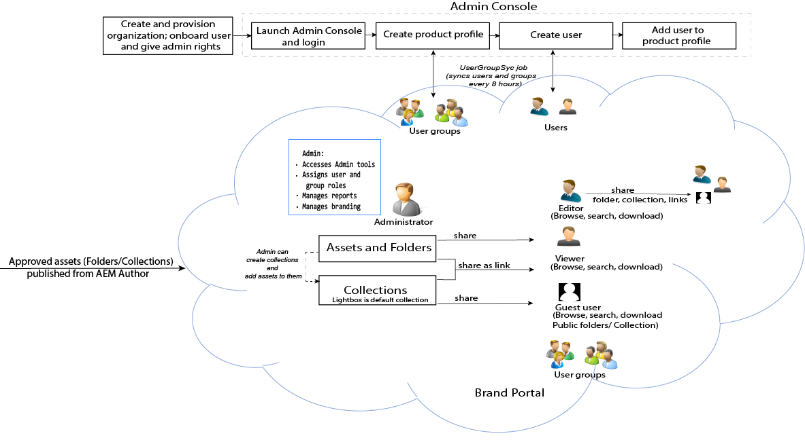

# Adobe Experience Manager Assets Brand Portal指南{#aem-brand-portal}

**Adobe Experience Manager Assets Brand** Portal借由安全方式向外部機構、合作夥伴、內部團隊和經銷商散布經過核准的品牌和產品資產以供下載，協助組織滿足其行銷需求。

缺少安全的資產共用解決方案可能會導致：

* 需透過電子郵件或雲端以手動方式共用資產
* 品牌法規遵循問題
* 缺乏控制資產使用方式的手段
* 行銷活動和產品上市時間的延遲
* 地理位置和組織之間的內容重複
* 資產發佈前的儲存方式不安全

有了 Brand Portal，組織便可確保品牌法規遵循，方法是透過讓行銷人員與通路合作夥伴及內部企業使用者共同作業，以便快速建立和管理最新的設計準則、標誌、行銷活動和產品資產，並將這些內容提供給利害關係人。
Brand Portal 是雲端式 SAAS 產品。並且以做為 Adobe Experience Manager Assets 產品的附加元件的方式提供 (內部部署或代管服務)。

Brand Portal 解決方案的工作流程如下圖所示。

## Adobe Experience Manager Brand Portal 使用手冊

此使用手冊說明了 Brand Portal 產品和主要工作流程的深入分析。使用左側邊欄瀏覽各種功能，並深入研究以瞭解不同角色與入口網站的互動方式。

### 另請參閱

| 使用手冊 | 說明 |
|--- |---|
| [新功能](whats-new.md) | Brand Portal 和舊版的不同之處和最新產品。 |
| [發行說明](brand-portal-release-notes.md) | 目前版本中的增強功能、已修正的嚴重問題，以及已知問題。 |
| [使用 Brand Portal 設定 AEM Assets](../using/configure-aem-assets-with-brand-portal.md) | 如何使用 AEM Assets 來複寫 Brand Portal 以發佈資產。 |
| [疑難排解平行發佈的問題](troubleshoot-parallel-publishing.md) | 疑難排解 Brand Portal 和 AEM Assets 之間的複寫。 |
| [支援的檔案格式](brand-portal-supported-formats.md) | Brand Portal 支援的檔案格式，可供預覽和下載。 |
| [將資產發佈至 Brand Portal](brand-portal-sharing-folders.md) | 如何將資料夾、集合、連結、預設集、結構、Facet 和標記發佈至 Brand Portal。 |
| [Brand Portal 中的 Asset Sourcing](brand-portal-asset-sourcing.md) | 如何在AEM Assets中設定Asset Sourcing、在Brand Portal中上傳資產，並將貢獻資料夾發佈回AEM Assets。 |

### 實用資源

* [透過AEM Assets了解Brand Portal](https://docs.adobe.com/content/help/zh-Hant/experience-manager-brand-portal/using/home.html)
