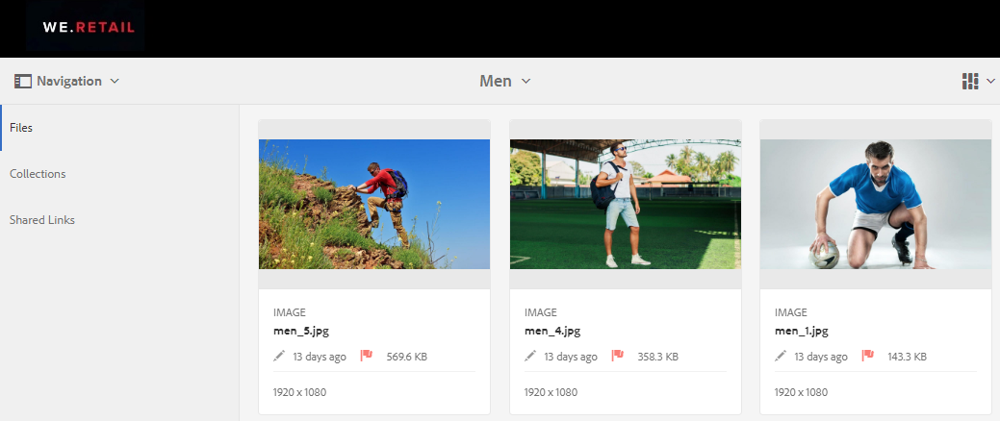
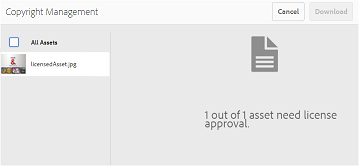
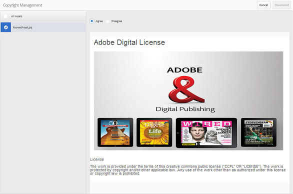
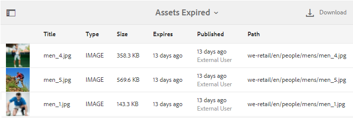

# 管理資產的數位版權 {#manage-digital-rights-of-assets}

確保創意資產和品牌資料的安全分發和使用對於保護您的品牌至關重要。 您可將到期日（和時間）與已核准的資產從AEM發佈至品牌入口網站，或是授權這些資產以條件性使用，在組織內外強制執行此授權。 此外，品牌入口網站可讓您指定從品牌入口網站分享之資產連結的到期日。

閱讀以瞭解資產在品牌入口網站上的保護方式，並瞭解相關的使用權限。

## 資產到期 {#asset-expiration}

資產到期是控制組織內品牌入口網站上已核准資產使用的有效方式。 從AEM Assets發佈至品牌入口網站的所有資產都可以有到期日，這會限制不同使用者角色對這些資產的使用。

### 與過期資產相關的使用權限 {#usage-permissions-expired-assets}

在品牌入口網站中，管理員可以檢視、下載過期資產並新增至系列。 但是，編輯人員和檢視器只能檢視過期的資產並新增至系列。

管理員可以將過期的資產從AEM Assets發佈至品牌入口網站。 但是，過期的資產無法透過品牌入口網站的墨水共用。 如果您從包含已到期資產和非已到期資產的檔案夾中選取任何已到期資產，則「共 **[!UICONTROL 用連結]**」動作將不可用。 但是，如果您選取的資料夾包含過期和未過期的資產，則「共用」和「共[!UICONTROL 用]**[!UICONTROL &#x200B;連結]** 」動作可用。

>[!NOTE]
>
>資料夾仍可共用為連結，即使其包含過期的資產亦然。 在此情況下，連結不會列出已到期的資產，且只會共用未到期的資產。

下表顯示過期資產的使用權限：

|  | **[!UICONTROL 連結共用]** | **[!UICONTROL 下載]** | **[!UICONTROL 屬性]** | **[!UICONTROL 新增至系列]** | **[!UICONTROL 刪除]** |
|---|---|---|---|---|---|
| **[!UICONTROL 管理員]** | 無法使用 | 可用 | 可用 | 可用 | 可用 |
| **[!UICONTROL 編輯者]** | 無法使用 | 無法使用 | 可用 | 可用 | 無法使用 |
| **[!UICONTROL 檢視者]** | 無法使用 | 無法使用 | 可用 | 可用 | 無法使用 |
| **[!UICONTROL 來賓用戶]** | 無法使用 | 無法使用 | 可用 | 可用 | 無法使用 |

>[!NOTE]
>
>如果檢視器和編輯人員下載包含已過期和未過期資產的檔案夾，則只會下載未過期的資產。 如果資料夾只包含過期的資產，則會下載空的資料夾。

### 資產的到期狀態 {#expiration-status-of-assets}

您可以在資產的「卡片檢視」中檢視資產的 **[!UICONTROL 到期狀態]**。 卡片上的紅旗表示資產已過期。

>[!NOTE]
>
>清單和欄檢視不會顯示資產的到期狀態。

## 資產連結到期 {#asset-link-expiration}

透過連結共用資產時，管理員和編輯人員可使用「連結共用」對話方塊中的「到期日」欄位，設 **[!UICONTROL 定到期日和]**時間**** 。 連結的預設有效期為分享連結當日起7天。

它可確保共用為連結的資產會在品牌入口網站管理員和編輯人員設定的日期和時間過期，而且在過期日期之後，無法再檢視和下載。 由於透過連結共用的資產也可由不屬於組織的外部使用者檢視，因此，透過指定到期日，您可以確保已核准的資產受到保護，且不會在指定時間後暴露於未知實體。

如需連結共用的詳細資訊，請參閱「 [將資產共用為連結」](../using/brand-portal-link-share.md)。

## 授權資產 {#licensed-assets}

授權資產必須在從Brand Portal下載之前接受授權合約。 授權資產的本合約是當您直接從品牌入口網站或透過共用連結下載資產時。 無論過期與否，所有使用者都可檢視受授權保護的資產。 但是，過期授權資產的下載和使用有限。 若要根據使用者角色瞭解過期授權資產的行為及允許的活動，請參閱過期資 [產的使用權限](../using/manage-digital-rights-of-assets.md#usage-permissions-expired-assets)。

受授權保護的資產 [會附加授權合約](https://helpx.adobe.com/experience-manager/6-5/assets/using/drm.html#DigitalRightsManagementinAssets) ，這是透過在AEM Assets中設定資產的 [中繼資料屬性](https://helpx.adobe.com/experience-manager/6-5/assets/using/drm.html#DigitalRightsManagementinAssets) 來完成。

如果您選擇下載受授權保護的資產，則會將您重新導向至「版權 **[!UICONTROL 管理]**」頁面。

您必須在這裡選擇要下載的資產，並接受相關的授權合約。 如果您不接受授權合約，則不 **[!UICONTROL 會啟用]**「下載」按鈕。

如果選擇包含多個受保護的資產，請一次選取一個資產、接受授權合約，然後繼續下載資產。

## 產生有關過期資產的報表 {#generate-report-about-expired-assets}

管理員可產生並下載報表，列出特定時段內到期的所有資產。 此報告包含詳細資訊— 例如大小、類型、指定資產階層中資產位置的路徑、資產的過期時間，以及資產的發佈時間— 關於過期資產。 您可自訂此報表的欄，以根據使用者需求顯示更多資料。

如需報表功能的詳細資訊，請參閱「使 [用報表」](../using/brand-portal-reports.md#work-with-reports)。
