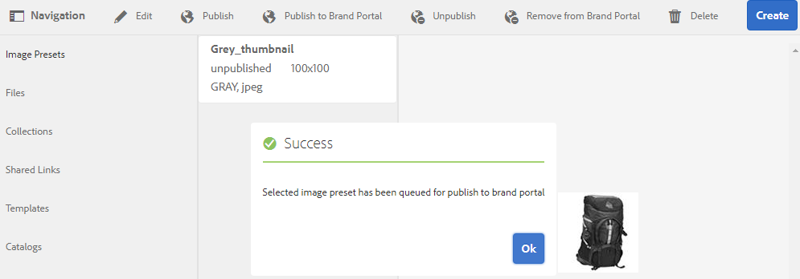
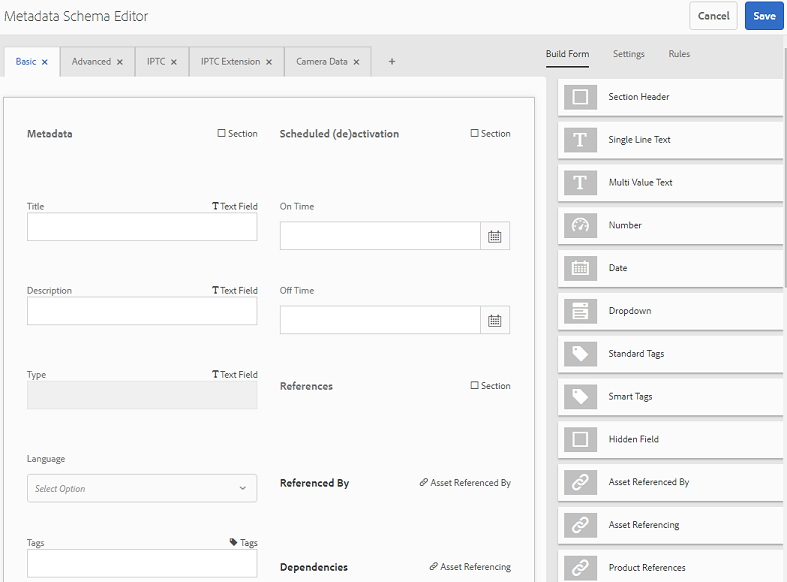
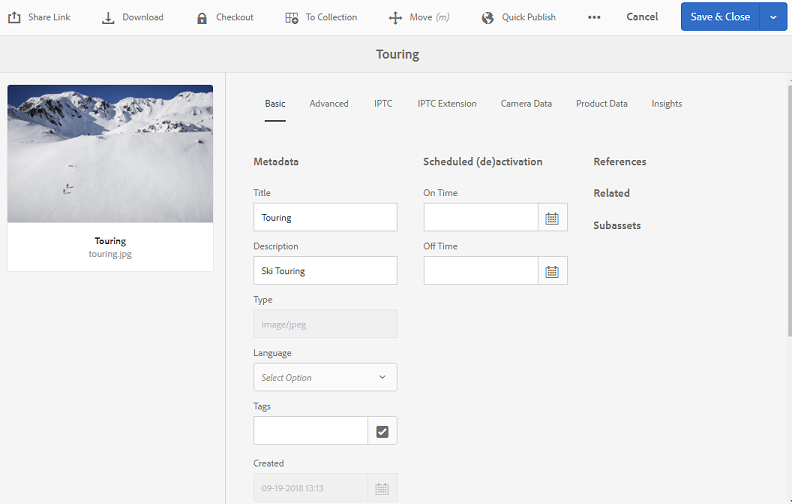
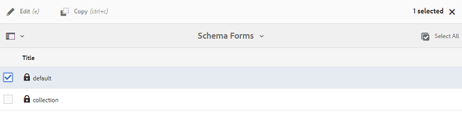
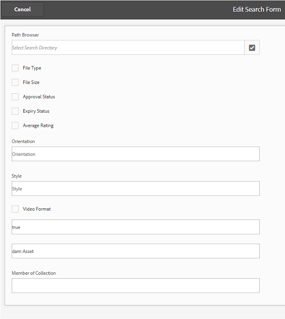
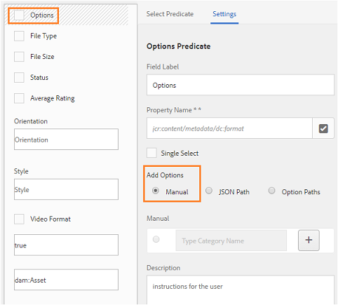

# 將預設集、結構和 Facet 發佈至 Brand Portal {#publish-presets-schema-and-facets-to-brand-portal}

文章會將影像預設集、中繼資料結構描述和自訂搜尋刻面從AEM Author例項發佈至品牌入口網站。 發佈功能可讓組織重複使用在AEM Author例項中建立／修改的影像預設集、中繼資料結構，以及搜尋Facet，以減少重複的工作。

>[!NOTE]
>
>AEM 6.2 SP1-CFP7和AEM 6.3 SP 1-CFP 1(6.3.1.1)之後提供從AEM Author實例發佈影像預設集、中繼資料架構和搜尋Facet的功能。

## 將影像預設集發佈至品牌入口網站 {#publish-image-presets-to-brand-portal}

影像預設集是一組調整大小和格式化指令，會在影像傳送時套用至影像。 您可以在品牌入口網站建立和修改影像預設集。 或者，如果AEM Author例項以動態媒體模式執行，則使用者可以在AEM Author建立預設集，並將它們發佈至AEM Assets品牌入口網站，並避免在品牌入口網站重新建立相同的預設集。\
建立預設集後，資產詳細資料轉譯邊欄和下載對話方塊上會將其列為動態轉譯。

>[!NOTE]
>
>如果AEM Author例項未在 **[!UICONTROL Dynamic Media Mode]**（客戶尚未購買Dynamic Media）中執行，則上傳時不會建立資產的**[!UICONTROL  Pyramid TIFF]** 轉譯。 影像預設集或動態轉譯適用於資產的 **[!UICONTROL Pyramid TIFF]**，因此，如果**[!UICONTROL  Pyramid TIFF]** （金字塔TIFF）不適用於AEM Author實例，則品牌入口網站也無法使用。 因此，資產詳細資料頁面和下載對話方塊的轉譯邊欄中不會顯示動態轉譯。

若要將影像預設集發佈至品牌入口網站：

1. 在AEM Author例項中，點選／按一下AEM標誌以存取全域導覽主控台，點選／按一下「工具」圖示並導覽至「 **[!UICONTROL 資產>影像預設集」]**。
1. 從影像預設集清單中選取影像預設集或多個影像預設集，然後按一下／點選「發 **[!UICONTROL 布至品牌入口網站」]**。

>[!NOTE]
>
>當使用者按一 **[!UICONTROL 下「發佈至品牌入口網站]**」時，影像預設集會排入發佈佇列。 建議用戶監視複製代理的日誌以確認發佈是否成功。

若要從品牌入口網站取消發佈影像預設集：

1. 在AEM Author例項中，點選／按一下AEM標誌以存取全域導覽主控台，並點選／按一下「 **[!UICONTROL Tools]**」（工具）圖示並導覽至「**[!UICONTROL  Assets > Image Presets]**」。
1. 選取影像預設集，然後從 **[!UICONTROL 頂端的可用選項中選取]**「從品牌入口網站移除」。

## 發佈中繼資料結構至品牌入口網站 {#publish-metadata-schema-to-brand-portal}

中繼資料結構描述在資產／系列的屬性頁面上顯示的版面和屬性。

 

如果使用者已編輯AEM Author例項上的預設架構，並願意使用與品牌入口網站上的預設架構相同的架構，他們只需將中繼資料架構表單發佈至品牌入口網站。 在這種情況下，品牌入口網站的預設架構會由從AEM Author例項發佈的預設架構過度使用。

如果使用者已在AEM Author例項上建立自訂結構描述，他們可以將自訂結構描述發佈至品牌入口網站，而不需在此重新建立相同的自訂結構描述。 然後，使用者可將此自訂結構套用至品牌入口網站中的任何資料夾／系列。

>[!NOTE]
>
>如果預設結構在AEM例項中鎖定（即未編輯），則無法將其發佈至品牌入口網站。

>[!NOTE]
>
>如果檔案夾已套用AEM Author例項的架構，品牌入口網站上也必須有相同的架構，以維持AEM作者和品牌入口網站上資產屬性頁面的一致性。

若要從AEM Author例項發佈中繼資料結構，請至品牌入口網站：

1. 在AEM Author例項中，點選／按一下AEM標誌以存取全域導覽主控台，並點選／按一下「工具」圖示並導覽至「資產> **[!UICONTROL 中繼資料結構]**」。
1. 選取中繼資料結構，然後從 **[!UICONTROL 上方的可用選項中選取「發佈至品牌入口網站]**」。

>[!NOTE]
>
>當使用者按一 **[!UICONTROL 下「發佈至品牌入口網站]**」時，中繼資料結構會排入發佈佇列。 建議用戶監視複製代理的日誌以確認發佈是否成功。

若要從品牌入口網站取消發佈中繼資料結構：

1. 在AEM Author例項中，點選／按一下AEM標誌以存取全域導覽主控台，並點選／按一下「工具」圖示並導覽至「資產>中繼資 **[!UICONTROL 料結構」]**。
1. 選取中繼資料結構，然後從 **[!UICONTROL 頂端的可用選項中]**，選取「從品牌入口網站移除」。

## 將搜尋Facet發佈至品牌入口網站 {#publish-search-facets-to-brand-portal}

搜尋表單可為品牌入口 [網站的使用者](../using/brand-portal-search-facets.md) ，提供分面搜尋功能。 搜尋刻面為品牌入口網站的搜尋提供更精細度。 在搜尋表 [單中新增的所有謂語](https://helpx.adobe.com/experience-manager/6-5/assets/using/search-facets.html#AddingaPredicate) ，都可供使用者在搜尋篩選器中當做搜尋Facet使用。

如果您願意使用AEM Author例項中的自訂搜尋表單 **[!UICONTROL Assets Admin Search Rail]**，則您可以將自訂的搜尋表單從AEM Author例項發佈至品牌入口網站，而不是在品牌入口網站上重新建立相同的表單。

>[!NOTE]
>
>AEM Assets上鎖定的 **[!UICONTROL 搜尋表單「資產管理搜尋邊欄]**」無法發佈至品牌入口網站，除非加以編輯。 編輯並發佈至品牌入口網站後，此搜尋表單會覆寫品牌入口網站上的搜尋表單。

若要將編輯過的搜尋Facet從AEM Author例項發佈至品牌入口網站：

1. 點選／按一下AEM標誌，然後前往「工具>一 **[!UICONTROL 般>搜尋表單」]**。
1. 選取編輯過的搜尋表單，然後選取「 **[!UICONTROL 發佈至品牌入口網站」]**。

   >[!NOTE]
   >
   >當使用者按一 **[!UICONTROL 下「發佈至品牌入口網站]**」時，搜尋Facet會排入發佈佇列。 建議用戶監視複製代理的日誌以確認發佈是否成功。

若要從品牌入口網站取消發佈搜尋表單：

1. 在AEM Author例項中，點選／按一下AEM標誌以存取全域導覽主控台，並點選／按一下「工具」圖示並導覽至「一般>搜 **[!UICONTROL 尋表格]**」。
1. 選取搜尋表單，然後從上 **[!UICONTROL 方可用的選項中選取]**「從品牌入口網站移除」。

>[!NOTE]
>
>「從 **[!UICONTROL 品牌入口網站取消發佈]**」動作會保留品牌入口網站上的預設搜尋表單，且不會還原為發佈前使用的最後一個搜尋表單。

### 限制 {#limitations}

1. 很少有搜尋謂語不適用於品牌入口網站的搜尋篩選器。 當這些搜尋謂語在從AEM Author例項發佈至品牌入口網站的搜尋表單中時，會將其篩選掉。 因此，在品牌入口網站的發佈表單中，使用者可看到的謂詞數目較少。 請參 [閱適用於品牌入口網站篩選器的搜尋謂語](../using/brand-portal-search-facets.md#list-of-search-predicates)。

1. 對於 [!UICONTROL Options Predicate]，如果使用者在AEM Author例項中使用任何自訂路徑來讀取選項，則無法在品牌入口網站中運作。 這些額外的路徑和選項不會隨搜尋表單發佈至品牌入口網站。 在這種情況下，使用者可以在「 **[!UICONTROL Add Options]**Predicate」（在選項謂詞中新增選項）中選取「Manual********」（手動）選項，以在Brand Portal中手動新增這些選項。

