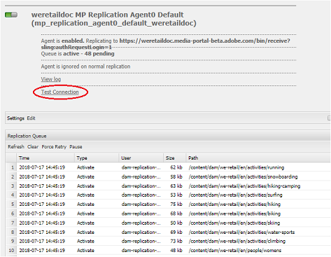

# 疑難排解平行發佈至 Brand Portal 的問題 {#troubleshoot-issues-in-parallel-publishing-to-brand-portal}

Brand Portal已透過AEM Assets設定，可從AEM Assets作者例項順暢地擷取（或發佈）已核准的品牌資產。 在[已設定](../using/configure-aem-assets-with-brand-portal.md)後，AEM作者會使用復寫代理將選取的資產複製到Brand Portal雲端服務，供Brand Portal使用者使用。 AEM 6.2 SP1-CFP5、AEM CFP 6.3.0.2及以上版本均使用多個復寫代理，以允許高速並行發佈。

>[!NOTE]
>
>Adobe建議升級至AEM 6.4.1.0，以確保已成功使用AEM Assets設定AEM Assets Brand Portal。 AEM 6.4的限制導致使用Brand Portal設定AEM Assets時發生錯誤，且復寫失敗。

在&#x200B;**[!UICONTROL /etc/cloudservice]**&#x200B;下為brand portal設定雲端服務時，會自動產生所有必要的使用者和代號，並將其儲存在存放庫中。 雲服務配置已建立，複製和複製代理複製內容所需的服務用戶也已建立。 這會建立四個復寫代理。 因此，當您從AEM發佈許多資產到Brand Portal時，這些資產會排入佇列，並透過Round Robin在這些復寫代理之間分送。

不過，發佈可能會因為大型Sling工作、AEM Author例項上的網路和&#x200B;**[!UICONTROL 磁碟I/O]**&#x200B;增加，或AEM Author例項效能下降而間歇性失敗。 因此，建議在開始發佈前測試與復寫代理的連線。

## 疑難排解首次發佈的失敗問題：驗證發佈配置 {#troubleshoot-failures-in-first-time-publishing-validating-your-publish-configuration}

驗證發佈設定的方式：

1. 檢查錯誤日誌
1. 檢查是否已建立復寫代理
1. 測試連接

**建立Cloud Service時尾隨記錄**

檢查尾部日誌。 檢查複製代理是否已建立。 如果複製代理建立失敗，請在雲端服務中進行微幅變更，以編輯雲端服務。 驗證並再次檢查復寫代理是否已建立。 否則，請重新編輯服務。

如果重複編輯雲端服務時未正確設定，請回報日托票。

**測試與復寫代理的連接**

查看日誌，如果在複製日誌中發現錯誤：

1. 聯絡Adobe支援。

1. 請重試[清除](../using/troubleshoot-parallel-publishing.md#clean-up-existing-config)並再次建立發佈配置。

<!--
Comment Type: remark
Last Modified By: Mini Gulati (mgulati)
Last Modified Date: 2018-06-21T22:56:21.256-0400

?? check and compare public key. At times public key is different

?? another thing to check in /useradmin

-->

### 清除現有的Brand Portal發佈設定 {#clean-up-existing-config}

發佈時，大部分情況下可能是因為發佈的使用者(例如：`mac-<tenantid>-replication`沒有最新的私密金鑰，因此發佈失敗並出現「401 unauthorized」錯誤，且復寫代理記錄中未回報其他錯誤。 您可能不想進行疑難排解，而是建立新的設定。 若要讓新設定正常運作，請從AEM作者設定中清除下列項目：

1. 前往`localhost:4502/crx/de/`(考慮您正在localhost:4502:上執行製作例項\
   我。刪除`/etc/replication/agents.author/mp_replication`
ii. 刪除 
`/etc/cloudservices/mediaportal/<config_name>`

1. 轉到localhost:4502/useradmin:\
   我。搜索用戶`mac-<tenantid>replication`
ii. 刪除此用戶

現在系統都清理好了。 現在，您可以嘗試建立新的cloudservice配置，並仍然使用`https://legacy-oauth.cloud.adobe.io/`中已存在的JWT應用程式。 不需要建立新應用程式，只需從新建立的雲端設定更新公開金鑰即可。

## Developer connection JWT應用程式租用戶可見性問題 {#developer-connection-jwt-application-tenant-visibility-issue}

如果在`https://legacy-oauth.cloud.adobe.io/`上，則列出當前用戶持有系統管理員的所有組織（租戶）。 如果您在此處找不到組織名稱，或者您無法在此處為所需的租戶建立應用程式，請檢查您是否擁有足夠的（系統管理員）權限來執行此操作。

此使用者介面有一個已知問題，即任何租用戶只能看到前10個應用程式。 建立應用程式時，請停留在該頁面並將URL加入書籤。 您不需要前往應用程式的清單頁面，並尋找您建立的應用程式。 您可以直接點擊此書籤化URL，並視需要更新/刪除應用程式。

JWT應用程式可能未正確列出。 因此，建立JWT應用程式時，建議您記下URL/將其加入書籤。

## 運行配置停止工作 {#running-configuration-stops-working}

<!--
Comment Type: draft

If the running configuration stops working, either of the following two possibilities
<g class="gr_ gr_15 gr-alert gr_gramm gr_inline_cards gr_run_anim Grammar multiReplace" data-gr-id="15" id="15" style="font-size: 12px;">
are
</g> there:

1.
<g class="gr_ gr_14 gr-alert gr_gramm gr_inline_cards gr_run_anim Grammar only-ins doubleReplace replaceWithoutSep" data-gr-id="14" id="14">
Connection
</g> has failed, or

2. Publish has failed with permission to dam-replication-service denied, while connection has passed 

If the connection has failed [1], the
<g class="gr_ gr_10 gr-alert gr_spell gr_inline_cards gr_run_anim ContextualSpelling ins-del multiReplace" data-gr-id="10" id="10">
fail safe
</g> way to fix it is to <a href="../using/troubleshoot-parallel-publishing.md#main-pars-header-1664955658">clean up</a> the existing Brand Portal publish configuration and recreate a publish configuration. 

However, if the
<g class="gr_ gr_18 gr-alert gr_spell gr_inline_cards gr_run_anim ContextualSpelling" data-gr-id="18" id="18">
publish
</g> has failed with
<g class="gr_ gr_16 gr-alert gr_gramm gr_inline_cards gr_run_anim Grammar only-ins doubleReplace replaceWithoutSep" data-gr-id="16" id="16">
permission
</g> denied to dam-replication-service, raise a support ticket.

-->

如果復寫代理（發佈至brand portal的程式正常）停止處理發佈工作，請檢查復寫記錄。 AEM內建自動重試功能，因此如果特定資產發佈失敗，系統會自動重試。 如果出現網路錯誤等間歇性問題，則重試期間可能會成功。

如果連續發佈失敗且隊列被阻止，則應檢查&#x200B;**[!UICONTROL 測試連接]**&#x200B;並嘗試解決正在報告的錯誤。

建議您根據錯誤記錄支援票證，讓Brand Portal工程團隊可協助您解決問題。

## 配置複製代理以避免連接超時錯誤 {#connection-timeout}

如果復寫佇列中有多個待處理請求，發佈工作通常會因逾時錯誤而失敗。 若要解決此問題，請確定復寫代理已設定為避免逾時。

執行下列步驟來配置復寫代理：
1. 登入您的AEM Assets製作例項。
1. 從&#x200B;**工具**&#x200B;面板，導覽至&#x200B;**[!UICONTROL 部署]** > **[!UICONTROL 復寫]**。
1. 在「復寫」頁面中，按一下「作者上的代理」**[!UICONTROL 。]**&#x200B;您可以看到Brand Portal租用戶的四個復寫代理。
1. 按一下復寫代理URL以開啟代理詳細資訊。
1. 按一下&#x200B;**[!UICONTROL 編輯]**&#x200B;以修改複製代理設定。
1. 在「代理設定」中，按一下&#x200B;**[!UICONTROL Extended]**&#x200B;標籤。
1. 選中&#x200B;**[!UICONTROL 關閉連接]**&#x200B;複選框。
1. 重複步驟4到7以配置所有四個複製代理。
1. 重新啟動伺服器。
