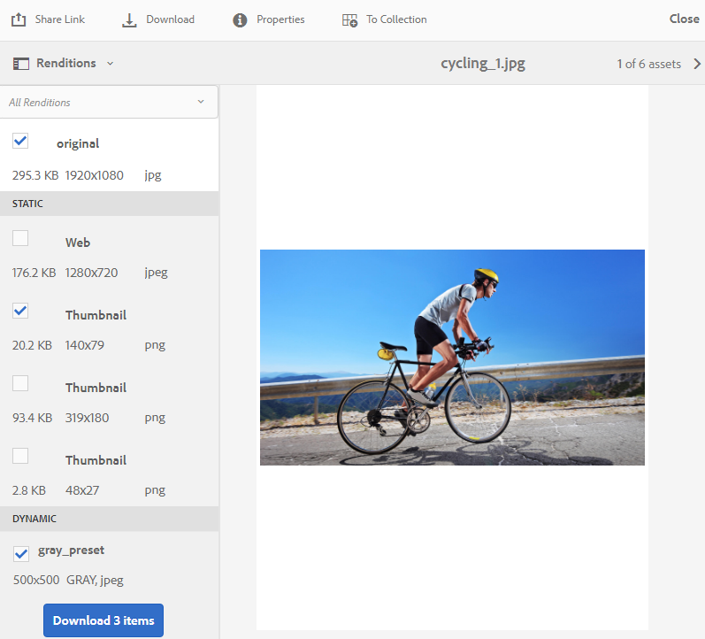

# AEM Assets Brand Portal 的新功能 {#what-s-new-in-aem-assets-brand-portal}

Adobe Experience Manager(AEM)Assets Brand Portal可協助您輕鬆取得、控制並安全地將經過核准的創意資產發佈給外部廠商和內部企業使用者，並跨裝置發佈。 它有助於提高資產共用的效率，加快資產上市時間，並降低不合規和未授權存取的風險。 Adobe正在努力改善整體品牌入口網站體驗。 搶先一窺新功能和增強功能。

## 2021.02.0 {#what-changed-in-feb-2021}中的變更

Brand Portal 2021.02.0是一個增強版本，主要針對AEM AssetsCloud Service的「資產來源補充」功能提供協助、改善資產下載體驗並包含重要修正。 它可讓管理員設定資料夾、系列的預設下載行為，以及在租用戶層級大量下載資產。 品牌入口網站&#x200B;**[!UICONTROL 使用狀況報表]**&#x200B;也已修改，以反映有效的品牌入口網站使用者。 請參閱最新的[品牌入口網站發行說明](brand-portal-release-notes.md)。

### 將AEM Assets作為Cloud Service的資產來源補充{#asset-sourcing-on-cloud-service}

「資產來源補充」功能現已在AEM Assets提供，做為Cloud Service。 預設會為所有雲端服務使用者啟用這些功能。 獲准的品牌入口網站使用者可以上傳新資產至貢獻檔案夾，並將貢獻檔案夾從品牌入口網站發佈至AEM Assets，做為Cloud Service例項，以協助資產採購。 管理員可以檢閱並核准品牌入口網站使用者的貢獻，以便進一步將他們散發給其他品牌入口網站使用者。

早前，資產採購僅在AEM Assets（內部部署和受管理服務）提供。

### 資產下載{#asset-download-setting}

除了現有的&#x200B;**[!UICONTROL 下載設定]**&#x200B;外，品牌入口網站管理員現在還可以設定&#x200B;**[!UICONTROL 資產下載]**&#x200B;設定。 此設定可讓管理員控制資料夾、系列和大量下載資產（超過20個資產）的預設下載行為。

<!--
Earlier, all the asset renditions were directly downloaded in a zip folder in case of folder, collection, and bulk download of assets. As the **[!UICONTROL Download]** dialog is skipped for folders or collections, there was no mechanism to control the downloading behaviour of the assets. Due to this, the users were finding it difficut to search for a particular asset rendition from a folder containing huge bunch of downloaded renditions. 
-->

之前，所有資產轉譯都直接下載在Zip檔案夾中。 檔案夾和系列會略過&#x200B;**[!UICONTROL 下載]**&#x200B;對話方塊，而且沒有方法可控制資產的下載行為，因此很難從大量下載中搜尋特定轉譯。

**[!UICONTROL 「資]** 產下載」設定現在提供選項，可供您在下載資料夾、系列或大量下載資產時，為每個資產建立個別的資料夾。

如果&#x200B;**[!UICONTROL 資產下載]**&#x200B;設定已停用，則會將檔案夾或系列下載至包含相同檔案夾下所有資產轉譯的Zip檔案夾，但使用共用連結下載資產除外。

以管理員身分登入您的品牌入口網站，並導覽至&#x200B;**[!UICONTROL 工具]** > **[!UICONTROL 下載]**。 管理員可以啟用「資產下載」**[!UICONTROL 設定，在下載資料夾、系列和大量下載資產時，為每個資產建立個別的資料夾。]**

<!--
### Download using Share link {#download-using-share-link}

The default behavior of downloading the assets using share link is now independent of the **[!UICONTROL Download Settings]**. A separate folder is created for each asset while downloading the assets using share link. 
-->

### 使用狀況報告{#usage-report}

品牌入口網站&#x200B;**[!UICONTROL 使用狀況報表]**&#x200B;已修改，僅反映作用中的品牌入口網站使用者。 未指派給Admin Console中任何產品描述檔的品牌入口網站使用者被視為非作用中使用者，不會反映在&#x200B;**[!UICONTROL 使用狀況報表]**&#x200B;中。

之前，「使用狀況報表」中會顯示活動中和非活動中的使用者。

## 2020.10.0 {#what-changed-in-oct-2020}中的變更

Brand Portal 2020.10.0是增強版，著重於簡化資產下載體驗並包含重要修正。 此增強功能包括資產下載的全新和改良工作流程、排除轉譯的其他選項、從&#x200B;**[!UICONTROL 轉譯]**&#x200B;面板直接下載、允許特定使用者群組存取和下載權限的設定，以及從所有品牌入口網站頁面輕鬆導覽至檔案、系列和共用連結。 請參閱最新的[品牌入口網站發行說明](brand-portal-release-notes.md)。

### 簡化下載體驗{#download-dialog}

之前，會出現&#x200B;**[!UICONTROL Download]**&#x200B;對話方塊，其中包含多個選項，例如為每個資產建立個別的檔案夾、電子郵件資產、選取原始資產、自訂轉譯、動態轉譯、排除系統轉譯，以及啟用下載加速，當選取多個資產或檔案夾時，這些選項對非技術或新使用者不明確。 此外，使用者無法看到所有資產轉譯或排除特定的自訂或動態轉譯。

新的&#x200B;**[!UICONTROL Download]**&#x200B;對話方塊可推廣資產選擇和篩選程式，讓品牌入口網站使用者在下載資產轉譯時更容易做出有效決策。 它會根據[**[!UICONTROL Download]**](brand-portal-download-assets.md)組態和&#x200B;**[!UICONTROL Download]**&#x200B;設定列出所有選取的資產及其轉譯。

>[!NOTE]
>
>所有使用者現在預設會啟用&#x200B;**[!UICONTROL 快速下載]**，並需要在瀏覽器的擴充功能中安裝[IBM Aspera Connect 3.9.9](https://www.ibm.com/support/knowledgecenter/SSXMX3_3.9.9/kc/connect_welcome.html)，才能從品牌入口網站下載資產。

<!--
If any of the **[!UICONTROL Custom Rendition]** or **[!UICONTROL System Rendition]** is enabled in the [**[!UICONTROL Download]**](brand-portal-download-assets.md) configuration and **[!UICONTROL Download]** settings are enabled for the group users, the new **[!UICONTROL Download]** dialog appears with all the renditions of the selected assets or folders containing assets in a list view. 
-->

在&#x200B;**[!UICONTROL Download]**&#x200B;對話方塊中，使用者可以：

* 在下載清單中檢視任何資產的所有可用轉譯。
* 排除下載不需要的資產轉譯。
* 只需按一下，即可將相同的轉譯集套用至所有類似的資產類型。
* 針對不同的資產類型套用不同的轉譯集。
* 為每一個資產建立個別的資料夾.
* 下載選取的資產及其轉譯。

單機資產、多個資產、包含資產的檔案夾、授權或未授權資產，以及使用共用連結下載資產的下載工作流程，都維持不變。 請參閱[從品牌入口網站下載資產的步驟](https://docs.adobe.com/content/help/en/experience-manager-brand-portal/using/download/brand-portal-download-assets.html#download-assets)。

### 快速導覽{#quick-navigation}

之前，檢視&#x200B;**[!UICONTROL 檔案]**、**[!UICONTROL 系列]**&#x200B;和&#x200B;**[!UICONTROL 共用連結]**&#x200B;的選項已隱藏，而且使用者每次要切換至其他檢視時，都需要按幾下。

在品牌入口網站2020.10.0中，使用者可使用快速導覽連結，按一下滑鼠，從所有品牌入口網站頁面導覽至&#x200B;**[!UICONTROL 檔案]**、**[!UICONTROL Collections]**&#x200B;和&#x200B;**[!UICONTROL 共用連結]**。

### 增強的轉譯面板{#rendition-panel}

先前，如果&#x200B;**[!UICONTROL Download]**&#x200B;組態中啟用任何&#x200B;**[!UICONTROL 自訂轉譯]**&#x200B;或&#x200B;**[!UICONTROL 系統轉譯]**，則使用者只能在&#x200B;**[!UICONTROL Renditions]**&#x200B;面板中檢視原始資產及其轉譯。 此外，使用者必須下載所有資產轉譯，因為沒有篩選器可排除不需要的特定自訂或動態轉譯。

<!--
Earlier, if any of the custom or system renditions was enabled in the **[!UICONTROL Download]** settings, an additional **[!UICONTROL Download]** dialog appeared on clicking the **[!UICONTROL Download]** button wherein the user had to manually select the set of renditions (original asset, custom renditions, dynamic renditions) to download.
There was no filter to exclude specific custom or dynamic renditions which were not required for download.
-->

在Brand Portal 2020.10.0中，使用者可以排除特定轉譯，並直接從資產詳細資料頁面的「轉譯」面板](brand-portal-download-assets.md#download-assets-from-asset-details-page)下載選取的轉譯，而不需開啟&#x200B;**[!UICONTROL 下載]**&#x200B;對話方塊。[

<!-- 
In Brand Portal 2020.10.0, direct download and exclude renditions features are introduced in the **[!UICONTROL Renditions]** panel on the asset details page. All the renditions (original asset, custom renditions, dynamic renditions) under the rendition panel are now associated with a check box and are enabled by default. 

The user can clear the check boxes to exclude the renditions which are not required for download. And can click on the **[!UICONTROL Download]** button in the **[!UICONTROL Renditions]** panel to directly download the selected set of renditions in a zip folder without having to open the **[!UICONTROL Download]** dialog.
-->

### 設定下載設定{#download-permissions}

除了現有的&#x200B;**[!UICONTROL Download]**&#x200B;組態外，品牌入口網站管理員也可以設定不同使用者群組的設定，以檢視和（或）從資產詳細資訊頁面下載原始資產及其轉譯。

以管理員身分登入您的品牌入口網站，並導覽至&#x200B;**[!UICONTROL 工具]** > **[!UICONTROL 使用者]**。

在&#x200B;**[!UICONTROL 使用者角色]**&#x200B;頁面中，導覽至&#x200B;**[!UICONTROL 群組]**&#x200B;標籤，以設定使用者群組的檢視和（或）下載設定。

之前，這些設定僅限群組使用者下載原始資產。

使用&#x200B;**[!UICONTROL 用戶角色]**&#x200B;頁面上的&#x200B;**[!UICONTROL 組]**&#x200B;頁籤，管理員可以配置視圖和下載設定：

* 如果已開啟&#x200B;**[!UICONTROL 下載原稿]**&#x200B;和&#x200B;**[!UICONTROL 下載轉譯]**&#x200B;設定，則所選群組的使用者可以檢視並下載原始資產及其轉譯。
* 如果兩個設定都已關閉，使用者只能檢視原始資產。 資產轉譯不會顯示給資產詳細資料頁面上的使用者。
* 如果只開啟「下載原稿」**[!UICONTROL 設定，使用者只能從資產詳細資料頁面檢視和下載原始資產。]**
* 如果只開啟「下載轉譯」**[!UICONTROL 設定，使用者可以檢視原始資產，但無法下載。]**&#x200B;不過，使用者可以檢視並下載資產轉譯。

請參閱[設定資產下載](https://docs.adobe.com/content/help/en/experience-manager-brand-portal/using/download/brand-portal-download-assets.html#configure-download-permissions)。

>[!NOTE]
>
>如果將使用者新增至多個群組，且其中一個群組有限制，則限制會套用至使用者。

<!--
>Restrictions to access the original asset and their renditions do not apply to administrators even if they are members of restricted groups.
 >
 >The users can always download assets and their renditions from the repository using a `curl` request even if the download configurations are turned-off.
 >
-->

## 6.4.7 {#what-changed-in-647}中的變更

Brand Portal 6.4.7版在Document Viewer中提供增強的資產下載體驗，並包含重要修正。 請參閱最新的[品牌入口網站發行說明](brand-portal-release-notes.md)。

<!--
Brand Portal 6.4.7 release brings in the Document Viewer, leverages the Brand Portal administrators to configure asset download, and centers top customer requests. See latest [Brand Portal Release Notes](brand-portal-release-notes.md).
-->

### 檔案檢視器{#doc-viewer}

Document Viewer可增強PDF檢視體驗。 在品牌入口網站中檢視PDF檔案時，提供與Adobe Document Cloud類似的體驗。

之前，檢視PDF檔案的選項有限。

有了Document Viewer，品牌入口網站的使用者現在可以選擇檢視頁面、檢視書籤、搜尋頁面文字、放大、縮小、導覽至上一頁和下一頁、切換至頁面、符合視窗、符合螢幕大小，以及隱藏或取消隱藏工具列。

>[!NOTE]
>
>其他檔案格式的檢視體驗保持不變。

### 下載體驗{#download-configurations}

資產下載程式經過改良，提供簡化的使用者體驗，同時[從品牌入口網站](brand-portal-download-assets.md)下載資產。

從品牌入口網站下載資產的現有工作流程不可避免地會出現&#x200B;**[!UICONTROL 下載]**&#x200B;對話方塊，其中包含多個下載選項可供選擇。

在Brand Portal 6.4.7中，Brand Portal管理員可以設定資產&#x200B;**[!UICONTROL Download]**&#x200B;設定。 可用的配置包括：
* **[!UICONTROL 快速下載]**
* **[!UICONTROL 自訂轉譯]**
* **[!UICONTROL 系統轉譯]**

品牌入口網站管理員可以啟用任何組合來設定資產下載。

<!--In Brand Portal 6.4.7, fast download, custom renditions, and system renditions are the three configurations available.-->

* 如果「自訂轉譯」]**和「系統轉譯」]**&#x200B;組態都已關閉，則會下載資產的原始轉譯，而不需使用任何其他對話方塊，以簡化品牌入口網站使用者的下載體驗。**[!UICONTROL **[!UICONTROL 

* 如果任何&#x200B;**[!UICONTROL 自訂轉譯]**&#x200B;或&#x200B;**[!UICONTROL 系統轉譯]**&#x200B;已啟用，則會顯示&#x200B;**[!UICONTROL 下載]**&#x200B;對話方塊，並下載原始資產以及資產轉譯。 啟用&#x200B;**[!UICONTROL 快速下載]**&#x200B;組態可加速下載程式。

根據此設定，單機資產、多個資產、包含資產的檔案夾、授權或未授權資產，以及使用共用連結下載資產的下載工作流程將維持不變。

## 6.4.6 {#what-changed-in-646}中的變更

在Brand Portal 6.4.6中，AEM Assets與Brand Portal之間的授權通道已變更。 品牌入口網站現在在AEM Assets成為AEM Assets6.3及更高版本的Cloud Service。 在AEM Assets6.3及更新版本中，品牌入口網站先前已透過舊版OAuth閘道在傳統使用者介面中設定，該閘道使用JWT代號交換來取得IMS存取代號以進行授權。 AEM Assets現在已透過Adobe開發人員主控台設定品牌入口網站，此主控台會購買IMS代號以授權您的品牌入口網站租用戶。

<!-- The steps to configure integration are different depending on your AEM version, and whether you are configuring for the first-time, or upgrading the existing integration:
-->

<!--
  
   | **AEM Version** |**New Integration** |**Upgrade Integration** |
|---|---|---|
| **AEM 6.5** |[Create new integration](../using/brand-portal-configure-integration-65.md) |[Upgrade existing integration](../using/brand-portal-configure-integration-65.md#upgrade-integration-65) | 
| **AEM 6.4** |[Create new integration](../using/brand-portal-configure-integration-64.md) |[Upgrade existing integration](../using/brand-portal-configure-integration-64.md#upgrade-integration-64) | 
| **AEM 6.3** |[Create new integration](../using/brand-portal-configure-integration-63.md) |[Upgrade existing integration](../using/brand-portal-configure-integration-63.md#upgrade-integration-63) | 
| **AEM 6.2** |Contact Support |Contact Support | 

   -->

使用品牌入口網站設定AEM Assets的步驟因您的版AEM本而異，以及您是首次設定或升級現有的設定：

<!--| **AEM Version** |**New Configuration** |**Upgrade Configuration** |
|---|---|---|
| **AEM 6.5 (6.5.4.0 and above)** |[Create configuration](../using/brand-portal-configure-integration-65.md) |[Upgrade configuration](../using/brand-portal-configure-integration-65.md#upgrade-integration-65) | 
| **AEM 6.4 (6.4.8.0 and above)** |[Create configuration](../using/brand-portal-configure-integration-64.md) |[Upgrade configuration](../using/brand-portal-configure-integration-64.md#upgrade-integration-64) | 
| **AEM 6.3 (6.3.3.8 and above)** |[Create configuration](../using/brand-portal-configure-integration-63.md) |[Upgrade configuration](../using/brand-portal-configure-integration-63.md#upgrade-integration-63) | 
| **AEM 6.2** |Contact Support |Contact Support | 
-->

<!-- AEM Assets configuration with Brand Portal on Adobe I/O is supported on:
* AEM 6.5.4.0 and above
* AEM 6.4.8.0 and above
* AEM 6.3.3.8 and above -->

| **版AEM本** | **新設定** | **升級配置** |
|---|---|---|
| **AEM Assets as a Cloud Service** | [建立設定](https://docs.adobe.com/content/help/zh-Hant/experience-manager-cloud-service/assets/brand-portal/configure-aem-assets-with-brand-portal.html) | - |
| **AEM 6.5（6.5.4.0及以上版本）** | [建立設定](https://docs.adobe.com/content/help/zh-Hant/experience-manager-65/assets/brandportal/configure-aem-assets-with-brand-portal.html) | [升級配置](https://docs.adobe.com/content/help/zh-Hant/experience-manager-65/assets/brandportal/configure-aem-assets-with-brand-portal.html#upgrade-integration-65) |
| **AEM 6.4（6.4.8.0及以上版本）** | [建立設定](https://docs.adobe.com/content/help/zh-Hant/experience-manager-64/assets/brandportal/configure-aem-assets-with-brand-portal.html) | [升級配置](https://docs.adobe.com/content/help/zh-Hant/experience-manager-64/assets/brandportal/configure-aem-assets-with-brand-portal.html#upgrade-integration-64) |
| **AEM6.3（6.3.3.8及以上版本）** | [建立設定](https://helpx.adobe.com/tw/experience-manager/6-3/assets/using/brand-portal-configuring-integration.html) | [升級配置](https://helpx.adobe.com/experience-manager/6-3/assets/using/brand-portal-configuring-integration.html#Upgradeconfiguration) |
| **AEM 6.2** | 聯絡支援 | 聯絡支援 |

>[!NOTE]
>
>建議將實例更新AEM為最新的Service Pack。

請參閱最新的[品牌入口網站發行說明](brand-portal-release-notes.md)。

請參閱[品牌入口網站常見問答集](brand-portal-faqs.md)。

## 6.4.5 {#what-changed-in-645}中的變更

Brand Portal 6.4.5 發佈了一項功能，此功能主要讓 Brand Portal 使用者 (外部代理商/團隊) 無需存取作者環境，就可將內容上傳至 Brand Portal 並發佈至 AEM Assets。此功能稱為&#x200B;**[品牌入口網站中的資產來源補充](brand-portal-asset-sourcing.md)**，並將透過為使用者提供雙向機制，讓他們能夠貢獻資產並與其他全球分散的品牌入口網站使用者共用資產，以改善客戶體驗。

### Brand Portal 中的 Asset Sourcing {#asset-sourcing-in-bp}

「資產來源AEM補充」可讓使用者（管理員／非管理員使用者）建立具有額外&#x200B;**資產貢獻**&#x200B;屬性的新資料夾，以確保建立的新資料夾可由品牌入口網站使用者提交資產。 這會自動觸發在新建立的&#x200B;**Contribution**&#x200B;資料夾中建立另外兩個子資料夾（稱為NEW和SHARED）的工作流程。

然AEM後，使用者會上傳應新增至貢獻資料夾的資產類型簡報，並上傳基準資產至&#x200B;**SHARED**&#x200B;資料夾，以確保BP使用者擁有所需的參考資訊，以定義需求。 然後，管理員可以先授與作用中的品牌入口網站使用者對貢獻資料夾的存取權，再將新建立的&#x200B;**貢獻**&#x200B;資料夾發佈至品牌入口網站。

當使用者在&#x200B;**NEW**&#x200B;資料夾中新增內容後，就可以將貢獻資料夾發佈回作AEM者環境。 請注意，完成匯入並反映AEM Assets境內新發佈的內容可能需要幾分鐘的時間。

此外，所有現有功能都保持不變。 品牌入口網站使用者可從貢獻資料夾以及其他許可的資料夾檢視、搜尋及下載資產。 此外，管理員還可以進一步共用貢獻資料夾、修改屬性並將資產新增至系列。

>[!NOTE]
>
>品牌入口網站中的資產來源AEM搜尋在6.5.2.0和更新版本上受支援。
>
>舊版不支援此功能- AEM 6.3和AEM 6.4。

### 上傳資產至貢獻資料夾{#upload-assets-in-bp}

具有適當權限的品牌入口網站使用者可以下載資產需求以瞭解貢獻的需要，並將包含多個資產的多個資產或檔案夾上傳至貢獻檔案夾。 不過，請注意，品牌入口網站使用者只能將資產上傳至&#x200B;**NEW**&#x200B;子資料夾。 **SHARED**&#x200B;資料夾用於分配需求和基準資產。

### 將貢獻資料夾發佈至AEM Assets{#publish-assets-to-aem}

上傳完成至&#x200B;**NEW**&#x200B;檔案夾後，品牌入口網站使用者就可以將貢獻檔案夾發佈回AEM。 匯入並反映AEM Assets已發佈的內容／資產可能需要幾分鐘的時間。 請參閱[將貢獻資料夾發佈至AEM Assets](brand-portal-publish-contribution-folder-to-aem-assets.md)

## 6.4.4 {#what-changed-in-644}中的變更

Brand Portal 6.4.4 版著重於文字搜尋和主要客戶請求的增強功能。請參閱最新的[品牌入口網站發行說明](brand-portal-release-notes.md)。

### 搜尋增強功能

Brand Portal 6.4.4以上版本支援篩選窗格中屬性謂語的部分文字搜尋。 要允許部分文本搜索，您需要在搜索表單的屬性謂語中啟用&#x200B;**Partial Search**。

閱讀以進一步瞭解部分文字搜尋和萬用字元搜尋。

#### 部分片語搜尋{#partial-phrase-search}

您現在可以在篩選窗格中，只指定搜尋過的片語的一或兩個零件，以搜尋資產。

**當您**
不確定搜尋的片語中發生的字詞的確切組合時，使用casePartial片語搜尋會很有幫助。

例如，如果您在Brand Portal中的搜尋表單使用Property Predicate對資產標題進行部分搜尋，則指定詞語&#x200B;**camp**&#x200B;會傳回標題片語中包含單字camp的所有資產。

#### 通配符搜索{#wildcard-search}

品牌入口網站允許在搜尋查詢中使用星號(*)以及您搜尋的片語中的部分字詞。

**使**
用案例如果您不確定搜尋的片語中發生的確切字詞，您可以使用萬用字元搜尋來填補搜尋查詢中的空白。

例如，如果品牌入口網站的搜尋表單使用屬性謂詞對資產標題進行部分搜尋，則指定&#x200B;**climb***&#x200B;會傳回所有資產，其標題片語中的字詞皆以字元&#x200B;**climb**&#x200B;開頭。

同樣地，指定：

* ***** camben傳回所有單字結尾為字元的資 **** 產，並在標題片語中。

* ***climb*傳** 回包含字元的所有資產，並 **** 在標題片語中加入字元。

>[!NOTE]
>
>在選中&#x200B;**部分搜索**&#x200B;複選框時，預設選擇&#x200B;**忽略大小寫**。

## 6.4.3 {#what-changed-in}中的變更

品牌入口網站6.4.3版主要針對— 除了品牌入口網站存取URL中的租用戶ID外，還為組織提供替代別名、新的檔案夾階層設定、視訊支援增強功能、從AEM作者實例排程發佈至品牌入口網站、營運增強功能— 和客戶要求類別。

### 非管理員的資料夾階層導覽

管理員現在可以設定資料夾在登入時如何顯示給非管理員使用者（編輯者、檢視者和來賓使用者）。 [在「一般設](../using/brand-portal-general-configuration.md) 定」中，會在「管理工 ****&#x200B;具」面板中新增「啟用檔案夾階層設定」。如果配置為：

* **啟用**，則從根資料夾開始的資料夾樹對非管理員用戶可見。因此，可授予他們類似管理員的導覽體驗。
* **停用**，則著陸頁面上只會顯示共用資料夾。

[啟用資料夾層次](../using/brand-portal-general-configuration.md)功能（啟用後）有助於區分具有與不同層次共用的相同名稱的資料夾。 登入時，非管理員使用者現在會看到共用資料夾的虛擬父（和上階）資料夾。

共用資料夾被組織在虛擬資料夾中的各個目錄內。 您可以使用鎖定表徵圖來識別這些虛擬資料夾。

請注意，虛擬資料夾的預設縮略圖是第一個共用資料夾的縮略圖。

### 在特定資料夾階層或路徑中搜尋

**Path** Browserpredicate is enduced in Search Form to allow search of assets in a specific directory.路徑瀏覽器的搜索謂語的預設搜索路徑為`/content/dam/mac/<tenant-id>/`，可通過編輯預設搜索表單來配置。

* 管理員使用者可使用路徑瀏覽器導覽至品牌入口網站上的任何資料夾目錄。
* 非管理員使用者可使用路徑瀏覽器，僅瀏覽至與他們共用的資料夾（並返回上層資料夾）。

   例如，`/content/dam/mac/<tenant-id>/folderA/folderB/folderC`與非管理員使用者共用。 使用者可使用路徑瀏覽器在folderC內搜尋資產。 此用戶還可以導航到folderB和folderA（因為它們是與用戶共用的folderC的祖先）。

您現在可以限制在已瀏覽的特定資料夾內搜尋資產，而不是從根資料夾開始。

請注意，在這些資料夾下搜尋只會傳回已與使用者共用的資產的結果。

### Dynamic Media視訊轉譯支援

AEM Author例項位於Dynamic Media混合模式的使用者，除了原始的視訊檔案外，還可以預覽及下載動態媒體轉譯。

若要允許在特定租用戶帳戶上預覽和下載動態媒體轉譯，管理員需要在&#x200B;**從管理工具面板的「視訊」設定中，指定** Dynamic Media組態&#x200B;**(視訊服務URL（DM-閘道URL）和註冊ID，以擷取動態視訊)。**

Dynamic Media視訊可在以下位置預覽：

* 資產詳細資訊頁面
* 資產的卡片檢視
* 連結共用預覽頁面

Dynamic Media視訊編碼可從以下網址下載：

* 品牌入口網站
* 共用連結

### 排程發佈至品牌入口網站

資產（和資料夾）發佈工作流程(從[AEM(6.4.2.0)](https://helpx.adobe.com/experience-manager/6-4/release-notes/sp-release-notes.html#main-pars_header_9658011)作者例項發佈至品牌入口網站)可排程在稍後的日期、時間。

同樣地，發佈的資產也可以在稍後（時間）從入口網站移除，方法是排程「從品牌入口網站取消發佈」工作流程。

### URL中的可設定租用戶別名

組織可在URL中使用替代首碼，以自訂其入口網站URL。 若要在現有的入口網站URL中取得租用戶名稱的別名，組織必須聯絡Adobe支援。

請注意，只能自訂品牌入口網站URL的首碼，而不能自訂整個URL。\
例如，現有網域為&#x200B;**geometrix.brand-portal.adobe.com**&#x200B;的組織可取得依要求建立的&#x200B;**geomettrixinc.brand-portal.adobe.com**。

不過，AEM Author例項可以[設定](https://helpx.adobe.com/tw/experience-manager/6-5/assets/using/brand-portal-configuring-integration.html)，但只能使用租用戶ID URL，而不能使用租用戶別名（替代）URL。

組織可自訂入口網站URL，而不是固定Adobe提供的URL，以符合其品牌需求。

### 下載體驗增強功能

此版本提供簡化的下載體驗，並減少點按和警告次數，網址為：

* 選擇只下載轉譯（而非原始資產）。
* 當存取原始轉譯受到限制時，請下載資產。

## 6.4.6 {#what-changed-in-1}中的變更

Brand Portal 6.4.2版提供多種功能，以滿足組織的資產分發需求，並協助他們透過訪客存取和最佳的下載體驗，觸及到遍布全球的大量使用者。 品牌入口網站也透過管理員的新設定、新增的報表，以及符合客戶要求，為組織提供更強大的控制力。

### 訪客存取

AEM品牌入口網站可讓訪客存取入口網站。 來賓用戶不需要憑據才能進入門戶，並且可以訪問和下載所有公共資料夾和系列。 Guest使用者可將資產新增至其燈箱（私人系列）並下載相同的資產。 他們也可以檢視管理員設定的智慧型標籤搜尋和搜尋謂詞。 來賓工作階段不允許使用者建立系列和儲存的搜尋，或進一步共用、存取檔案夾和系列設定，以及將資產共用為連結。

在組織中，允許多個併發來賓會話，此會話限制為每個組織的用戶配額總數的10%。

來賓會話保持活動狀態2小時。 因此，燈箱的狀態也會保留到工作階段開始時間兩小時後。 兩小時後，來賓會話必須重新啟動，因此燈箱狀態將丟失。

### 加速下載

品牌入口網站使用者可運用以IBM Aspera Connect為基礎的快速下載，以快上25倍的速度下載，而且不論其在全球的位置，都能享受順暢的下載體驗。 若要從品牌入口網站或共用連結更快速下載資產，使用者必須在下載對話方塊中選取&#x200B;**啟用下載加速**&#x200B;選項，前提是組織已啟用下載加速。

為了為組織啟用基於IBM Aspera的加速下載，管理員從管理工具面板的[一般設定](brand-portal-general-configuration.md#allow-download-acceleration)啟用下載加速&#x200B;**選項（預設為停用）。**&#x200B;若要進一步瞭解從品牌入口網站和共用連結更快速下載資產檔案的必要條件和疑難排解步驟，請參閱[指南以加速從品牌入口網站下載。](../using/accelerated-download.md#main-pars-header)

### 使用者登入報表

引入了追蹤使用者登入的新報表。 **使用者登入**&#x200B;報表有助於讓組織審核並檢查品牌入口網站的委派管理員和其他使用者。

報表會從Brand Portal 6.4.2部署記錄每個使用者的顯示名稱、電子郵件ID、角色（管理員、檢視器、編輯器、訪客）、群組、上次登入、活動狀態，以及登入計數，直到產生報表為止。 管理員可將報表匯出為。csv。 「使用者登入」報表與其他報表一起，讓組織可以更密切地監控使用者與已核准品牌資源的互動情況，進而確保符合公司法規遵循辦公室的規定。

### 存取原始轉譯

管理員可限制使用者存取原始影像檔(.jpeg、.tiff、.png、.bmp、.gif、.pjpeg、x-portable-anymap、x-portable-bitmap、x-portable-graymap、x-rgb、x-xbitmap、x-xpixmap、x-icon、image/x-photoshop、.psd、image/vnd.adobe.photoshop)，並提供低解析度的存取權限轉譯，這些轉譯會從品牌入口網站或共用連結下載。 此存取權可在使用者群組層級從「管理工具」面板的「使用者角色」頁面的「群組」標籤加以控制。

* 依預設，所有使用者都可以下載原始轉譯，因為所有使用者都已啟用「存取原稿」。
* 管理員需要取消選取個別的核取方塊，以防止一組使用者存取原始轉譯。
* 如果使用者是多個群組的成員，但只有其中一個群組有限制，則限制會套用至該使用者。
* 這些限制不適用於管理員，即使管理員是受限制群組的成員。
* 將資產共用為連結的使用者權限，會套用至使用共用連結下載資產的使用者。

### 卡片和清單檢視上的資料夾階層路徑

資料夾的卡片現在會在「卡片檢視」中，顯示資料夾階層資訊給非管理員使用者（編輯者、檢視器和來賓使用者）。 此功能可讓使用者得知資料夾的位置，以及他們存取的上層階層。

資料夾層次結構資訊對於區分具有與從不同資料夾層次結構共用的其他資料夾相似名稱的資料夾特別有用。 如果非管理員使用者不知道與他們共用之資產的檔案夾結構，則名稱相似的資產／檔案夾似乎會令人困惑。

* 各卡片上顯示的路徑會被截斷以符合卡片大小。 不過，使用者可將完整路徑視為將滑鼠暫留在截斷路徑上的工具提示。

「清單檢視」會顯示一欄中資產的資料夾路徑，以傳送給品牌入口網站的所有使用者。

### 檢視資產屬性的概述選項

品牌入口網站為非管理員使用者（編輯、檢視器、訪客使用者）提供「概述」選項，以檢視所選資產／檔案夾的資產屬性。 「概述」(Overview)選項可見：

1. 在頂端的工具列中，選取資產／資料夾時。
2. 在下拉式清單中，選取「軌道選擇器」。

在選取資產／資料夾時選取「概述」選項時，使用者可以看到資產建立的標題、路徑和時間。 但是，在資產詳細資料頁面上，選取「概述」選項可讓使用者查看資產的中繼資料。

## 新配置

管理員可新增6種新設定，以針對特定租戶啟用／停用下列功能：

* 允許訪客存取
* 允許使用者要求存取品牌入口網站
* 允許管理員從品牌入口網站刪除資產
* 允許建立公開系列
* 允許建立公用智慧型系列
* 允許下載加速

以上配置可在管理工具面板的「訪問」和「常規」設定下使用。

### Adobe I/OUI以設定Auth整合

Brand Portal 6.4.2之前使用Adobe.io [https://legacy-oauth.cloud.adobe.io/](https://legacy-oauth.cloud.adobe.io/)介面來建立JWT應用程式，此應用程式可設定Auth整合，讓AEM Assets與Brand Portal整合。 之前，用於設定OAuth整合的UI是裝載在`https://marketing.adobe.com/developer/`中。 若要進一步瞭解如何整合AEM Assets與品牌入口網站，以便將資產和系列發佈至品牌入口網站，請參閱[設定AEM Assets與品牌入口網站的整合](https://docs.adobe.com/content/help/en/experience-manager-64/assets/brandportal/configure-aem-assets-with-brand-portal.html)。

## 搜尋增強功能

管理員可以使用更新的屬性謂詞使屬性謂語不區分大小寫，該屬性謂語具有「忽略大小寫」檢查。 此選項可用於屬性謂詞和多值屬性謂詞。\
不過，非區分大小寫的搜尋會比預設的屬性述詞搜尋慢。 如果搜尋篩選器中有太多非區分大小寫的謂語，搜尋會變慢。 因此，建議審慎使用非區分大小寫的搜尋。

## 6.4.1 {#what-changed-in-2}中的變更

Brand Portal 6.4.1是平台升級版本，提供多種新功能和重要的增強功能，例如瀏覽、搜尋和效能增強功能，以提供令人滿意的客戶體驗。

### 瀏覽增強功能

* 新的內容樹狀結構可快速導覽資產階層。

* 引入新的鍵盤快速鍵，例如&#x200B;_(p)_（用於導覽至屬性頁面）、_(e)_（用於編輯）和&#x200B;_(ctrl+c)_（用於複製操作）。
* 已改善捲動、在卡片和清單檢視中延遲載入的體驗，以瀏覽大量資產。
* 增強的卡片檢視功能，並支援根據檢視設定的不同大小的卡片。

* 卡片檢視現在會在將滑鼠指標暫留在日期標籤上方時顯示日期／時間戳記。

* 資產快照下方&#x200B;**更多詳細資料**&#x200B;的增強欄檢視，可讓您導覽至資產的詳細資料頁面。

* 除了地區設定、資產類型、維度、大小、評分和出版物資訊外，清單檢視現在預設會在第一欄顯示資產的檔案名稱。 新的&#x200B;**檢視設定**&#x200B;可用來設定在清單檢視中顯示的詳細資料量。

* 使用新的導覽按鈕在資產之間來回導覽，並檢視資產計數，改善資產詳細資料體驗。

* 新功能，可在資產的詳細資訊頁面AEM中預覽從上傳的音訊檔案。
* 資產屬性中提供的新相關資產功能。 與品牌入口網站上的其他來源／衍生資產AEM相關並發佈至品牌入口網站的資產，現在其關係在品牌入口網站中保持不變，並在屬性頁面上連結至相關資產。
* 已引入新的設定，以限制非管理員使用者建立公用系列。 組織可以與Adobe支援團隊合作，在特定帳戶上設定此功能。

### 搜尋增強功能

* 在導覽至搜尋項目後，可重新回到搜尋結果中的相同位置，而不需再執行搜尋查詢。
* 新的搜尋結果計數，以顯示已提供的搜尋結果數目。
* 改進的「檔案類型搜尋篩選」功能，可依據較早的「影像、檔案、多媒體」選項更精細的MIME類型（例如。jpg、.png和。psd）來篩選搜尋結果。
* 增強的系列搜尋篩選器，提供精確的時間戳記，而非先前的時間滑桿功能。
* 已引入新的「存取」類型篩選器，以搜尋「公開」或「非公開」的系列。

### 下載最佳化

* 直接下載單一大型檔案，而不需建立zip檔案，因此可提高速度和總處理能力。
* 連結共用功能的Zip下載限制已從1GB增加到5GB。

* 使用者現在可以選擇只下載自訂和原始檔案，並防止立即轉譯，同時從品牌入口網站或透過共用連結功能下載資產。

### 效能增強功能

* 資產下載速度提升100%。
* 資產搜尋回應的改善幅度高達40%。
* 瀏覽效能提升40%。

**注意**:根據實驗室進行的測試，引用了一些改進。

### 增強的報告功能

**引入連結共**
用報表已引入新報表，以提供共用連結的相關資訊。「連結共用」報表會列出在指定時間範圍內與組織內部和外部使用者共用之資產的所有URL。 此外，它還會通知連結的共用時間、共用者及過期時間。

**已修改進入點以存取「使用情**
況」報表「使用狀況」報表現在已與其他報表整合，現在可從「資產報表」主控台檢視。若要進入「資產報表」主控台，請從管理工具面板導覽至**建立／管理報表**。

**改善使用者在品牌入口**
網站上的報告介面體驗，讓組織更直覺，更能掌控。除了建立各種報表外，管理員現在還可以重新造訪產生的報表，並下載或刪除這些報表，因為這些報表會儲存在品牌入口網站中。

您可新增或移除預設欄，以自訂每個要建立的報表。 此外，自訂欄可新增至「下載」、「有效期」和「發佈」報表，以控制其詳細程度。

### 改良的管理工具

改良「管理工具」中的「具有超前輸入和瀏覽功能的中繼資料、搜尋和報表」屬性選擇器，以簡化管理體驗。

### 其他增強功能

* 從AEM6.3.2.1和6.4發佈至品牌入口網站的資產現在可公開提供給品牌入口網站的一般使用者，方法是在「AEM Assets品牌入口網站複製」對話方塊上標示「公用資料夾發佈」核取方塊。

* 如果有人要求存取品牌入口網站，管理員會透過存取要求電子郵件收到通知，但「品牌入口網站」通知區中的通知除外。

## 6.3.2 {#what-changed-in-3}中的變更

Brand Portal 6.3.2包含新增和增強功能，以滿足客戶的熱門要求和一般效能增強功能。

### 要求存取品牌入口網站{#request-access-to-brand-portal}

使用者現在可以使用品牌入口網站登入畫面上新的&#x200B;**需要存取**&#x200B;功能，來要求存取品牌入口網站。

根據使用者是否擁有Adobe ID或需要建立Adobe ID，使用者可以遵循適當的工作流程來提交請求。 品牌入口網站產品管理員會在其通知區域收到此類要求，並透過Adobe Admin Console授予存取權。

如需詳細資訊，請參閱[要求存取品牌入口網站](../using/brand-portal.md#requestaccesstobrandportal)。

### 已下載資產報表{#enhancement-in-the-assets-downloaded-report}的增強功能

下載的資產報表現在包含指定日期和時間範圍內每位使用者的資產下載計數。 使用者可以以。csv格式下載此報告並編譯資料，例如授權資產的總下載計數。

如需詳細資訊，請參閱[建立及管理其他報表](../using/brand-portal-reports.md#createandmanageadditionalreports)中的步驟3和6。

### 品牌入口網站維護通知{#brand-portal-maintenance-notification}

品牌入口網站現在會在即將進行的維護活動前幾天顯示通知橫幅。 範例通知：

如需詳細資訊，請參閱[品牌入口網站維護通知](https://helpx.adobe.com/experience-manager/brand-portal/using/brand-portal.html#BrandPortalmaintenancenotification)。

### 使用連結共用功能{#enhancement-for-licensed-assets-shared-using-the-link-share-feature}增強共用的授權資產

使用連結共用功能下載授權資產時，現在會提示您同意這些資產的授權合約。

如需詳細資訊，請參閱[將資產共用為連結](../using/brand-portal-link-share.md#shareassetsasalink)中的步驟12。

### 用戶選擇器增強功能{#user-picker-enhancement}

現在已增強使用者選擇器效能，以迎合擁有龐大使用者群的客戶需求。

### Experience Cloud品牌變更{#experience-cloud-branding-changes}

品牌入口網站現在符合Adobe Experience Cloud新品牌。

## 6.3.1 {#what-changed-in-4}中的變更

品牌入口網站6.3.1包含全新和增強的功能，可讓品牌入口網站與AEM一致。

### 升級的用戶介面{#upgraded-user-interface}

為了讓品牌入口網站的使用體驗與AEM之一致，Adobe正在轉換至Coral 3使用者介面。 這項變更可增強整體可用性，包括導覽和外觀。

#### 增強的導覽體驗{#enhanced-navigational-experience}

* 透過新的Adobe標誌，快速存取管理工具：

* 透過覆蓋進行產品導覽：

* 快速導覽至父資料夾：

* 快速搜尋並導覽至所需的內容和工具：

### 增強的瀏覽體驗{#enhanced-browsing-experience}

* 瀏覽嵌套資料夾的新列視圖：

 

* 在資料夾中的資產清單中，最新上傳的資產會顯示在頂端。

### 增強的搜尋體驗{#enhanced-search-experience}

* 全新的Omni搜尋功能可讓您在輸入搜尋關鍵字時，透過自動建議，快速存取相關內容、功能或標籤。 Omni搜尋功能適用於所有搜尋功能。

* 您也可以將搜尋篩選器新增至Omni搜尋，進一步縮小搜尋範圍並加快搜尋速度。

* 新的資產評分型搜尋功能可讓您搜尋具有評分的資產(如果是從AEM Assets發佈)。
* 新的多值搜尋功能可使用AND運算子接受多個關鍵字，以更快速地發現資產。
* 新的搜尋提升功能可讓您改善搜尋關聯性，讓特定資產出現在搜尋結果的頂端。
* 新的路徑搜尋功能可讓您提供巢狀資料夾的路徑，以便搜尋該資料夾中的資產。

#### 新的智慧型標籤搜尋{#new-smart-tags-based-search}

如果具有智慧標籤的影像從AEM Assets發佈至品牌入口網站，您可以使用智慧標籤名稱作為搜尋關鍵字在品牌入口網站中搜尋這些影像。 此功能僅適用於檔案。

### 增強的下載體驗{#enhanced-downloading-experience}

下載巢狀資料夾後，您可以保留原始資料夾階層。 巢狀資料夾中的資產可下載至單一資料夾，而非個別的資料夾。

### 改善效能{#improved-performance}

瀏覽、搜尋和下載功能的增強功能可大幅改善品牌入口網站的效能。

### 資產的全新數位版權管理{#new-digital-rights-management-for-assets}

管理員可先設定資產的到期日和時間，再加以共用。 資產過期後，檢視者和編輯可看到它，但無法下載。 當資產過期時，管理員會收到通知。

### 增強的資產排序{#enhanced-asset-sorting}

清單檢視中資料夾中的資產排序不再局限於第一頁上顯示的資產數目。 資料夾中的所有資產都會排序，不論所有資產是否列在第一頁。

### 增強報告{#reporting-capabilities}

管理員可以建立並管理三種報表類型：資產已下載、過期和已發佈。 您也可以設定報表中的欄，並將報表匯出為CSV格式。

### 其他 Metadata {#additional-metadata}

Brand Portal 6.3.1推出額外的中繼資料，與AEM Assets6.3相當。您可以使用「結構編輯器」表單來控制應在「資產屬性」頁面上顯示的中繼資料。 外部連結共用使用者看不到資產中繼資料，他們只能使用連結共用URL來預覽和下載資產。

### 管理員{#additional-capabilities-for-administrators}的其他功能

* 在最終確定登錄螢幕壁紙的自定義之前，管理員可以預覽更改。

* 管理員新增使用者後，就不需要接受邀請即可新增至品牌入口網站，系統會自動新增這些使用者。

### AEM Assets6.3 {#new-publishing-capabilities-in-aem-assets}中的新發佈功能

* 管理AEM員可使用AEM6.3 SP 1-CFP 1(6.3.1.1)，將中繼資料架構從AEM Assets發佈至品牌入口網站，此方案將於2017年第4季推出。

* 管AEM理員可使用AEM6.2 SP1-CFP7和AEM6.3 SP 1-CFP 1(6.3.1.1)，將所有標籤從AEM Assets發佈至品牌入口網站。

* 從AEM Assets，您可以發佈具有標籤的資產和系列，包括智慧型標籤。 然後，您可以使用這些標籤在品牌入口網站中作為搜尋關鍵字來搜尋這些資產或系列。
