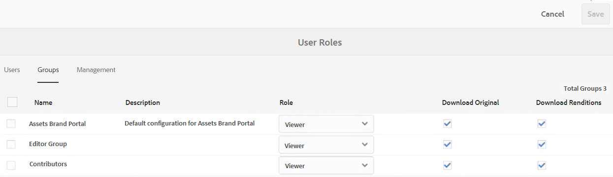

# AEM Assets Brand Portal 的新功能 {#what-s-new-in-aem-assets-brand-portal}

Adobe Experience Manager(AEM)Assets Brand Portal可協助您跨裝置輕鬆取得、控制並安全地將經過核准的創意資產發佈給外部人士和內部業務使用者。 它有助於提高資產共用的效率，加快資產上市時間，並降低不合規和未經授權的訪問風險。 Adobe正致力於改善整體Brand Portal體驗。 以下是新功能和增強功能的潛在概覽。

## 2021.02.0中的變更{#what-changed-in-feb-2021}

Brand Portal 2021.02.0是增強功能版本，在AEM Assets as aCloud Service上導入Brand Portal啟動工作流程、促進AEM Assets as aCloud Service上的Asset Sourcing功能、改善資產下載體驗，並包含重要修正。 此外，管理員也能設定資料夾、集合和租用戶層級資產的預設下載行為。 Brand Portal **[!UICONTROL 使用狀況報表]**&#x200B;也已修改，以反映作用中的Brand Portal使用者。 請參閱最新的[Brand Portal發行說明](brand-portal-release-notes.md)。

### 在AEM Assets上以Cloud Service方式啟用Brand Portal {#bp-automation-on-cloud-service}

AEM Assets as aCloud Service現在有權使用預先設定的Brand Portal執行個體。 Cloud Manager使用者可在AEM Assets上以Cloud Service例項的形式啟用Brand Portal。

過去，AEM Assets as a Cloud Service是使用Adobe開發人員控制台以Brand Portal手動設定。

Cloud Manager使用者會觸發啟用工作流程，在後端建立必要的設定，並在與AEM Assets(作為Cloud Service例項)相同的IMS組織上啟用Brand Portal。

若要在您的AEM Assets上以Cloud Service例項的形式啟用Brand Portal:

1. 登入AdobeCloud Manager並導覽至&#x200B;**[!UICONTROL Environments]**。
1. 從清單中選取環境（逐一）以檢視環境詳細資訊。 找到與Brand Portal相關聯的環境後，按一下&#x200B;**[!UICONTROL 啟動Brand Portal]**&#x200B;按鈕以開始啟動工作流程。
1. 啟動Brand Portal租用戶後，狀態會變更為「已啟動」。

請參閱[在AEM Assets上以Cloud Service形式啟用Brand Portal](https://experienceleague.adobe.com/docs/experience-manager-cloud-service/assets/brand-portal/configure-aem-assets-with-brand-portal.html?lang=en)。

### AEM Assets as aCloud Service上的Asset Sourcing {#asset-sourcing-on-cloud-service}

AEM Assets現在提供「資產來源補充」功能，Cloud Service為。 預設會為所有雲端服務使用者啟用此功能。 獲許的Brand Portal使用者可以上傳新資產至貢獻資料夾，並將貢獻資料夾從Brand Portal發佈至AEM Assets，作為Cloud Service例項，協助資產來源補充。 管理員可以檢閱並核准Brand Portal使用者的貢獻，以進一步將其分發給其他Brand Portal使用者。

過去， Asset Sourcing僅可在AEM Assets上使用（內部部署和托管服務）。

請參閱[Brand Portal中的Asset Sourcing](https://experienceleague.adobe.com/docs/experience-manager-brand-portal/using/asset-sourcing-in-brand-portal/brand-portal-asset-sourcing.html?lang=en)。

### 資產下載 {#asset-download-setting}

除了現有的&#x200B;**[!UICONTROL 下載設定]**,Brand Portal管理員現在還可以設定&#x200B;**[!UICONTROL 資產下載]**&#x200B;設定。 此設定可讓管理員控管資料夾、集合和租用戶層級大量下載資產（超過20個資產）的預設下載行為。

<!--
Earlier, all the asset renditions were directly downloaded in a zip folder in case of folder, collection, and bulk download of assets. As the **[!UICONTROL Download]** dialog is skipped for folders or collections, there was no mechanism to control the downloading behaviour of the assets. Due to this, the users were finding it difficut to search for a particular asset rendition from a folder containing huge bunch of downloaded renditions. 
-->

之前，所有資產轉譯都會直接下載至zip資料夾中。 已針對資料夾和集合略過&#x200B;**[!UICONTROL 下載]**&#x200B;對話方塊，且沒有方法可控制資產的下載行為，因此很難從大量下載中搜尋特定轉譯。

**[!UICONTROL 「資]** 產下載」設定現在提供選項，供您在下載資料夾、集合或大量下載資產時，為每個資產建立個別的資料夾。

如果停用「**[!UICONTROL 資產下載]**」設定，資料夾或集合會下載至zip資料夾，其中包含相同資料夾下的所有資產轉譯，但使用共用連結下載資產除外。

以管理員身分登入您的Brand Portal租用戶，並導覽至&#x200B;**[!UICONTROL Tools]** > **[!UICONTROL Download]**。 管理員可以啟用&#x200B;**[!UICONTROL 資產下載]**&#x200B;設定，在下載資料夾、集合和大量下載資產時，為每個資產建立個別資料夾。

請參閱從Brand Portal](https://experienceleague.adobe.com/docs/experience-manager-brand-portal/using/download/brand-portal-download-assets.html?lang=en)下載資產。[
<!--
### Download using Share link {#download-using-share-link}

The default behavior of downloading the assets using share link is now independent of the **[!UICONTROL Download Settings]**. A separate folder is created for each asset while downloading the assets using share link. 
-->

### 使用狀況報表{#usage-report}

已修改Brand Portal **[!UICONTROL 使用狀況報表]**，僅反映作用中的品牌入口網站使用者。 未指派給Admin Console中任何產品設定檔的Brand Portal使用者會視為非作用中使用者，且不會反映在&#x200B;**[!UICONTROL 使用狀況報表]**&#x200B;中。

過去，使用狀況報表中會顯示使用中和非使用中使用者。

## 2020.10.0中的變更{#what-changed-in-oct-2020}

Brand Portal 2020.10.0是增強功能版本，著重於簡化資產下載體驗，並包含重要修正。 增強功能包括資產下載的全新和改良的工作流程、排除轉譯的其他選項、從&#x200B;**[!UICONTROL 轉譯]**&#x200B;面板直接下載、為特定使用者群組允許存取和下載權限的設定，以及從所有Brand Portal頁面輕鬆導覽至檔案、集合和共用連結。 請參閱最新的[Brand Portal發行說明](brand-portal-release-notes.md)。

### 簡化的下載體驗{#download-dialog}

之前， **[!UICONTROL 下載]**&#x200B;對話方塊會出現多個選項，例如為每個資產、電子郵件資產、選取原始資產、自訂轉譯、動態轉譯、排除系統轉譯，以及啟用下載加速，這些選項在選取多個資產或資料夾時，對非技術或新使用者不明確，尤其是對要下載的多個資產或資料夾時。 此外，使用者無法看見所有資產轉譯或排除特定的自訂或動態轉譯。

新的&#x200B;**[!UICONTROL 下載]**&#x200B;對話方塊可推廣資產選取和篩選程式，讓Brand Portal使用者在下載資產轉譯時更容易做出有效決策。 它會根據[**[!UICONTROL Download]**](brand-portal-download-assets.md)組態和&#x200B;**[!UICONTROL Download]**&#x200B;設定，列出所有選取的資產及其轉譯。

>[!NOTE]
>
>所有使用者現在都會預設啟用&#x200B;**[!UICONTROL Fast Download]**，且在從Brand Portal下載資產之前，須先在其瀏覽器的擴充功能中安裝[IBM Aspera Connect 3.9.9](https://www.ibm.com/support/knowledgecenter/SSXMX3_3.9.9/kc/connect_welcome.html)。

<!--
If any of the **[!UICONTROL Custom Rendition]** or **[!UICONTROL System Rendition]** is enabled in the [**[!UICONTROL Download]**](brand-portal-download-assets.md) configuration and **[!UICONTROL Download]** settings are enabled for the group users, the new **[!UICONTROL Download]** dialog appears with all the renditions of the selected assets or folders containing assets in a list view. 
-->

從&#x200B;**[!UICONTROL Download]**&#x200B;對話框，用戶可以：

* 在下載清單中檢視任何資產的所有可用轉譯項目。
* 排除下載不需要的資產轉譯。
* 只要按一下，即可將相同的轉譯集套用至所有類似的資產類型。
* 針對不同的資產類型套用不同的轉譯集。
* 為每一個資產建立個別的資料夾.
* 下載選取的資產及其轉譯。

獨立資產、多個資產、包含資產的資料夾、授權或未授權資產的下載工作流程保持不變，以及使用共用連結下載資產。 請參閱從Brand Portal](https://docs.adobe.com/content/help/en/experience-manager-brand-portal/using/download/brand-portal-download-assets.html#download-assets)下載資產的步驟。[

### 快速導航{#quick-navigation}

以前，查看&#x200B;**[!UICONTROL 檔案]**、**[!UICONTROL 集合]**&#x200B;和&#x200B;**[!UICONTROL 共用連結]**&#x200B;的選項被隱藏，並且每次用戶要切換到其他視圖時需要多次點擊。

在Brand Portal 2020.10.0中，使用者可使用快速導覽連結，從所有Brand Portal頁面按一下，導覽至&#x200B;**[!UICONTROL 檔案]**、**[!UICONTROL 集合]**&#x200B;和&#x200B;**[!UICONTROL 共用連結]**。

### 增強的轉譯面板{#rendition-panel}

過去，如果&#x200B;**[!UICONTROL Download]**&#x200B;配置中啟用了任何&#x200B;**[!UICONTROL Custom Rendition]**&#x200B;或&#x200B;**[!UICONTROL System Rendition]**，則用戶只能在&#x200B;**[!UICONTROL Renditions]**&#x200B;面板中查看原始資產及其格式副本。 此外，使用者必須下載所有資產轉譯，因為沒有篩選器可排除不需要的特定自訂或動態轉譯。

<!--
Earlier, if any of the custom or system renditions was enabled in the **[!UICONTROL Download]** settings, an additional **[!UICONTROL Download]** dialog appeared on clicking the **[!UICONTROL Download]** button wherein the user had to manually select the set of renditions (original asset, custom renditions, dynamic renditions) to download.
There was no filter to exclude specific custom or dynamic renditions which were not required for download.
-->

在Brand Portal 2020.10.0中，使用者可以排除特定轉譯，並直接[從資產詳細資訊頁面的「轉譯」面板](brand-portal-download-assets.md#download-assets-from-asset-details-page)下載選取的轉譯，而不需開啟&#x200B;**[!UICONTROL 下載]**&#x200B;對話方塊。

<!-- 
In Brand Portal 2020.10.0, direct download and exclude renditions features are introduced in the **[!UICONTROL Renditions]** panel on the asset details page. All the renditions (original asset, custom renditions, dynamic renditions) under the rendition panel are now associated with a check box and are enabled by default. 

The user can clear the check boxes to exclude the renditions which are not required for download. And can click on the **[!UICONTROL Download]** button in the **[!UICONTROL Renditions]** panel to directly download the selected set of renditions in a zip folder without having to open the **[!UICONTROL Download]** dialog.
-->

### 配置下載設定{#download-permissions}

除了現有的&#x200B;**[!UICONTROL 下載]**&#x200B;設定外，Brand Portal管理員也可以設定不同使用者群組的設定，以檢視和（或）從資產詳細資訊頁面下載原始資產及其轉譯。

以管理員身分登入您的Brand Portal租用戶，並導覽至&#x200B;**[!UICONTROL Tools]** > **[!UICONTROL Users]**。

在&#x200B;**[!UICONTROL 使用者角色]**&#x200B;頁面中，導覽至&#x200B;**[!UICONTROL 群組]**&#x200B;標籤，以設定使用者群組的檢視和（或）下載設定。

過去，這些設定只能用於限制群組使用者下載原始資產。

**[!UICONTROL 使用者角色]**&#x200B;頁面上的&#x200B;**[!UICONTROL 群組]**&#x200B;標籤可讓管理員設定檢視和下載設定：

* 如果同時開啟&#x200B;**[!UICONTROL 下載原始]**&#x200B;和&#x200B;**[!UICONTROL 下載轉譯]**&#x200B;設定，則所選群組的使用者可以檢視和下載原始資產及其轉譯。
* 如果兩個設定皆關閉，使用者只能檢視原始資產。 資產詳細資料頁面上的使用者看不到資產轉譯。
* 如果僅開啟&#x200B;**[!UICONTROL 下載原始]**&#x200B;設定，使用者只能從資產詳細資料頁面檢視和下載原始資產。
* 如果只開啟「下載轉譯」]**設定，使用者可以檢視原始資產，但無法下載。**[!UICONTROL &#x200B;不過，使用者可以檢視和下載資產轉譯。

請參閱[設定資產下載](https://docs.adobe.com/content/help/en/experience-manager-brand-portal/using/download/brand-portal-download-assets.html#configure-download-permissions)。

>[!NOTE]
>
>如果將使用者新增至多個群組，且其中一個群組有限制，則限制將套用至使用者。

<!--
>Restrictions to access the original asset and their renditions do not apply to administrators even if they are members of restricted groups.
 >
 >The users can always download assets and their renditions from the repository using a `curl` request even if the download configurations are turned-off.
 >
-->

## 6.4.7 {#what-changed-in-647}中的變更

Brand Portal 6.4.7版導入了檔案檢視器，增強了下載資產的體驗，並包含重要修正。 請參閱最新的[Brand Portal發行說明](brand-portal-release-notes.md)。

<!--
Brand Portal 6.4.7 release brings in the Document Viewer, leverages the Brand Portal administrators to configure asset download, and centers top customer requests. See latest [Brand Portal Release Notes](brand-portal-release-notes.md).
-->

### 文檔查看器{#doc-viewer}

文檔查看器增強了PDF查看體驗。 在Brand Portal中檢視PDF檔案時，提供與Adobe Document Cloud類似的體驗。

之前，檢視PDF檔案的選項有限。

使用Document Viewer,Brand Portal使用者現在可以選擇檢視頁面、檢視書籤、搜尋頁面文字、放大、縮小、導覽至上一頁和下一頁、切換至頁面、調整至視窗、調整至螢幕大小，以及隱藏或取消隱藏工具列。

>[!NOTE]
>
>其他文檔格式的查看體驗保持不變。

### 下載體驗{#download-configurations}

改寫資產下載程式，從Brand Portal[下載資產時，提供簡化的使用者體驗。](brand-portal-download-assets.md)

從Brand Portal下載資產的現有工作流程不可避免地會出現&#x200B;**[!UICONTROL 下載]**&#x200B;對話方塊，其中包含多個要選擇的下載選項。

在Brand Portal 6.4.7中，Brand Portal管理員可以設定資產&#x200B;**[!UICONTROL 下載]**&#x200B;設定。 可用的配置包括：
* **[!UICONTROL 快速下載]**
* **[!UICONTROL 自訂轉譯]**
* **[!UICONTROL 系統轉譯]**

Brand Portal管理員可啟用任何組合以設定資產下載。

<!--In Brand Portal 6.4.7, fast download, custom renditions, and system renditions are the three configurations available.-->

* 如果同時關閉&#x200B;**[!UICONTROL 自訂轉譯]**&#x200B;和&#x200B;**[!UICONTROL 系統轉譯]**&#x200B;設定，則會下載資產的原始轉譯，而不會有任何其他對話方塊，這可簡化Brand Portal使用者的下載體驗。

* 如果啟用了任何&#x200B;**[!UICONTROL 自訂轉譯]**&#x200B;或&#x200B;**[!UICONTROL 系統轉譯]**，則會顯示&#x200B;**[!UICONTROL 下載]**&#x200B;對話方塊，並下載原始資產以及資產轉譯。 啟用&#x200B;**[!UICONTROL 快速下載]**&#x200B;配置可加快下載過程。

根據設定，獨立資產、多個資產、包含資產的資料夾、授權或未授權資產以及使用共用連結下載資產的下載工作流程將維持不變。

## 6.4.6 {#what-changed-in-646}中的變更

在Brand Portal 6.4.6中，AEM Assets與Brand Portal之間的授權通道已變更。 AEM Assets as aCloud Service、AEM Assets 6.3及更新版本現已支援Brand Portal。 在AEM Assets 6.3及更新版本中，Brand Portal先前是透過舊版OAuth閘道在傳統UI中設定，該閘道會使用JWT權杖交換來取得IMS存取權杖以進行授權。 AEM Assets現在可透過「Adobe開發人員控制台」使用Brand Portal進行設定，這會擷取IMS代號，以便授權您的Brand Portal租用戶。

<!-- The steps to configure integration are different depending on your AEM version, and whether you are configuring for the first-time, or upgrading the existing integration:
-->

<!--
  
   | **AEM Version** |**New Integration** |**Upgrade Integration** |
|---|---|---|
| **AEM 6.5** |[Create new integration](../using/brand-portal-configure-integration-65.md) |[Upgrade existing integration](../using/brand-portal-configure-integration-65.md#upgrade-integration-65) | 
| **AEM 6.4** |[Create new integration](../using/brand-portal-configure-integration-64.md) |[Upgrade existing integration](../using/brand-portal-configure-integration-64.md#upgrade-integration-64) | 
| **AEM 6.3** |[Create new integration](../using/brand-portal-configure-integration-63.md) |[Upgrade existing integration](../using/brand-portal-configure-integration-63.md#upgrade-integration-63) | 
| **AEM 6.2** |Contact Support |Contact Support | 

   -->

使用Brand Portal設定AEM Assets的步驟會因您的AEM版本、您是首次設定或升級現有設定而有所不同：

<!--| **AEM Version** |**New Configuration** |**Upgrade Configuration** |
|---|---|---|
| **AEM 6.5 (6.5.4.0 and above)** |[Create configuration](../using/brand-portal-configure-integration-65.md) |[Upgrade configuration](../using/brand-portal-configure-integration-65.md#upgrade-integration-65) | 
| **AEM 6.4 (6.4.8.0 and above)** |[Create configuration](../using/brand-portal-configure-integration-64.md) |[Upgrade configuration](../using/brand-portal-configure-integration-64.md#upgrade-integration-64) | 
| **AEM 6.3 (6.3.3.8 and above)** |[Create configuration](../using/brand-portal-configure-integration-63.md) |[Upgrade configuration](../using/brand-portal-configure-integration-63.md#upgrade-integration-63) | 
| **AEM 6.2** |Contact Support |Contact Support | 
-->

<!-- AEM Assets configuration with Brand Portal on Adobe I/O is supported on:
* AEM 6.5.4.0 and above
* AEM 6.4.8.0 and above
* AEM 6.3.3.8 and above -->

| **AEM版本** | **新配置** | **升級配置** |
|---|---|---|
| **AEM Assets as a Cloud Service** | [建立設定](https://docs.adobe.com/content/help/zh-Hant/experience-manager-cloud-service/assets/brand-portal/configure-aem-assets-with-brand-portal.html) | - |
| **AEM 6.5（6.5.4.0和更新版本）** | [建立設定](https://docs.adobe.com/content/help/zh-Hant/experience-manager-65/assets/brandportal/configure-aem-assets-with-brand-portal.html) | [升級配置](https://docs.adobe.com/content/help/zh-Hant/experience-manager-65/assets/brandportal/configure-aem-assets-with-brand-portal.html#upgrade-integration-65) |
| **AEM 6.4（6.4.8.0和更新版本）** | [建立設定](https://docs.adobe.com/content/help/zh-Hant/experience-manager-64/assets/brandportal/configure-aem-assets-with-brand-portal.html) | [升級配置](https://docs.adobe.com/content/help/zh-Hant/experience-manager-64/assets/brandportal/configure-aem-assets-with-brand-portal.html#upgrade-integration-64) |
| **AEM 6.3（6.3.3.8和更新版本）** | [建立設定](https://helpx.adobe.com/tw/experience-manager/6-3/assets/using/brand-portal-configuring-integration.html) | [升級配置](https://helpx.adobe.com/tw/experience-manager/6-3/assets/using/brand-portal-configuring-integration.html#Upgradeconfiguration) |
| **AEM 6.2** | 聯絡支援 | 聯絡支援 |

>[!NOTE]
>
>建議您將AEM執行個體更新至最新的Service Pack。

請參閱最新的[Brand Portal發行說明](brand-portal-release-notes.md)。

請參閱[Brand Portal常見問題集](brand-portal-faqs.md)。

## 6.4.5 {#what-changed-in-645}中的變更

Brand Portal 6.4.5 發佈了一項功能，此功能主要讓 Brand Portal 使用者 (外部代理商/團隊) 無需存取作者環境，就可將內容上傳至 Brand Portal 並發佈至 AEM Assets。這項功能稱為「Brand Portal中的&#x200B;**[Asset Sourcing」](brand-portal-asset-sourcing.md)**，為使用者提供雙向機制，以便貢獻資產並與分散於全球各地的其他Brand Portal使用者共用資產，進而改善客戶體驗。

### Brand Portal 中的 Asset Sourcing {#asset-sourcing-in-bp}

Asset Sourcing可讓AEM使用者（管理員/非管理員使用者）使用額外的&#x200B;**Asset Contribution**&#x200B;屬性建立新資料夾，確保所建立的新資料夾可供Brand Portal使用者開啟，以便提交資產。 這會自動觸發在新建立的&#x200B;**Contribution**&#x200B;資料夾內建立另外兩個子資料夾（稱為NEW和SHARED）的工作流程。

接著，AEM使用者上傳應新增至貢獻資料夾的資產類型簡介，以及上傳基線資產至&#x200B;**SHARED**&#x200B;資料夾，以確保BP使用者擁有所需的參考資訊，借此定義需求。 然後，管理員可先將新建立的&#x200B;**Contribution**&#x200B;資料夾發佈至Brand Portal，將該貢獻資料夾的作用中Brand Portal使用者存取權授予。

使用者在&#x200B;**NEW**&#x200B;資料夾中新增內容後，就可以將貢獻資料夾發佈回AEM製作環境。 請注意，完成匯入並反映AEM Assets中新發佈的內容可能需要幾分鐘的時間。

此外，所有現有功能均維持不變。 Brand Portal使用者可以從貢獻資料夾以及其他允許的資料夾檢視、搜尋和下載資產。 管理員也可以進一步共用貢獻資料夾、修改屬性，以及新增資產至集合。

>[!NOTE]
>
>AEM 6.5.2.0及更新版本支援Brand Portal中的Asset Sourcing 。
>
>舊版不支援AEM 6.3和AEM 6.4。

### 上傳資產至貢獻資料夾{#upload-assets-in-bp}

擁有適當權限的Brand Portal使用者可以下載資產需求，以了解貢獻的需求，並將包含多個資產的多個資產或資料夾上傳至貢獻資料夾。 不過，請注意，Brand Portal使用者只能將資產上傳至&#x200B;**NEW**&#x200B;子資料夾。 **SHARED**&#x200B;資料夾的用途是分配需求和基線資產。

### 將貢獻資料夾發佈至AEM Assets {#publish-assets-to-aem}

上傳完成至&#x200B;**NEW**&#x200B;資料夾後，Brand Portal使用者就可以將貢獻資料夾發佈回AEM。 匯入及反映AEM Assets中已發佈的內容/資產可能需要幾分鐘的時間。 請參閱[將貢獻資料夾發佈至AEM Assets](brand-portal-publish-contribution-folder-to-aem-assets.md)

## 6.4.4 {#what-changed-in-644}中的變更

Brand Portal 6.4.4 版著重於文字搜尋和主要客戶請求的增強功能。請參閱最新的[Brand Portal發行說明](brand-portal-release-notes.md)。

### 搜尋增強功能

Brand Portal 6.4.4以上版本支援篩選窗格中屬性述詞的部分文字搜尋。 若要允許部分文本搜索，您需要在搜索表單的「屬性謂詞」中啟用&#x200B;**部分搜索**。

請閱讀以深入了解部分文字搜尋和萬用字元搜尋。

#### 部分片語搜索{#partial-phrase-search}

您現在可以在篩選窗格中，僅指定所搜尋片語的一個部分（即一兩個字），以搜尋資產。

**當您**
不確定搜尋的片語中出現的字詞的確切組合時，使用casePartial phrase搜尋會有所幫助。

例如，若您在Brand Portal中的搜尋表單使用「屬性述詞」來進行資產標題的部分搜尋，則指定字詞&#x200B;**camp**&#x200B;會傳回標題片語中包含camp的所有資產。

#### 通配符搜索{#wildcard-search}

Brand Portal允許在搜尋查詢中使用星號(*)，以及搜尋片語中單字的一部分。

**使**
用案例如果您不確定搜尋片語中出現的確切字詞，可以使用萬用字元搜尋來填滿搜尋查詢中的間隙。

例如，如果Brand Portal中的搜尋表單使用「屬性述詞」來部分搜尋資產標題，則指定&#x200B;**climb***&#x200B;會傳回標題片語中所有字詞，且字詞開頭為字元&#x200B;**climb**&#x200B;的資產。

同樣地，指定：

* ***** cambe會傳回所有單詞結尾為字元的資 **** 產，並在標題片語中加上字元。

* ***climb*** 會傳回所有包含字元的資產，並 **** 將其標題片語括住。

>[!NOTE]
>
>選中&#x200B;**部分搜索**&#x200B;複選框時，預設選中&#x200B;**忽略大小寫**。

## 6.4.3 {#what-changed-in}中的變更

Brand Portal 6.4.3版著重於：在Brand Portal存取URL中，除了為組織提供租用戶ID外，還為組織提供替代別名、新的資料夾階層設定、視訊支援增強功能、從AEM製作例項到Brand Portal的排程發佈、作業增強功能，以及符合客戶要求。

### 非管理員的資料夾階層導覽

管理員現在可以設定資料夾在登入時如何顯示給非管理員使用者（編輯者、檢視者和訪客使用者）。 [「啟用資](../using/brand-portal-general-configuration.md) 料夾階層配置」會新 **增至「一般設定」**&#x200B;中的管理工具面板。如果設定為：

* **啟用**&#x200B;後，非管理員使用者將可看到從根資料夾開始的資料夾樹狀結構。因此，會授予他們類似管理員的導覽體驗。
* **停用**&#x200B;時，登錄頁面上只會顯示共用資料夾。

[啟用資料夾階層](../using/brand-portal-general-configuration.md)功能（若已啟用）可協助您區分從不同階層共用之相同名稱的資料夾。 現在，非管理員使用者登入時可以看到共用資料夾的虛擬上層（和上階）資料夾。

共用資料夾在虛擬資料夾中的各目錄內組織。 您可以使用鎖表徵圖識別這些虛擬資料夾。

請注意，虛擬資料夾的預設縮圖是第一個共用資料夾的縮圖影像。

### 在特定資料夾階層或路徑中搜尋

**「搜** 尋表單」導入了路徑瀏覽器述詞，以允許搜尋特定目錄中的資產。路徑瀏覽器的搜索謂詞的預設搜索路徑為`/content/dam/mac/<tenant-id>/`，可通過編輯預設搜索表單來配置該路徑。

* 管理員使用者可使用路徑瀏覽器導覽至Brand Portal上的任何資料夾目錄。
* 非管理員使用者可使用路徑瀏覽器，只導覽至與他們共用的資料夾（並導覽回父資料夾）。

   例如， `/content/dam/mac/<tenant-id>/folderA/folderB/folderC`與非管理員使用者共用。 使用者可使用路徑瀏覽器在folderC內搜尋資產。 此用戶也可以導航到folderB和folderA（因為它們是與用戶共用的folderC的祖先）。

您現在可以限制已瀏覽之特定資料夾中的資產搜尋，而不是從根資料夾開始。

請注意，在這些資料夾下搜尋只會傳回已與使用者共用的資產的結果。

### Dynamic Media影片轉譯支援

AEM製作執行個體位於Dynamic Media混合模式的使用者，除了原始視訊檔案，還可以預覽和下載動態媒體轉譯。

若要允許在特定租用戶帳戶上預覽和下載動態媒體轉譯，管理員需從管理工具面板在&#x200B;**Video**&#x200B;設定中指定&#x200B;**Dynamic Media設定**(視訊服務URL（DM — 閘道URL）和註冊ID以擷取動態視訊)。

Dynamic Media影片可在下列位置預覽：

* 資產詳細資訊頁面
* 資產的卡片檢視
* 連結共用預覽頁面

Dynamic Media視訊編碼可從以下位置下載：

* 品牌入口網站
* 共用連結

### 排程發佈至Brand Portal

可從[AEM(6.4.2.0)](https://helpx.adobe.com/experience-manager/6-4/release-notes/sp-release-notes.html#main-pars_header_9658011)製作例項發佈至Brand Portal的資產（和資料夾）工作流程可排程在之後的日期、時間內執行。

同樣地，您也可以排程從Brand Portal中取消發佈工作流程，在稍後（時間）從入口網站移除已發佈的資產。

### URL中可設定的租用戶別名

組織可在URL中加上替代首碼，以取得自訂的入口網站URL。 若要在現有入口URL中取得租用戶名稱的別名，組織需要聯絡Adobe支援。

請注意，只能自訂Brand Portal URL的首碼，不能自訂整個URL。\
例如，現有網域為&#x200B;**geometrix.brand-portal.adobe.com**&#x200B;的組織可取得依請求建立的&#x200B;**geomettrixinc.brand-portal.adobe.com**。

不過，AEM Author例項只能使用租用戶ID URL來設定，而不能使用租用戶別名（替代）URL。

組織可透過自訂入口網站URL來滿足其品牌需求，而不需堅持由Adobe提供的URL。

### 下載體驗增強功能

此版本提供簡化的下載體驗，並減少點按次數和警告次數，具體如下：

* 選擇僅下載轉譯（而非原始資產）。
* 限制存取原始轉譯時，請下載資產。

## 6.4.6 {#what-changed-in-1}中的變更

Brand Portal 6.4.2版提供多種功能，可滿足組織的資產發佈需求，並協助透過訪客存取和加速下載的最佳體驗，觸及分散於全球各地的大量使用者。 Brand Portal也透過管理員的新設定、新新增的報表，為組織提供更優異的控制力，並能符合客戶要求。

### 訪客存取

AEM Brand Portal可讓訪客存取入口網站。 來賓用戶不需要憑據進入門戶，並且可以訪問和下載所有公共資料夾和集合。 來賓使用者可將資產新增至其燈箱（私人集合）並下載相同的資產。 他們也可以檢視智慧標籤搜尋和搜尋管理員設定的述詞。 來賓工作階段不允許使用者建立集合和儲存的搜尋，或進一步共用，存取資料夾和集合設定，以及以連結形式共用資產。

在組織中，允許多個同時進行的來賓會話，但每個組織的用戶配額總數不得超過10%。

來賓會話保持活動狀態2小時。 因此，燈箱的狀態也會保留至工作階段開始時間兩小時之前。 兩小時後，訪客工作階段必須重新啟動，因此燈箱狀態會遺失。

### 加速下載

Brand Portal使用者可善用IBM Aspera Connect的快速下載功能，將速度提升至25倍，無論其在全球的位置為何，都能享有順暢的下載體驗。 若要從Brand Portal或共用連結更快速下載資產，使用者必須在下載對話方塊中選取&#x200B;**啟用下載加速**&#x200B;選項，前提是組織上已啟用下載加速。

要為組織啟用基於IBM Aspera的加速下載，管理員可從管理工具面板的[一般設定](brand-portal-general-configuration.md#allow-download-acceleration)中&#x200B;**啟用下載加速**&#x200B;選項（預設情況下為禁用）。 若要進一步了解從Brand Portal和共用連結更快速下載資產檔案的必要條件和疑難排解步驟，請參閱[指南，以加速從Brand Portal](../using/accelerated-download.md#main-pars-header)下載。

### 使用者登入報表

推出新報表以追蹤使用者登入。 **使用者登入**&#x200B;報表有助於讓組織稽核及檢查委派的管理員和其他Brand Portal使用者。

在產生報表之前，報表會記錄每個使用者的顯示名稱、電子郵件ID、角色（管理員、檢視器、編輯器、訪客）、群組、上次登入、活動狀態，以及Brand Portal 6.4.2部署中的登入計數。 管理員可將報表匯出為.csv。 除了其他報表，「使用者登入」報表還可讓組織更密切地監控使用者與已核准品牌資源的互動，確保符合企業法規遵循辦公室。

### 存取原始轉譯

管理員可限制使用者存取原始影像檔案(.jpeg、.tiff、.png、.bmp、.gif、.pjpeg、x-portable-anymap、x-portable-bymap、x-portable-graymap、x-portable-pixmap、x-rgb、x-xbitmap、x-xpixmap、x-icon、image/photoshop、.psd、image/vnd.adobe.photoshop)，並允許存取低解析度轉譯，供他們從Brand Portal或共用連結下載。 您可以在使用者群組層級，從管理工具面板的使用者角色頁面的群組標籤控制此存取。

* 依預設，所有使用者都能下載原始轉譯，因為所有使用者都已啟用「存取原始」。
* 管理員需要取消選取個別的核取方塊，以防止一組使用者存取原始轉譯。
* 如果使用者是多個群組的成員，但只有其中一個群組有限制，則限制會套用至該使用者。
* 這些限制不適用於管理員，即使它們是受限制組的成員。
* 以連結方式共用資產的使用者權限，適用於使用共用連結下載資產的使用者。

### 卡片和清單檢視上的資料夾階層路徑

資料夾卡片在「卡片檢視」中，現在會向非管理員使用者（編輯者、檢視者和訪客使用者）顯示資料夾階層資訊。 此功能可讓使用者了解資料夾的位置，以及他們正在存取的父階層。

資料夾階層資訊對於區分名稱類似於從不同資料夾階層共用之其他資料夾的資料夾特別有用。 如果非管理員使用者不知道與他們共用之資產的資料夾結構，則名稱類似的資產/資料夾似乎會令人困惑。

* 個別卡片上顯示的路徑會遭截斷以符合卡片大小。 不過，使用者可將完整路徑視為將游標暫留在截斷路徑上的工具提示。

清單檢視會在欄中顯示資產的資料夾路徑，給所有Brand Portal使用者。

### 檢視資產屬性的概觀選項

Brand Portal為非管理員使用者（編輯者、檢視者、訪客使用者）提供「概觀」選項，以檢視所選資產/資料夾的資產屬性。 「概述」選項會顯示：

1. 在頂端的工具列中選取資產/資料夾。
2. 在下拉式清單中選取「邊欄選取器」。

在選取資產/資料夾時選取「概觀」選項時，使用者可以看到資產建立的標題、路徑和時間。 然而，在資產詳細資料頁面上選取「概述」選項，可讓使用者查看資產的中繼資料。

## 新配置

新增6項新設定供管理員啟用/停用特定租戶的下列功能：

* 允許訪客存取
* 允許使用者要求存取Brand Portal
* 允許管理員從Brand Portal刪除資產
* 允許建立公用集合
* 允許建立公用智慧型集合
* 允許下載加速

上述設定可在管理工具面板的存取和一般設定下取得。

### Adobe I/OUI以設定oAuth整合

Brand Portal 6.4.2以上版本使用Adobe.io [https://legacy-oauth.cloud.adobe.io/](https://legacy-oauth.cloud.adobe.io/)介面來建立JWT應用程式，這可啟用設定oAuth整合以允許AEM Assets與Brand Portal整合。 之前，用於設定OAuth整合的UI托管於`https://marketing.adobe.com/developer/`。 若要深入了解如何整合AEM Assets與Brand Portal，以便將資產和集合發佈至Brand Portal，請參閱[設定AEM Assets與Brand Portal的整合](https://docs.adobe.com/content/help/en/experience-manager-64/assets/brandportal/configure-aem-assets-with-brand-portal.html)。

## 搜尋增強功能

管理員可以使用更新的屬性述詞來使屬性述詞不區分大小寫，該謂詞會檢查「忽略大小寫」。 此選項適用於屬性述詞和多值屬性述詞。\
不過，不區分大小寫的搜尋會相對比屬性述詞的預設搜尋來得慢。 如果搜尋篩選器中有太多不區分大小寫的謂語，搜尋可能會變慢。 因此，建議審慎使用不區分大小寫的搜尋。

## 6.4.1 {#what-changed-in-2}中的變更

Brand Portal 6.4.1為平台升級版本，提供多項新功能和重要增強功能，例如瀏覽、搜尋和效能增強功能，以提供符合客戶需求的體驗。

### 瀏覽增強功能

* 新增內容樹狀結構邊欄，以快速導覽資產階層。

* 引入新的鍵盤快速鍵，例如用於導覽至屬性頁面的&#x200B;_(p)_、用於編輯的&#x200B;_(e)_&#x200B;和用於複製操作的&#x200B;_(ctrl+c)_。
* 改善捲動功能、在卡片和清單檢視中延遲載入體驗，以瀏覽大量資產。
* 增強卡片檢視功能，支援根據檢視設定調整不同大小的卡片。

* 卡片檢視現在會在將游標暫留在日期標籤上方時顯示日期/時間戳記。

* 增強資產快照下具有&#x200B;**更多詳細資料**&#x200B;的欄檢視，可讓您導覽至資產的詳細資料頁面。

* 除了地區設定、資產類型、維度、大小、評等和發佈資訊外，清單檢視現在預設會顯示第一欄中資產的檔案名稱。 新的&#x200B;**檢視設定**&#x200B;可用來設定要在清單檢視中顯示的詳細資料量。

* 改善資產詳細資料體驗，提供使用新導覽按鈕在資產之間來回導覽及檢視資產計數的功能。

* 在資產詳細資訊頁面預覽從AEM上傳之音訊檔案的新功能。
* 資產屬性中提供的新相關資產功能。 與AEM上的其他來源/衍生資產相關且在Brand Portal上發佈的資產，其關係現在會在Brand Portal中保持不變，且連結至屬性頁面上的相關資產。
* 已導入新設定，限制非管理員使用者建立公開集合。 組織可以與Adobe支援團隊合作，在特定帳戶上設定此功能。

### 搜尋增強功能

* 導覽至搜尋項目後，導入的功能可在搜尋結果中回到相同位置，而不需再次執行搜尋查詢。
* 新的「搜尋結果」計數，以顯示已提供的搜尋結果數量。
* 改善「檔案類型搜尋篩選」，與先前的「影像」、「檔案」、「多媒體」選項相比，可根據微調MIME類型（例如.jpg、.png和.psd）篩選搜尋結果。
* 增強集合的搜尋篩選條件，提供精確的時間戳記，而非先前的時間滑桿功能。
* 已導入新的存取類型篩選器，以搜尋公開或非公開的集合。

### 下載最佳化

* 直接下載單一大型檔案，無需建立zip檔案，因此可提高速度和吞吐量。
* 連結共用功能的Zip下載上限已從1GB提高為5GB。

* 使用者現在可以選擇只下載自訂和原始檔案，並防止現成可用的轉譯，同時從Brand Portal或透過共用連結功能下載資產。

### 效能增強功能

* 資產下載速度提升高達100%。
* 對資產的搜尋回應最多改善40%。
* 瀏覽效能提升40%。

**注意**:根據實驗室進行的測試，引用了改進。

### 增強的報告功能

**引入連結共**
用報表導入新報表，提供共用連結的相關資訊。「連結共用」報表會列出在指定時間範圍內與整個組織的內部和外部使用者共用之資產的所有URL。 也會通知連結的共用時間、對象、過期時間。

**已修改進入點以存取「使用量」**
報表「使用量」報表現在已與其他報表整合，且現在可從「資產報表」控制台檢視。若要存取「資產報表」控制台，請從管理工具面板導覽至**建立/管理報表**。

**改善使用者體**
驗Brand Portal上的報表介面已更直覺化，並對組織實施更佳的控制。除了建立各種報表外，管理員現在還可以重新造訪產生的報表，並下載或刪除它們，因為這些報表會儲存在Brand Portal中。

您可以新增或移除預設欄，以自訂所建立的每個報表。 此外，自訂欄可新增至「下載」、「過期」和「發佈」報表，以控制其精細度。

### 改良的管理工具

改善「管理工具」中的「屬性選取器」，適用於「中繼資料」、「搜尋」和「具有預先輸入功能的報表」，以及可簡化管理體驗的瀏覽功能。

### 其他增強功能

* 從AEM 6.3.2.1和6.4發佈至Brand Portal的資產現在可以標示「AEM Assets Brand Portal復寫」對話方塊的「公用資料夾發佈」核取方塊，供Brand Portal的一般使用者公開使用。

* 若有人要求存取Brand Portal，除了Brand Portal通知區的通知外，系統會透過存取要求電子郵件通知管理員。

## 6.3.2 {#what-changed-in-3}中的變更

Brand Portal 6.3.2包含針對熱門客戶要求的全新增強功能，以及一般效能增強功能。

### 要求存取Brand Portal {#request-access-to-brand-portal}

使用者現在可以使用Brand Portal登入畫面上提供的新&#x200B;**需要存取**&#x200B;功能，來要求存取Brand Portal。

根據使用者是否擁有Adobe ID或需要建立Adobe ID，使用者可以遵循適當的工作流程來提交請求。 Brand Portal產品管理員會在其通知區域收到這類要求，並透過Adobe Admin Console授予存取權。

如需詳細資訊，請參閱[要求存取Brand Portal](../using/brand-portal.md#requestaccesstobrandportal)。

### 增強下載的資產報表{#enhancement-in-the-assets-downloaded-report}

下載的資產報表現在包含指定日期和時間範圍內每位使用者的資產下載計數。 使用者可以下載.csv格式的報表，並編譯資料，例如授權資產的總下載計數。

如需詳細資訊，請參閱[建立和管理其他報表](../using/brand-portal-reports.md#createandmanageadditionalreports)中的步驟3和6。

### Brand Portal維護通知{#brand-portal-maintenance-notification}

Brand Portal現在會在未來維護活動前幾天顯示通知橫幅。 範例通知：

如需詳細資訊，請參閱[Brand Portal維護通知](https://helpx.adobe.com/experience-manager/brand-portal/using/brand-portal.html#BrandPortalmaintenancenotification)。

### 增強使用連結共用功能{#enhancement-for-licensed-assets-shared-using-the-link-share-feature}共用的授權資產

使用連結共用功能下載授權資產時，系統現在會提示您同意這些資產的授權合約。

如需詳細資訊，請參閱[以連結形式共用資產中的步驟12。](../using/brand-portal-link-share.md#shareassetsasalink)

### 用戶選擇器增強功能{#user-picker-enhancement}

現在已增強使用者選擇器效能，以符合擁有大量使用者的客戶需求。

### Experience Cloud品牌變更{#experience-cloud-branding-changes}

Brand Portal現已符合新的Adobe Experience Cloud品牌。

## 6.3.1 {#what-changed-in-4}中的變更

Brand Portal 6.3.1包含新的增強功能，旨在讓Brand Portal與AEM一致。

### 升級用戶介面{#upgraded-user-interface}

為了讓Brand Portal的使用者體驗與AEM一致，Adobe正在轉換至Coral 3使用者介面。 這項變更可增強整體可用性，包括導覽和外觀。

#### 增強的導覽體驗{#enhanced-navigational-experience}

* 透過新的Adobe標誌快速存取管理工具：

* 透過覆蓋圖導覽產品：

* 快速導覽至父資料夾：

* 快速搜尋並導覽至所需內容和工具：

### 增強的瀏覽體驗{#enhanced-browsing-experience}

* 新的列視圖以瀏覽嵌套的資料夾：

 

* 在資料夾中的資產清單中，最新上傳的資產會顯示在頂端。

### 增強的搜尋體驗{#enhanced-search-experience}

* 全新搜尋功能有助於在您輸入搜尋關鍵字時，透過自動建議快速存取相關內容、功能或標籤。 所有搜尋功能均提供全方位搜尋功能。

* 您也可以將搜尋篩選器新增至Omni搜尋，以進一步縮小搜尋範圍並加快搜尋速度。

* 新的資產評等型搜尋可讓您搜尋有評等的資產(如果是從AEM Assets發佈)。
* 新的多值搜尋功能可接受含有AND運算子的多個關鍵字，以更快速地探索資產。
* 新的搜尋提升功能可讓您改善搜尋關聯性，讓特定資產顯示在搜尋結果的頂端。
* 新的路徑型搜尋功能可讓您提供巢狀資料夾的路徑，以便搜尋該資料夾中的資產。

#### 新的智慧標籤型搜尋{#new-smart-tags-based-search}

如果具有智慧標籤的影像從AEM Assets發佈至Brand Portal，您可以使用智慧標籤名稱作為搜尋關鍵字，在Brand Portal中搜尋這些影像。 此功能僅適用於檔案。

### 增強的下載體驗{#enhanced-downloading-experience}

下載巢狀資料夾後，您可以保留原始資料夾階層。 巢狀資料夾內的資產可從單一資料夾下載，而非透過個別資料夾。

### 改善效能{#improved-performance}

瀏覽、搜尋和下載功能的增強功能可大幅改善Brand Portal效能。

### 資產的新數位版權管理{#new-digital-rights-management-for-assets}

管理員可以先設定資產的到期日和時間，再共用資產。 資產過期後，檢視者和編輯都可看見資產，但無法下載。 資產過期時，管理員會收到通知。

### 增強資產排序{#enhanced-asset-sorting}

清單檢視中，資料夾中的資產排序不再受限於第一頁上顯示的資產數量。 資料夾中的所有資產都會排序，而不論是否都列在第一頁。

### 增強報告{#reporting-capabilities}

管理員可以建立和管理三種報表類型：下載、過期和發佈的資產。 也提供設定報表欄及將報表匯出為CSV格式的功能。

### 其他 Metadata {#additional-metadata}

Brand Portal 6.3.1引進了其他中繼資料，其與AEM Assets 6.3相同。您可以使用結構編輯器表單控制應顯示在「資產屬性」頁面上的中繼資料。 外部連結共用使用者看不到資產中繼資料，他們只能使用連結共用URL預覽和下載資產。

### 管理員的其他功能{#additional-capabilities-for-administrators}

* 在最終完成對登錄螢幕壁紙的自定義之前，管理員可以預覽更改。

* 管理員新增使用者後，使用者不需要接受邀請即可新增至Brand Portal，就會自動新增。

### AEM Assets 6.3 {#new-publishing-capabilities-in-aem-assets}中的新發佈功能

* AEM管理員可使用AEM 6.3 SP 1-CFP 1(6.3.1.1)，將中繼資料結構從AEM Assets發佈至Brand Portal（將於2017年第4季推出）。

* AEM管理員可使用AEM 6.2 SP1-CFP7和AEM 6.3 SP 1-CFP 1(6.3.1.1)，將所有標籤從AEM Assets發佈至Brand Portal。

* 從AEM Assets，您可以發佈具有標籤的資產和集合，包括智慧標籤。 接著，您就可以使用這些標籤來搜尋這些資產或集合，作為Brand Portal中的搜尋關鍵字。
