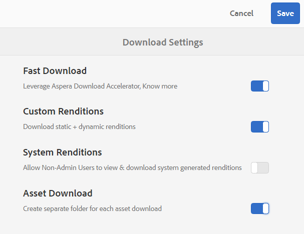

# Experience Manager Assets·Brand Portal有什麼新聞嗎 {#what-s-new-in-aem-assets-brand-portal}

Adobe Experience Manager Assets Brand Portal幫助您輕鬆獲得、控制和安全地將經批准的創意資產分散到外部各方和跨設備的內部業務用戶。 它有助於提高資產共用的效率，加快資產的上市時間，並降低不遵守法規和未經授權的訪問的風險。 Adobe正在努力改善Brand Portal的整體經驗。 以下是新功能和增強功能的潛在概覽。

## 2022.08.0中的更改 {#what-changed-in-August-2022}

Brand Portal2022.08.0包括對關鍵問題的修復。 查看最新 [Brand Portal發行說明](brand-portal-release-notes.md)。

## 2022.05.0中的更改 {#what-changed-in-May-2022}

Brand Portal現在每12小時執行一次自動作業，以刪除發佈到的所有Brand Portal資AEM產。 因此，您不需要手動刪除「貢獻」資料夾中的資產，以使資料夾大小低於閾值限制。 您還可以使用 **[!UICONTROL 工具]** > **[!UICONTROL 資產貢獻狀態]** > **[!UICONTROL 刪除報告]** 頁籤。 作業的報表提供以下詳細資訊：

* 作業開始時間
* 作業結束時間
* 作業狀態
* 作業中包括的總資產
* 作業中已成功刪除的資產總數
* 作業運行後可用的總儲存

您還可以進一步追溯以查看刪除作業中包括的每個資產的詳細資訊。 報表中包括資產標題、大小、作者、刪除狀態和刪除時間等詳細資訊。

此外，Brand Portal2022.05.0還包括對關鍵問題的修復。 查看最新 [Brand Portal發行說明](brand-portal-release-notes.md)。

## 2022.02.0中的更改 {#what-changed-in-Feb-2022}

Brand Portal2022.02.0是一個內部版本，包含對關鍵問題的修復。 查看最新 [Brand Portal發行說明](brand-portal-release-notes.md)。

## 2021.10.0中的更改 {#what-changed-in-october-2021}

Brand Portal2021.10.0是一個內部版本，包含對關鍵問題的修復。 查看最新 [Brand Portal發行說明](brand-portal-release-notes.md)。

## 2021.08.0中的更改 {#what-changed-in-august-2021}

Brand Portal2021.08.0是一個內部版本，為企業和團隊客戶介紹業務概況，以便讓組織更好地控制其資產。 用戶現在對新組織和已遷移組織具有特定於組織的權利。 在遷移期間，所有現有Adobe ID帳戶都遷移到業務ID。

* 遷移所有新組織和現有組織的業務ID。
* 業務ID不需要任何特定設定，如申請域或設定SSO。
* 您可以添加任何電子郵件地址的用戶，包括gmail.com或outlook.com等公共電子郵件域。

**對Brand Portal用戶的影響**

遷移不會影響您的現有資料集、資產、用戶或任何設定。 遷移期間發生的唯一內部更改是您現有組織有權訪問業務配置檔案。

>[!NOTE]
>
>業務配置檔案目前適用於2021年8月16日之後建立的新組織。
>
>在遷移您的組織之前，您可以繼續使用Adobe ID、Enterprise ID或Federated ID類型來訪問組織。

### 參考條目 {#reference-articles}

* [介紹Adobe配置檔案](https://helpx.adobe.com/enterprise/kb/introducing-adobe-profiles.html)

* [管理Adobe配置檔案](https://helpx.adobe.com/enterprise/using/manage-adobe-profiles.html)

* [更新為用戶和管理員的登錄體驗](https://helpx.adobe.com/enterprise/using/storage-for-business.html#new-admin-sign-in-exp)

* [遷移期間登錄限制](https://helpx.adobe.com/enterprise/kb/account-temporarily-unavailable.html)

* [在Admin Console中管理用戶](https://helpx.adobe.com/enterprise/using/manage-users-individually.html)

* [管理企業用戶的產品配置檔案](https://helpx.adobe.com/enterprise/using/manage-product-profiles.html#assign-users)

* [域信任](https://helpx.adobe.com/enterprise/admin-guide.html/enterprise/using/set-up-identity.ug.html#directory-trusting)

<!--   
### Add new users to T2E organization   {#add-users-to-T2E-org}

On adding a new user in Admin Console for a new or migrated T2E organization, the user will have to perform an additional step **Join Team** to get entitled to the T2E organization. 

The user is entitled only if the user chooses to **Join Team**, otherwise the user won't get access to the selected T2E organization in Brand Portal. 

>[!NOTE]
>
>The workflow is not applicable to the existing Brand Portal users.

### Additional screen while navigating to Admin Console   {#navigate-to-admin-console}

The administrators will have to perform an additional step of selecting the T2E organization while navigating from Brand Portal to Admin Console. The workflow applies on the new and migrated T2E organizations.   

Selection of the T2E organization is a one-time activity and is not required everytime the administrator navigates from Brand Portal to Admin Console.

1. Log in to a T2E organization in Brand Portal as administrator.
1. Go to **[!UICONTROL Tools]** > **[!UICONTROL Users]** > **[!UICONTROL Management]** and click on the link **[!UICONTROL Launch Admin Console]**. 

   Or, go to **[!UICONTROL Unified Shell]** > **[!UICONTROL Administration]** and click on the link **[!UICONTROL Launch Admin Console]**. 
1. Search the T2E organization to login to Admin Console.

   

### Restriction during migration of an organization   {#login-restriction}

When an organization is undergoing T2E migration, the users of that organization will not be able to login to Brand Portal. The following error message appears on the screen. However, the migration won't impact the active user session until the token expires. 

Once the migration is complete, the users can login to Brand Portal. The users will receive an email notification containing the entitlement changes. If the users are entitled to more than one organization, they will have to select the organization at the time of login. 
-->

<!--
For a new or migrated T2E orgnization, the users will have an organization specific entitlement. A user can have multiple entitlements with the same email id for different T2E organizations. 
-->

## 2021.06.0中的更改 {#what-changed-in-june-2021}

Brand Portal2021.06.0是一個內部版本，包含對關鍵問題的修復。 查看最新 [Brand Portal發行說明](brand-portal-release-notes.md)。

## 2021.02.0中的更改 {#what-changed-in-feb-2021}

Brand Portal2021.02.0是一個增強版，它引入了AEM Assetsas a Cloud Service的Brand Portal激活工作流程，方便了AEM Assetsas a Cloud Service的資產採購功能，改善了資產下載體驗，並包括了關鍵的修復。 它還使管理員能夠在租戶級別配置資料夾、集合和資產批量下載的預設下載行為。 Brand Portal **[!UICONTROL 使用情況報告]** 已修改以反映活動的Brand Portal用戶。

### 啟用Brand PortalAEM Assetsas a Cloud Service {#bp-automation-on-cloud-service}

AEM Assetsas a Cloud Service現在有權擁有預配置的Brand Portal實例。 Cloud Manager用戶可以在AEM Assetsas a Cloud Service實例上激活Brand Portal。

早些時候，AEM Assetsas a Cloud Service使用Adobe Developer控制台手動配置為Brand Portal。

Cloud Manager用戶觸發激活工作流，該工作流在後端建立所需配置，並在與AEM Assetsas a Cloud Service實例相同的IMS組織上激活Brand Portal。

要在您的AEM Assetsas a Cloud Service實例上激活Brand Portal:

1. 登錄到Adobe雲管理器並導航到 **[!UICONTROL 環境]**。
1. 從清單中選擇環境（逐個）。 找到與Brand Portal關聯的環境後，按一下 **[!UICONTROL 激活Brand Portal]** 按鈕開始激活工作流。
1. 激活Brand Portal租戶後，狀態將更改為「已激活」。

請參閱 [激活Brand PortalAEM Assetsas a Cloud Service](https://experienceleague.adobe.com/docs/experience-manager-cloud-service/assets/brand-portal/configure-aem-assets-with-brand-portal.html)。

### 基於AEM Assetsas a Cloud Service的資產採購 {#asset-sourcing-on-cloud-service}

「資產來源補充」功能現在可在AEM Assetsas a Cloud Service上找到。 預設情況下，該功能為所有雲服務用戶啟用。 允許的Brand Portal用戶可以通過將新資產上載到繳費資料夾並將繳費資料夾從Brand Portal發佈到AEM Assetsas a Cloud Service實例，為資產採購作出貢獻。 管理員可以審查和批准Brand Portal用戶的貢獻，以便將其進一步分發給其他Brand Portal用戶。

早些時候，資產採購僅在AEM Assets提供（內部和托管服務）。

請參閱 [Brand Portal資產來源補充](https://experienceleague.adobe.com/docs/experience-manager-brand-portal/using/asset-sourcing-in-brand-portal/brand-portal-asset-sourcing.html)。

### 資產下載 {#asset-download-setting}

除現有 **[!UICONTROL 下載設定]**,Brand Portal管理員現在可以配置 **[!UICONTROL 資產下載]** 的子菜單。 此設定允許管理員在租戶級別控制資料夾、集合和大量下載資產（20多個資產）的預設下載行為。

<!--
Earlier, all the asset renditions were directly downloaded in a zip folder in case of folder, collection, and bulk download of assets. As the **[!UICONTROL Download]** dialog is skipped for folders or collections, there was no mechanism to control the downloading behaviour of the assets. Due to this, the users were finding it difficut to search for a particular asset rendition from a folder containing huge bunch of downloaded renditions. 
-->

以前，所有資產格式副本都直接下載到zip資料夾中。 的 **[!UICONTROL 下載]** 已跳過資料夾和集合的對話框，並且沒有方法控制資產的下載行為，因此很難從許多下載中搜索特定格式副本。

**[!UICONTROL 資產下載]** 設定現在提供一個選項，用於在下載資產的資料夾、集合或批量下載時為每個資產建立單獨的資料夾。

如果 **[!UICONTROL 資產下載]** 設定被禁用，資料夾或集合將下載到包含同一資料夾下所有資產格式副本的zip資料夾中，但使用共用連結下載資產除外。

以管理員身份登錄到您的Brand Portal租戶並導航到 **[!UICONTROL 工具]** > **[!UICONTROL 下載]**。 管理員可以 **[!UICONTROL 資產下載]** 設定為在下載資料夾、集合和批量下載資產時為每個資產建立單獨的資料夾。

請參閱 [下載Brand Portal資產](https://experienceleague.adobe.com/docs/experience-manager-brand-portal/using/download/brand-portal-download-assets.html)。
<!--
### Download using Share link {#download-using-share-link}

The default behavior of downloading the assets using share link is now independent of the **[!UICONTROL Download Settings]**. A separate folder is created for each asset while downloading the assets using share link. 
-->

### 使用情況報告 {#usage-report}

Brand Portal **[!UICONTROL 使用情況報告]** 已修改，僅反映活動的Brand Portal用戶。 未分配給Admin Console中任何產品配置檔案的Brand Portal用戶被視為非活動用戶，不會反映在 **[!UICONTROL 使用情況報告]**。

以前，使用報告中顯示了活動和非活動用戶。

## 2020.10.0中的更改 {#what-changed-in-oct-2020}

Brand Portal2020.10.0是一個增強版，它側重於簡化資產下載體驗，並包括關鍵的修復。 該增強包括用於資產下載的新的和改進的工作流、用於排除格式副本的其他選項、直接從 **[!UICONTROL 格式副本]** 面板、允許特定用戶組訪問和下載權限的配置，以及從所有Brand Portal頁面輕鬆導航到檔案、集合和共用連結。 查看最新 [Brand Portal發行說明](brand-portal-release-notes.md)。

### 簡化的下載體驗 {#download-dialog}

之前， **[!UICONTROL 下載]** 對話框顯示了多個選項，如為每個資產建立單獨的資料夾、電子郵件資產、選擇原始資產、自定義格式副本、動態格式副本、排除系統格式副本以及啟用下載加速，這些選項在選擇要下載的多個資產或資料夾時對非技術用戶或新用戶不明確。 此外，用戶無法查看所有資產格式副本或排除特定的自定義格式副本或動態格式副本。

新 **[!UICONTROL 下載]** 對話框概括了資產選擇和篩選過程，使Brand Portal用戶在下載資產格式副本時更容易作出有效決策。 它根據 [**[!UICONTROL 下載]**](brand-portal-download-assets.md) 配置和 **[!UICONTROL 下載]** 的子菜單。

>[!NOTE]
>
>現在所有用戶都 **[!UICONTROL 快速下載]** 預設啟用，需要IBMAspera Connect 3.9.9(`https://www.ibm.com/docs/en/aspera-connect/3.9.9`)，然後從Brand Portal下載資產。

<!--
If any of the **[!UICONTROL Custom Rendition]** or **[!UICONTROL System Rendition]** is enabled in the [**[!UICONTROL Download]**](brand-portal-download-assets.md) configuration and **[!UICONTROL Download]** settings are enabled for the group users, the new **[!UICONTROL Download]** dialog appears with all the renditions of the selected assets or folders containing assets in a list view. 
-->

從 **[!UICONTROL 下載]** 對話框，用戶可以：

* 查看下載清單中任何資產的所有可用格式副本。
* 排除下載不需要的資產的格式副本。
* 一次按一下即可將同一組格式副本應用於所有類似的資產類型。
* 為不同資產類型應用不同的格式副本集。
* 為每一個資產建立個別的資料夾.
* 下載所選資產及其格式副本。

對於單機資產、多個資產、包含資產的資料夾、許可或未授權資產，以及使用共用連結下載資產，下載工作流保持不變。 請參閱 [從Brand Portal下載資產的步驟](https://experienceleague.adobe.com/docs/experience-manager-brand-portal/using/download/brand-portal-download-assets.html)。

### 快速導航  {#quick-navigation}

以前，查看 **[!UICONTROL 檔案]**。 **[!UICONTROL 集合]**, **[!UICONTROL 共用連結]** 每次用戶想切換到其他視圖時，都會隱藏並需要多次按一下。

在Brand Portal2020.10.0中，用戶可以導航到 **[!UICONTROL 檔案]**。 **[!UICONTROL 集合]**, **[!UICONTROL 共用連結]** 使用快速導航連結，按一下滑鼠。

### 增強的格式副本面板 {#rendition-panel}

以前，用戶只能在 **[!UICONTROL 格式副本]** 面板 **[!UICONTROL 自定義格式副本]** 或 **[!UICONTROL 系統格式副本]** 在 **[!UICONTROL 下載]** 配置。 此外，用戶必須下載所有資產格式副本，因為沒有篩選器可以排除不需要的特定自定義格式副本或動態格式副本。

<!--
Earlier, if any of the custom or system renditions was enabled in the **[!UICONTROL Download]** settings, an additional **[!UICONTROL Download]** dialog appeared on clicking the **[!UICONTROL Download]** button wherein the user had to manually select the set of renditions (original asset, custom renditions, dynamic renditions) to download.
There was no filter to exclude specific custom or dynamic renditions which were not required for download.
-->

在Brand Portal2020.10.0中，用戶可以排除特定格式副本並直接 [從「格式副本」面板下載選定格式副本](brand-portal-download-assets.md#download-assets-from-asset-details-page) 在資產詳細資訊頁面中，無需開啟 **[!UICONTROL 下載]** 對話框。

<!-- 
In Brand Portal 2020.10.0, direct download and exclude renditions features are introduced in the **[!UICONTROL Renditions]** panel on the asset details page. All the renditions (original asset, custom renditions, dynamic renditions) under the rendition panel are now associated with a check box and are enabled by default. 

The user can clear the check boxes to exclude the renditions which are not required for download. And can click on the **[!UICONTROL Download]** button in the **[!UICONTROL Renditions]** panel to directly download the selected set of renditions in a zip folder without having to open the **[!UICONTROL Download]** dialog.
-->

### 配置下載設定 {#download-permissions}

除現有 **[!UICONTROL 下載]** 配置時，Brand Portal管理員還可以為不同用戶組配置設定，以查看和（或）從資產詳細資訊頁面下載原始資產及其格式副本。

以管理員身份登錄到您的Brand Portal租戶並導航到 **[!UICONTROL 工具]** > **[!UICONTROL 用戶]**。

在 **[!UICONTROL 用戶角色]** 頁，導航到 **[!UICONTROL 組]** 頁籤，以配置用戶組的視圖和（或）下載設定。

以前，這些設定僅用於限制組用戶下載原始資產。

的 **[!UICONTROL 組]** 的 **[!UICONTROL 用戶角色]** 頁允許管理員配置視圖和下載設定：

* 如果兩者都 **[!UICONTROL 下載原始]** 和 **[!UICONTROL 下載格式副本]** 設定已開啟，選定組的用戶可以查看和下載原始資產及其格式副本。
* 如果這兩個設定都被關閉，則用戶只能查看原始資產。 資產格式副本對資產詳細資訊頁面上的用戶不可見。
* 如果 **[!UICONTROL 下載原始]** 設定已開啟，用戶只能從資產詳細資訊頁面查看和下載原始資產。
* 如果 **[!UICONTROL 下載格式副本]** 設定已開啟，用戶可以查看原始資產，但無法下載。 不過，用戶可以查看和下載資產格式副本。

請參閱 [配置資產下載](https://experienceleague.adobe.com/docs/experience-manager-brand-portal/using/download/brand-portal-download-assets.html#configure-download-permissions)。

>[!NOTE]
>
>如果將用戶添加到多個組，並且其中一個組具有限制，則限制將適用於用戶。

<!--
>Restrictions to access the original asset and their renditions do not apply to administrators even if they are members of restricted groups.
 >
 >The users can always download assets and their renditions from the repository using a `curl` request even if the download configurations are turned-off.
 >
-->

## 6.4.7中的更改 {#what-changed-in-647}

Brand Portal6.4.7版引入了文檔查看器，增強了下載資產的體驗，並包括了關鍵的修復。 查看最新 [Brand Portal發行說明](brand-portal-release-notes.md)。

<!--
Brand Portal 6.4.7 release brings in the Document Viewer, leverages the Brand Portal administrators to configure asset download, and centers top customer requests. See latest [Brand Portal Release Notes](brand-portal-release-notes.md).
-->

### 文檔查看器 {#doc-viewer}

文檔查看器增強了PDF查看體驗。 它在查看Brand Portal的PDF檔案時，提供了與Adobe Document Cloud類似的體驗。

以前，有限的選項可用於查看PDF檔案。

使用文檔查看器，Brand Portal用戶現在可以選擇查看頁面、查看書籤、搜索頁面文本、放大、縮小、導航到上一頁和下一頁、切換到頁面、適合窗口、適合螢幕以及隱藏或取消隱藏工具欄。

>[!NOTE]
>
>其他文檔格式的查看體驗保持不變。

### 下載體驗 {#download-configurations}

資產下載流程得到改進，在 [從Brand Portal下載資產](brand-portal-download-assets.md)。

從Brand Portal下載資產的現有工作流，不可避免地會出現  **[!UICONTROL 下載]** 對話框，其中包含多個下載選項可供選擇。

在Brand Portal6.4.7,Brand Portal管理員可以配置資產  **[!UICONTROL 下載]** 的子菜單。 可用配置包括：

* **[!UICONTROL 快速下載]**
* **[!UICONTROL 自訂轉譯]**
* **[!UICONTROL 系統轉譯]**

Brand Portal管理員可以啟用任何組合來配置資產下載。

<!--In Brand Portal 6.4.7, fast download, custom renditions, and system renditions are the three configurations available.-->

* 如果兩者都 **[!UICONTROL 自定義格式副本]** 和 **[!UICONTROL 系統格式副本]** 配置被關閉，資產的原始格式副本被下載而不需要任何其他對話框，這簡化了Brand Portal用戶的下載體驗。

* 如果 **[!UICONTROL 自定義格式副本]** 或 **[!UICONTROL 系統格式副本]** 的 **[!UICONTROL 下載]** 對話框，並下載原始資產以及資產格式副本。 啟用  **[!UICONTROL 快速下載]** 配置加快了下載過程。

根據配置，下載工作流對於獨立資產、多個資產、包含資產的資料夾、許可或未授權資產以及使用共用連結下載資產保持恆定。

## 6.4.6中的更改 {#what-changed-in-646}

在Brand Portal6.4.6,AEM Assets和Brand Portal之間的授權渠道發生了改變。 Brand Portal現在在AEM Assetsas a Cloud Service、AEM Assets6.3及以上版本上受支援。 在AEM Assets6.3及更高版本中，Brand Portal通過舊式OAuth網關在經典UI中進行配置，該網關使用JWT令牌交換來獲取IMS訪問令牌以進行授權。 AEM Assets現在通過Adobe Developer控制台配置Brand Portal，該控制台為您的Brand Portal租戶提供IMS令牌授權。

<!-- The steps to configure integration are different depending on your AEM version, and whether you are configuring for the first-time, or upgrading the existing integration:
-->

<!--
  
   | **AEM Version** |**New Integration** |**Upgrade Integration** |
|---|---|---|
| **AEM 6.5** |[Create new integration](../using/brand-portal-configure-integration-65.md) |[Upgrade existing integration](../using/brand-portal-configure-integration-65.md#upgrade-integration-65) | 
| **AEM 6.4** |[Create new integration](../using/brand-portal-configure-integration-64.md) |[Upgrade existing integration](../using/brand-portal-configure-integration-64.md#upgrade-integration-64) | 
| **AEM 6.3** |[Create new integration](../using/brand-portal-configure-integration-63.md) |[Upgrade existing integration](../using/brand-portal-configure-integration-63.md#upgrade-integration-63) | 
| **AEM 6.2** | | 

   -->

將AEM Assets配置為Brand Portal的步驟AEM因您的版本以及您是首次配置還是升級現有配置而異：

<!--| **AEM Version** |**New Configuration** |**Upgrade Configuration** |
|---|---|---|
| **AEM 6.5 (6.5.4.0 and above)** |[Create configuration](../using/brand-portal-configure-integration-65.md) |[Upgrade configuration](../using/brand-portal-configure-integration-65.md#upgrade-integration-65) | 
| **AEM 6.4 (6.4.8.0 and above)** |[Create configuration](../using/brand-portal-configure-integration-64.md) |[Upgrade configuration](../using/brand-portal-configure-integration-64.md#upgrade-integration-64) | 
| **AEM 6.3 (6.3.3.8 and above)** |[Create configuration](../using/brand-portal-configure-integration-63.md) |[Upgrade configuration](../using/brand-portal-configure-integration-63.md#upgrade-integration-63) | 

-->

<!-- AEM Assets configuration with Brand Portal on Adobe I/O is supported on:
* AEM 6.5.4.0 and above
* AEM 6.4.8.0 and above
* AEM 6.3.3.8 and above -->

| **版AEM本** | **新配置** | **升級配置** |
|---|---|---|
| **AEM Assets as a Cloud Service** | [建立設定](https://experienceleague.adobe.com/docs/experience-manager-cloud-service/assets/brand-portal/configure-aem-assets-with-brand-portal.html) | - |
| **AEM6.5(6.5.4.0及以上)** | [建立設定](https://experienceleague.adobe.com/docs/experience-manager-65/assets/brandportal/configure-aem-assets-with-brand-portal.html) | [升級配置](https://experienceleague.adobe.com/docs/experience-manager-65/assets/brandportal/configure-aem-assets-with-brand-portal.html#upgrade-integration-65) |
| **AEM6.4(6.4.8.0及以上)** | [建立設定](https://experienceleague.adobe.com/docs/experience-manager-64/assets/brandportal/configure-aem-assets-with-brand-portal.html) | [升級配置](https://experienceleague.adobe.com/docs/experience-manager-64/assets/brandportal/configure-aem-assets-with-brand-portal.html#upgrade-integration-64) |
| **AEM6.3(6.3.3.8及以上)** | [建立設定](https://helpx.adobe.com/tw/experience-manager/6-3/assets/using/brand-portal-configuring-integration.html) | [升級配置](https://helpx.adobe.com/tw/experience-manager/6-3/assets/using/brand-portal-configuring-integration.html#Upgradeconfiguration) |
| **AEM 6.2** | 聯繫客戶支援 | 聯繫客戶支援 |

>[!NOTE]
>
>建議將實例更新AEM為最新的Service Pack。

查看最新 [Brand Portal發行說明](brand-portal-release-notes.md)。

請參閱 [Brand Portal常見問題](brand-portal-faqs.md)。

## 6.4.5中的更改 {#what-changed-in-645}

Brand Portal 6.4.5 發佈了一項功能，此功能主要讓 Brand Portal 使用者 (外部代理商/團隊) 無需存取作者環境，就可將內容上傳至 Brand Portal 並發佈至 AEM Assets。此功能稱為 **[Brand Portal資產來源補充](brand-portal-asset-sourcing.md)**&#x200B;以及通過為用戶提供雙向機制來與全球分佈的其他Brand Portal用戶共同貢獻和共用資產來改善客戶體驗。

### Brand Portal 中的 Asset Sourcing {#asset-sourcing-in-bp}

資產來源AEM補充允許用戶（管理員/非管理員用戶）建立額外資料夾 **資產貢獻** 屬性，確保新資料夾可由Brand Portal用戶提交資產。 它會自動觸發一個工作流，該工作流在新建立的子資料夾中建立兩個附加子資料夾，稱為NEW和SHARED **貢獻** 的子菜單。

然後AEM，用戶通過將關於應添加到貢獻資料夾的資產類型的簡要說明和將基線資產上載到 **共用** 資料夾，確保Brand Portal用戶擁有所需的參考資訊。 然後，管理員可以在發佈新建立的稿件之前，授予活動的Brand Portal用戶對稿件資料夾的訪問權 **貢獻** 資料夾到Brand Portal。

用戶完成在 **新建** 資料夾，它們可以將貢獻資料夾發佈回AEM作者環境。 請注意，完成導入並反映AEM Assets內新發佈的內容可能需要幾分鐘時間。

此外，所有現有功能都保持不變。 Brand Portal用戶可以從貢獻資料夾和其他允許的資料夾中查看、搜索和下載資產。 管理員可以進一步共用稿件資料夾、修改屬性和向集合添加資產。

>[!NOTE]
>
>Brand Portal的資產來源AEM6.5.2.0及以上版本。
>
>早期版本 — AEM 6.3和AEM 6.4不支援此功能。

### 將資產上載到貢獻資料夾 {#upload-assets-in-bp}

具有適當權限的Brand Portal用戶可以將包含多個資產的單個資產或資料夾（.zip檔案）上載到貢獻資料夾。 用戶可以將多個資產上載到資產貢獻資料夾。 但是，一次只能建立一個資料夾。

Brand Portal用戶只能將資產上傳到 **新建** 子資料夾。 的 **共用** 資料夾用於分配需求和基準資產。

### 將稿資料夾發佈到AEM Assets {#publish-assets-to-aem}

上載完成後， **新建** 資料夾，Brand Portal用戶可將貢獻資料夾發回AEM。 導入和反映AEM Assets已發佈的內容/資產可能需要幾分鐘。 請參閱 [將貢獻資料夾發佈到AEM Assets](brand-portal-publish-contribution-folder-to-aem-assets.md)。

## 6.4.4中的更改 {#what-changed-in-644}

Brand Portal 6.4.4 版著重於文字搜尋和主要客戶請求的增強功能。查看最新 [Brand Portal發行說明](brand-portal-release-notes.md)。

### 搜索增強

Brand Portal6.4.4以後支援對篩選窗格中的屬性謂詞進行部分文本搜索。 要允許部分文本搜索，必須啟用 **部分搜索** 在搜索窗體中的屬性謂詞中。

閱讀以瞭解有關部分文本搜索和通配符搜索的詳細資訊。

#### 部分短語搜索 {#partial-phrase-search}

現在，您可以通過在篩選窗格中僅指定搜索短語的一個部分來搜索資產。

**用例**
如果您不確定搜索的短語中出現的單詞的確切組合，則部分短語搜索會有所幫助。

例如，如果您在Brand Portal的搜索表單使用屬性謂詞對資產標題進行部分搜索，則指定術語 **營地** 返回標題短語中帶有單詞camp的所有資產。

#### 通配符搜索 {#wildcard-search}

Brand Portal允許使用星號(&#42;)，以及搜索短語中的詞的一部分。

**用例。 如果您不確定搜索短語中出現的確切詞語，則可以使用通配符搜索來填補搜索查詢中的空白。

例如，指定 **爬&#42;** 返回所有具有以字元開頭的單詞的資產 **爬** 如果Brand Portal的搜索表單使用屬性謂詞對資產標題進行部分搜索，則在其標題短語中顯示。

同樣，指定：

* **&#42;爬** 返回所有以字元結尾的字詞的資產 **爬** 在他們的頭銜短語中。

* **&#42;爬&#42;** 返回包含字元的所有字的資產 **爬** 在他們的頭銜短語中。

>[!NOTE]
>
>選擇 **部分搜索** 複選框， **忽略大小寫** 的下界。

## 6.4.3中的更改 {#what-changed-in}

Brand Portal6.4.3版的重點是 — 除了在Brand Portal的租戶ID訪問URL外，為組織提供備用別名，新的資料夾層次結構配置，視頻支援增強，從AEM作者實例到Brand Portal的計畫發佈，操作增強 — 並滿足客戶要求。

### 非管理員的資料夾層次結構導航

管理員現在可以配置在登錄時向非管理員用戶（編輯器、查看器和來賓用戶）顯示資料夾的方式。 [啟用資料夾層次結構](../using/brand-portal-general-configuration.md) 配置已添加到 **常規設定**，在管理工具面板中。 如果配置為：

* **啟用**，從根資料夾開始的資料夾樹對非管理員用戶可見。 因此，為他們提供類似於管理員的導航體驗。
* **禁用**，登錄頁上只顯示共用資料夾。

的 [啟用資料夾層次結構](../using/brand-portal-general-configuration.md) 功能（啟用後）有助於區分具有不同層次共用的相同名稱的資料夾。 登錄時，非管理員用戶現在可以查看共用資料夾的虛擬父資料夾（和上級資料夾）。

共用資料夾在虛擬資料夾中的各個目錄內組織。 您可以使用鎖定表徵圖識別這些虛擬資料夾。

虛擬資料夾的預設縮略圖是第一個共用資料夾的縮略圖。

### 在特定資料夾層次結構或路徑中搜索

**路徑瀏覽器** 謂詞將引入「搜索表單」中，以允許在特定目錄中搜索資產。 路徑瀏覽器的搜索謂詞的預設搜索路徑為 `/content/dam/mac/<tenant-id>/`，可通過編輯預設搜索表單來配置。

* 管理員用戶可以使用路徑瀏覽器導航到Brand Portal上的任何資料夾目錄。
* 非管理員用戶可以使用路徑瀏覽器僅導航到與他們共用的資料夾（並導航回父資料夾）。

   比如說， `/content/dam/mac/<tenant-id>/folderA/folderB/folderC` 與非管理員用戶共用。 用戶可以使用路徑瀏覽器在folderC內搜索資產。 此用戶還可以導航到folderB和folderA（因為它們是與用戶共用的folderC的祖先）。

現在，您可以限制在已瀏覽到的特定資料夾內進行資產搜索，而不是從根資料夾開始。

在這些資料夾下搜索僅返回與用戶共用的資產的結果。

### Dynamic Media視頻格式副本支援

AEM Author實例處於Dynamic Media混合模式的用戶除了可以預覽原始視頻檔案外，還可以預覽和下載動態媒體格式副本。

要允許在特定租戶帳戶上預覽和下載動態媒體格式副本，管理員必須指定 **Dynamic Media配置** (視頻服務URL(DM-Gateway URL)和註冊ID，以獲取動態視頻) **視頻** 「管理工具」面板中的配置。

Dynamic Media視頻可以在以下位置預覽：

* 資產詳細資訊頁
* 資產的卡視圖
* 連結共用預覽頁

Dynamic Media視頻編碼可從以下網址下載：

* Brand Portal
* 共用連結

### 計畫發佈到Brand Portal

資產（和資料夾）發佈工作流 [AEM(6.4.2.0)](https://experienceleague.adobe.com/docs/experience-manager-64/release-notes/sp-release-notes.html) 可以安排到Brand Portal的作者實例的日期、時間。

同樣，可以稍後通過安排「從Brand Portal取消發佈」工作流從門戶中刪除已發佈的資產。

### URL中的可配置租戶別名

組織可以通過在URL中設定備用前置詞來自定義其門戶URL。 要獲取其現有門戶URL中租戶名稱的別名，組織必須聯繫客戶支援。

只能自定義Brand PortalURL的前置詞，而不能自定義整個URL。\
例如，具有現有域的組織 **幾何矩陣.brand-portal.adobe.com** 能 **geometrixinc.brand-portal.adobe.com** 已根據請求建立。

但是，AEM作者實例可以 [配置](https://experienceleague.adobe.com/docs/experience-manager-65/assets/brandportal/configure-aem-assets-with-brand-portal.html) 僅具有租戶ID URL，而不具有租戶別名（備用）URL。

組織可以通過自定義門戶URL來滿足其品牌需求，而不是堅持Adobe提供的URL。

### 下載體驗增強

該版本通過減少點擊次數和警告，提供簡化的下載體驗，具體內容如下：

* 選擇只下載格式副本（而不是原始資產）。
* 當訪問原始格式副本受到限制時下載資產。

## 6.4.2中的更改 {#what-changed-in-1}

Brand Portal6.4.2發行版提供了一系列功能，可滿足組織的資產分配需求，並幫助他們通過來賓訪問和通過加快下載獲得最佳體驗，與分佈在全球的許多用戶取得聯繫。 Brand Portal還通過為管理員提供新配置、新增報告以及滿足客戶要求，為組織提供更大的控制。

### 訪客存取

AEM品牌門戶允許來賓訪問門戶。 來賓用戶不需要憑據即可進入門戶，並且可以訪問和下載所有公共資料夾和集合。 來賓用戶可以將資產添加到其燈箱（私有集合）並下載相同的資產。 它們還可以查看管理員設定的智慧標籤搜索和搜索謂詞。 來賓會話不允許用戶建立集合和保存的搜索或進一步共用它們、訪問資料夾和集合設定以及將資產作為連結共用。

在組織中，允許多個併發來賓會話，該會話限制為每個組織用戶配額總數的10%。

來賓會話保持活動狀態兩小時。 因此，該燈箱的狀態也會保留到會話開始時間後兩小時。 兩小時後，來賓會話必須重新啟動，因此光盒狀態將丟失。

### 加速下載

Brand Portal用戶可以應用基於IBMAspera Connect的快速下載，使速度提高25倍，無論他們在全球的位置如何，都能享受無縫的下載體驗。 要更快地從Brand Portal或共用連結下載資產，用戶需要選擇 **啟用下載加速** 選項，前提是已在其組織上啟用下載加速。

為使IBM·阿斯佩拉能夠加快組織下載，管理員 **啟用下載加速** 選項（預設情況下禁用） [常規設定](brand-portal-general-configuration.md#allow-download-acceleration) 的子菜單。 要瞭解有關從Brand Portal和共用連結更快下載資產檔案的先決條件和故障排除步驟的詳細資訊，請參閱 [加速從Brand Portal下載的指南](../using/accelerated-download.md#main-pars-header)。

### 用戶登錄報告

已引入一個新報告來跟蹤用戶登錄。 的 **用戶登錄** 報告有助於使各組織能夠審計和檢查Brand Portal的委派管理員和其他用戶。

報告記錄從Brand Portal6.4.2部署到生成報告之前的每個用戶的顯示名稱、電子郵件ID、personas(admin、viewer、editor、guest)、組、上次登錄、活動狀態和登錄計數。 管理員可以將報告導出為.csv。 除了其他報告外，「用戶登錄」報告還使組織能夠更密切地監視用戶與已批准品牌資源的交互，從而確保符合公司法規遵從性辦公室的要求。

### 訪問原始格式副本

管理員可以限制用戶訪問原始影像檔案(.jpeg、.tiff、.png、.bmp、.gif、.pjpeg、x-portable-anymap、x-portable-graymap、x-portable-map、x-rgb、x-xbitmap、x-icon、image/photoshop、image/x-photoshop、.pshop、image/vnd.adobe.photoshop)，並允許訪問低解析度從Brand Portal或共用連結下載的格式副本。 此訪問可以在管理員工具面板的「用戶角色」頁的「組」頁籤的用戶組級別進行控制。

* 預設情況下，所有用戶都能夠下載原始格式副本，因為「訪問原始」已為所有用戶啟用。
* 管理員需要取消選擇相應的複選框以防止一組用戶訪問原始格式副本。
* 如果用戶是多個組的成員，但其中只有一個組具有限制，則限制將適用於該用戶。
* 這些限制不適用於管理員，即使它們是受限組的成員。
* 將用戶共用資產作為連結的權限應用於使用共用連結下載資產的用戶。

### 「卡」和「清單」視圖上的資料夾層次結構路徑

資料夾卡現在在「卡視圖」中向非管理員用戶（編輯器、查看器和來賓用戶）顯示資料夾層次結構資訊。 此功能使用戶能夠瞭解資料夾的位置，以及他們訪問的與父層次結構相關的資料夾。

資料夾層次結構資訊對於區分具有與從不同資料夾層次結構共用的其他資料夾相似名稱的資料夾特別有用。 如果非管理員用戶不知道與他們共用的資產的資料夾結構，則名稱相似的資產/資料夾似乎令人困惑。

* 截斷各個卡上顯示的路徑以適合卡大小。 但是，用戶可以將完整路徑視為懸停在截斷路徑上的工具提示。

「清單視圖」顯示列中所有Brand Portal用戶的資產的資料夾路徑。

### 查看資產屬性的概覽選項

Brand Portal為非管理員用戶（編輯器、查看器、來賓用戶）提供「概述」選項，以查看選定資產/資料夾的資產屬性。 「概述」(Overview)選項可見：

1. 在頂部的工具欄中，選擇資產/資料夾。
2. 在下拉清單中，選擇「Rail Selector（滑軌選擇器）」。

在選擇資產/資料夾時選擇「概覽」選項時，用戶可以查看資產建立的標題、路徑和時間。 但是，在資產詳細資訊頁面上，選擇「概覽」選項允許用戶查看資產的元資料。

## 新配置

為管理員添加了六種新配置，以在特定租戶上啟用/禁用以下功能：

* 允許訪客存取
* 允許用戶請求訪問Brand Portal
* 允許管理員從Brand Portal刪除資產
* 允許建立公共集合
* 允許建立公共智慧集合
* 允許下載加速

以上配置在管理工具面板的「訪問」和「常規」設定下可用。

### Adobe I/OUI以配置oAuth整合

Brand Portal6.4.2以後使用舊式OAuth(`https://legacy-oauth.cloud.adobe.io/`)介面，用於建立JWT應用程式，該應用程式可配置oAuth整合以允許AEM Assets與Brand Portal整合。 以前，用於配置OAuth整合的UI托管在 `https://marketing.adobe.com/developer/`。 要瞭解有關將AEM Assets與Brand Portal整合以向Brand Portal發佈資產和收藏的更多資訊，請參閱 [配置AEM Assets與Brand Portal的整合](https://experienceleague.adobe.com/docs/experience-manager-64/assets/brandportal/configure-aem-assets-with-brand-portal.html)。

## 搜索增強

管理員可以使用更新的屬性謂詞使屬性謂詞不區分大小寫，該屬性謂詞已選中「忽略大小寫」。 此選項可用於屬性謂詞和多值屬性謂詞。\
但是，非區分大小寫的搜索比屬性謂詞的預設搜索要慢。 如果搜索篩選器中的非區分大小寫謂語過多，則搜索可能會減慢。 因此，建議審慎地使用非案件敏感搜索。

## 6.4.1中的更改 {#what-changed-in-2}

Brand Portal6.4.1是一個平台升級版本，它帶來了幾項新功能和重要功能增強，如瀏覽、搜索和效能增強，以提供令人滿意的客戶體驗。

### 瀏覽增強

* 新建內容樹導軌可快速導航資產層次結構。

* 例如，介紹了新的鍵盤快捷鍵 _(p)_ 用於導航到屬性頁面， _(e)_ 編輯，和 _(ctrl+c)_ 複製操作。
* 改進了在卡和清單視圖中滾動、緩慢載入體驗，以瀏覽大量資產。
* 增強的卡視圖，支援根據視圖設定大小不同的卡。

* 卡視圖現在顯示懸停在日期標籤上方的日期/時間戳。

* 增強的列視圖 **詳細資訊** 在資產快照下，您可以導航到資產的詳細資訊頁面。

* 現在，除了區域設定、資產類型、維、大小、評級和發佈資訊外，清單視圖預設顯示第一列中資產的檔案名。 新建 **查看設定** 可用於配置要在「清單」視圖中顯示的詳細資訊量。

* 通過使用新的導航按鈕在資產之間來回導航和查看資產計數，改進了資產詳細資訊體驗。

* 在資產詳細資訊頁面中預覽AEM從上傳的音頻檔案的新功能。
* 在資產屬性中提供的新相關資產功能。 與Brand Portal上的其他來源/衍生資產AEM相關並在上發佈的資產現在在Brand Portal保持其關係，並在「屬性」頁面上與相關資產連結。
* 已引入新配置，以限制非管理員用戶建立公共集合。 組織可以與客戶支援團隊合作，在特定帳戶上配置此功能。

### 搜索增強

* 引入的功能是在導航到搜索項後返回搜索結果中的相同位置，而不再運行搜索查詢。
* 已提供顯示搜索結果數的新搜索結果計數。
* 改進的檔案類型搜索篩選器，與早期的「影像」、「文檔」、「多媒體」選項相比，能夠根據細粒度的MIME類型(如.jpg、.png和.psd)篩選搜索結果。
* 增強的集合搜索篩選器，具有準確的時間戳而不是以前的時間滑塊功能。
* 已引入新的「訪問」類型篩選器以搜索「公共」或「非公共」的集合。

### 下載優化

* 直接下載單個大檔案，而不建立zip檔案，從而提高了速度和吞吐量。
* 連結共用功能的每個檔案大小的下載限制為 **1** GB

* 用戶現在可以選擇只下載自定義和原始檔案，並防止現成格式副本，同時從Brand Portal或通過共用連結功能下載資產。

### 效能增強

* 資產下載速度提高100%。
* 對資產的搜索響應提高40%。
* 瀏覽效能提高40%。

**注釋**:根據實驗室的test，提出了改進。

### 增強的報告功能

**引入的連結共用報告**
介紹了一份新報告，提供有關共用連結的資訊。 「連結共用」報告將列出在指定時間範圍內與組織內部和外部用戶共用的資產的所有URL。 它還會通知連結何時共用、由誰共用以及何時過期。

**已修改入口點以訪問「Usage」報告**
使用情況報告現在與其他報告合併，現在可以從資產報告控制台查看。 要訪問資產報表控制台，請導航至 **建立/管理報告** 從「管理工具」面板。

**改進了報告用戶體驗**
Brand Portal的報告介面變得更加直觀，對組織的控制也更加強大。 除了建立各種報告外，管理員現在還可以重新訪問生成的報告並下載或刪除它們，因為這些報告保存在Brand Portal。

通過添加或刪除預設列，可以自定義每個正在建立的報告。 此外，可以將自定義列添加到「下載」、「到期」和「發佈」報告，以控制其粒度。

### 改進的管理工具

改進了管理工具中的屬性選取器，用於元資料、搜索和報告，具有超前類型和瀏覽功能，可簡化管理體驗。

### 其他增強功能

* 現在，從AEM6.3.2.1和6.4發佈到Brand Portal的資產可以通過標籤「AEM Assets Brand Portal複製」對話框上的「公用資料夾發佈」複選框向Brand Portal的普通用戶公開。

* 如果有人請求訪問Brand Portal，則管理員將通過訪問請求電子郵件(Brand Portal通知區中的通知除外)獲得通知。

## 6.3.2中的更改 {#what-changed-in-3}

Brand Portal6.3.2包括針對頂級客戶要求和一般效能增強的新增和增強功能。

### 請求訪問Brand Portal {#request-access-to-brand-portal}

用戶現在可以使用新的 **需要訪問** 功能可在Brand Portal的登錄螢幕上找到。

根據用戶是否擁有Adobe ID或是否需要建立Adobe ID，用戶可以遵循相應的工作流提交請求。 Brand Portal產品管理員在其通知區域收到此類請求並通過Adobe Admin Console授予訪問權。

有關詳細資訊，請參見 [請求訪問Brand Portal](../using/brand-portal.md#requestaccesstobrandportal)。

### 增強下載的資產報告 {#enhancement-in-the-assets-downloaded-report}

資產下載報告現在包括指定日期和時間範圍內每個用戶的資產下載計數。 用戶可以以.csv格式下載此報告並編譯資料，如許可資產的總下載計數。

有關詳細資訊，請參閱中的步驟3和6 [建立和管理其他報告](../using/brand-portal-reports.md#createandmanageadditionalreports)。

### Brand Portal維護通知 {#brand-portal-maintenance-notification}

Brand Portal現在在即將進行的維護活動前幾天顯示通知標題。 示例通知：

有關詳細資訊，請參見 [Brand Portal維護通知](https://experienceleague.adobe.com/docs/experience-manager-brand-portal/using/introduction/brand-portal.html)。

### 使用連結共用功能共用的授權資產的增強 {#enhancement-for-licensed-assets-shared-using-the-link-share-feature}

使用連結共用功能下載許可資產時，系統現在會提示您同意這些資產的許可協定。

有關詳細資訊，請參閱中的步驟12 [將資產作為連結共用](../using/brand-portal-link-share.md#shareassetsasalink)。

### 用戶選取器增強 {#user-picker-enhancement}

用戶選取器效能現在得到增強，以滿足擁有大量用戶群的客戶的需求。

### 體驗雲品牌更改 {#experience-cloud-branding-changes}

Brand Portal現在與Adobe Experience Cloud新品牌保持一致。

## 6.3.1中的更改 {#what-changed-in-4}

Brand Portal6.3.1包含新的和增強的功能，旨在使Brand Portal與AEM一致。

### 升級的用戶介面 {#upgraded-user-interface}

為了使Brand Portal的用戶體驗與AEM其一致，Adobe正在過渡到Coral 3用戶介面。 此更改增強了總體可用性，包括導航和外觀。

#### 增強的導航體驗 {#enhanced-navigational-experience}

* 通過新的Adobe徽標快速訪問管理工具：

* 通過覆蓋進行產品導航：

* 快速導航到父資料夾：

* 快速搜索並導航到所需的內容和工具：

### 增強的瀏覽體驗 {#enhanced-browsing-experience}

* 瀏覽嵌套資料夾的新列視圖：

 

* 在資料夾中的資產清單中，上載的最新資產顯示在頂部。

### 增強的搜索體驗 {#enhanced-search-experience}

* 在鍵入搜索關鍵字時，新的Omni搜索功能可通過自動建議快速訪問相關內容、功能或標籤。 Omni搜索可用於所有搜索功能。

* 您還可以將搜索過濾器添加到Omni搜索，以進一步縮小搜索範圍並加快搜索速度。

* 新的基於資產評級的搜索允許您搜索具有評級的資產(如果是從AEM Assets發佈的)。
* 新的多值搜索功能使用AND運算子接受多個關鍵字以更快地發現資產。
* 新的搜索增強功能使您能夠提高搜索相關性，以便特定資產顯示在搜索結果的頂部。
* 新的基於路徑的搜索功能允許您提供到嵌套資料夾的路徑，以便能夠搜索該資料夾中的資產。

#### 基於智慧標籤的新搜索 {#new-smart-tags-based-search}

如果具有智慧標籤的影像從AEM Assets發佈到Brand Portal，您可以使用智慧標籤名稱作為搜索關鍵字在Brand Portal搜索這些影像。 此功能僅對檔案可用。

### 增強的下載體驗 {#enhanced-downloading-experience}

下載嵌套資料夾後，可以保留原始資料夾層次結構。 嵌套資料夾內的資產可在單個資料夾中下載，而不是單獨的資料夾。

### 改進的效能 {#improved-performance}

瀏覽、搜索和下載功能方面的增強功能可顯著提高Brand Portal的效能。

### 新的資產數字版權管理 {#new-digital-rights-management-for-assets}

管理員可以在共用資產之前設定資產的到期日期和時間。 資產過期後，查看者和編輯可以看到它，但無法下載。 當資產過期時，管理員會收到通知。

### 增強的資產排序 {#enhanced-asset-sorting}

清單視圖中資料夾中的資產排序不再限制在第一頁上顯示的資產數量。 資料夾中的所有資產都會排序，而不管是否都列在第一頁。

### 增強的報告 {#reporting-capabilities}

管理員可以建立和管理三種類型的報告 — 下載、過期和發佈的資產。 還可以配置報告中的列，並將報告導出為CSV格式。

### 其他 Metadata {#additional-metadata}

Brand Portal6.3.1引入了與AEM Assets6.3相同的額外元資料。可以使用「架構編輯器」表單控制應在「資產屬性」頁上可見的元資料。 資產元資料對外部連結共用用戶不可見，他們只能使用連結共用URL預覽和下載資產。

### 管理員的其他功能 {#additional-capabilities-for-administrators}

* 在完成登錄螢幕牆紙的自定義設定之前，管理員可以預覽更改。

* 管理員添加新用戶後，無需接受邀請即可添加到Brand Portal，將自動添加。

### AEM Assets6.3的新出版能力 {#new-publishing-capabilities-in-aem-assets}

* 管AEM理員可以使用AEM6.3 SP 1-CFP 1(6.3.1.1)將元資料模式從AEM Assets發佈到Brand Portal。

* 管AEM理員可以使用AEM6.2 SP1-CFP7和AEM6.3 SP 1-CFP 1(6.3.1.1)發佈從AEM Assets到Brand Portal的所有標籤。

* 在AEM Assets，您可以發佈具有標籤的資產和集合，包括智慧標籤。 然後，您可以使用這些標籤作為搜索關鍵字在Brand Portal搜索這些資產或集合。
