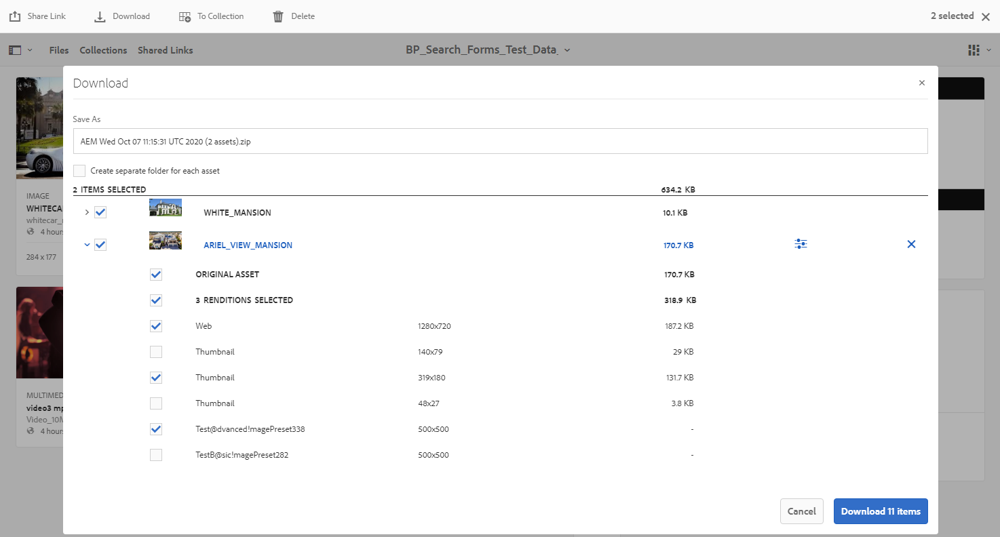

# Experience Manager Assets Brand Portal的新增功能 {#what-s-new-in-aem-assets-brand-portal}

Adobe Experience Manager Assets Brand Portal可協助您跨裝置輕鬆取得、控制及安全地將經過核准的創意資產發佈給外部人士和內部業務使用者。 它有助於提高資產共用的效率，加快資產上市時間，並降低不合規和未經授權的訪問風險。 Adobe正致力於改善整體Brand Portal體驗。 以下是新功能和增強功能的潛在概覽。

## 2022.10.0中的變化 {#what-changed-in-October-2022}

Brand Portal 2022.10.0包含重大問題的修正。 查看最新 [Brand Portal發行說明](brand-portal-release-notes.md).

## 2022.08.0中的變化 {#what-changed-in-August-2022}

Brand Portal 2022.08.0包含重大問題的修正。 查看最新 [Brand Portal發行說明](brand-portal-release-notes.md).

## 2022.05.0中的變化 {#what-changed-in-May-2022}

Brand Portal現在會每十二小時執行自動作業，刪除發佈至AEM的所有Brand Portal資產。 因此，您不需要手動刪除「貢獻」資料夾中的資產，即可將資料夾大小維持在臨界值限制以下。 您也可以使用 **[!UICONTROL 工具]** > **[!UICONTROL 資產貢獻狀態]** > **[!UICONTROL 刪除報表]** 選項。 作業的報表提供下列詳細資料：

* 作業開始時間
* 作業結束時間
* 作業狀態
* 工作中包含的資產總計
* 已成功刪除作業中的資產總計
* 作業運行後提供的總儲存

您也可以進一步深入鑽研，以檢視刪除工作中包含之每個資產的詳細資訊。 報表中會包含資產標題、大小、作者、刪除狀態和刪除時間等詳細資訊。

此外，Brand Portal 2022.05.0還包含重要問題的修正。 查看最新 [Brand Portal發行說明](brand-portal-release-notes.md).

## 2022.02.0中的變化 {#what-changed-in-Feb-2022}

Brand Portal 2022.02.0是內部版本，包含重要問題的修正。 查看最新 [Brand Portal發行說明](brand-portal-release-notes.md).

## 2021.10.0中的變化 {#what-changed-in-october-2021}

Brand Portal 2021.10.0是內部版本，包含重要問題的修正。 查看最新 [Brand Portal發行說明](brand-portal-release-notes.md).

## 2021.08.0中的變化 {#what-changed-in-august-2021}

Brand Portal 2021.08.0是內部發行版本，為企業和團隊客戶引入業務設定檔，讓組織能更妥善地控制其資產。 使用者現在擁有新組織和已移轉組織的特定權限。 在移轉期間，所有現有的Adobe ID帳戶都會移轉至業務ID。

* 移轉後，業務ID會傳送至所有新組織和現有組織。
* 業務ID不需要任何特定設定，例如要求網域或設定SSO。
* 您可以使用任何電子郵件地址來新增使用者，包括公開電子郵件網域，例如gmail.com或outlook.com。

**對Brand Portal使用者的影響**

移轉不會影響您現有的資料集、資產、使用者或任何設定。 在移轉期間發生的唯一內部變更，是您現有組織有權使用業務設定檔。

>[!NOTE]
>
>業務設定檔目前適用於2021年8月16日之後建立的新組織。
>
>在移轉組織之前，您可以繼續使用Adobe ID、Enterprise ID或Federated ID類型來存取組織。

### 參考文章 {#reference-articles}

* [Adobe設定檔簡介](https://helpx.adobe.com/enterprise/kb/introducing-adobe-profiles.html)

* [管理Adobe設定檔](https://helpx.adobe.com/enterprise/using/manage-adobe-profiles.html)

* [更新為使用者和管理員登入體驗](https://helpx.adobe.com/enterprise/using/storage-for-business.html#new-admin-sign-in-exp)

* [移轉期間登入限制](https://helpx.adobe.com/enterprise/kb/account-temporarily-unavailable.html)

* [在Admin Console中管理使用者](https://helpx.adobe.com/enterprise/using/manage-users-individually.html)

* [管理企業使用者的產品設定檔](https://helpx.adobe.com/enterprise/using/manage-product-profiles.html#assign-users)

* [域信任](https://helpx.adobe.com/enterprise/admin-guide.html/enterprise/using/set-up-identity.ug.html#directory-trusting)

<!--   
### Add new users to T2E organization   {#add-users-to-T2E-org}

On adding a new user in Admin Console for a new or migrated T2E organization, the user will have to perform an additional step **Join Team** to get entitled to the T2E organization. 

The user is entitled only if the user chooses to **Join Team**, otherwise the user won't get access to the selected T2E organization in Brand Portal. 

>[!NOTE]
>
>The workflow is not applicable to the existing Brand Portal users.

### Additional screen while navigating to Admin Console   {#navigate-to-admin-console}

The administrators will have to perform an additional step of selecting the T2E organization while navigating from Brand Portal to Admin Console. The workflow applies on the new and migrated T2E organizations.   

Selection of the T2E organization is a one-time activity and is not required everytime the administrator navigates from Brand Portal to Admin Console.

1. Log in to a T2E organization in Brand Portal as administrator.
1. Go to **[!UICONTROL Tools]** > **[!UICONTROL Users]** > **[!UICONTROL Management]** and click on the link **[!UICONTROL Launch Admin Console]**. 

   Or, go to **[!UICONTROL Unified Shell]** > **[!UICONTROL Administration]** and click on the link **[!UICONTROL Launch Admin Console]**. 
1. Search the T2E organization to login to Admin Console.

   

### Restriction during migration of an organization   {#login-restriction}

When an organization is undergoing T2E migration, the users of that organization will not be able to login to Brand Portal. The following error message appears on the screen. However, the migration won't impact the active user session until the token expires. 

Once the migration is complete, the users can login to Brand Portal. The users will receive an email notification containing the entitlement changes. If the users are entitled to more than one organization, they will have to select the organization at the time of login. 
-->

<!--
For a new or migrated T2E orgnization, the users will have an organization specific entitlement. A user can have multiple entitlements with the same email id for different T2E organizations. 
-->

## 2021.06.0中的變化 {#what-changed-in-june-2021}

Brand Portal 2021.06.0是內部版本，包含重要問題的修正。 查看最新 [Brand Portal發行說明](brand-portal-release-notes.md).

## 2021.02.0中的變化 {#what-changed-in-feb-2021}

Brand Portal 2021.02.0是增強功能版本，在AEM Assetsas a Cloud Service上導入Brand Portal啟動工作流程、促進AEM Assetsas a Cloud Service上的Asset Sourcing功能、改善資產下載體驗，並包含重要修正。 此外，管理員也能設定資料夾、集合和租用戶層級資產的預設下載行為。 Brand Portal **[!UICONTROL 使用狀況報表]** 也已修改以反映作用中的Brand Portal使用者。

### 在AEM Assets上啟用Brand Portalas a Cloud Service {#bp-automation-on-cloud-service}

AEM Assets as a Cloud Service現在有權使用預先設定的Brand Portal執行個體。 Cloud Manager使用者可在AEM Assetsas a Cloud Service執行個體上啟用Brand Portal。

之前，AEM Assets as a Cloud Service是使用Adobe Developer Console以手動方式設定Brand Portal。

Cloud Manager使用者會觸發啟用工作流程，在後端建立必要的設定，並在與AEM Assetsas a Cloud Service例項相同的IMS組織上啟用Brand Portal。

若要在您的AEM Assetsas a Cloud Service執行個體上啟用Brand Portal:

1. 登入AdobeCloud Manager並導覽至 **[!UICONTROL 環境]**.
1. 從清單中選取環境（逐一）。 找到與Brand Portal相關聯的環境後，按一下 **[!UICONTROL 啟用Brand Portal]** 按鈕，開始啟動工作流程。
1. 啟動Brand Portal租用戶後，狀態會變更為「已啟動」。

請參閱 [啟用Brand Portal AEM Assetsas a Cloud Service](https://experienceleague.adobe.com/docs/experience-manager-cloud-service/assets/brand-portal/configure-aem-assets-with-brand-portal.html).

### Asset Sourcing on AEM Assets as a Cloud Service {#asset-sourcing-on-cloud-service}

Asset Sourcing功能現已可在AEM Assets as a Cloud Service上使用。 預設會為所有雲端服務使用者啟用此功能。 獲許的Brand Portal使用者可上傳新資產至貢獻資料夾，並將貢獻資料夾從Brand Portal發佈至AEM Assetsas a Cloud Service例項，以貢獻資產來源補充。 管理員可以檢閱並核准Brand Portal使用者的貢獻，以進一步將其分發給其他Brand Portal使用者。

過去， Asset Sourcing僅可在AEM Assets上使用（內部部署和托管服務）。

請參閱 [Asset Sourcing in Brand Portal](https://experienceleague.adobe.com/docs/experience-manager-brand-portal/using/asset-sourcing-in-brand-portal/brand-portal-asset-sourcing.html).

### 資產下載 {#asset-download-setting}

除現有 **[!UICONTROL 下載設定]**,Brand Portal管理員現在可以設定 **[!UICONTROL 資產下載]** 設定。 此設定可讓管理員控管資料夾、集合和租用戶層級大量下載資產（超過20個資產）的預設下載行為。

<!--
Earlier, all the asset renditions were directly downloaded in a zip folder in case of folder, collection, and bulk download of assets. As the **[!UICONTROL Download]** dialog is skipped for folders or collections, there was no mechanism to control the downloading behaviour of the assets. Due to this, the users were finding it difficut to search for a particular asset rendition from a folder containing huge bunch of downloaded renditions. 
-->

之前，所有資產轉譯都會直接下載至zip資料夾中。 此 **[!UICONTROL 下載]** 資料夾和集合會略過對話方塊，而且沒有方法可控制資產的下載行為，因此很難從許多下載中搜尋特定轉譯。

**[!UICONTROL 資產下載]** 設定現在提供選項，供您在下載資料夾、集合或大量下載資產時，為每個資產建立個別的資料夾。

若 **[!UICONTROL 資產下載]** 設定已停用，資料夾或集合會下載至zip資料夾中，其中包含相同資料夾下所有資產轉譯，但使用共用連結下載資產除外。

以管理員身分登入您的Brand Portal租用戶，並導覽至 **[!UICONTROL 工具]** > **[!UICONTROL 下載]**. 管理員可以啟用 **[!UICONTROL 資產下載]** 設定，在下載資料夾、集合和大量下載資產時，為每個資產建立個別資料夾。

請參閱 [從Brand Portal下載資產](https://experienceleague.adobe.com/docs/experience-manager-brand-portal/using/download/brand-portal-download-assets.html).
<!--
### Download using Share link {#download-using-share-link}

The default behavior of downloading the assets using share link is now independent of the **[!UICONTROL Download Settings]**. A separate folder is created for each asset while downloading the assets using share link. 
-->

### 使用狀況報表 {#usage-report}

Brand Portal **[!UICONTROL 使用狀況報表]** 已修改，僅反映作用中的Brand Portal使用者。 未指派給Admin Console中任何產品設定檔的Brand Portal使用者會視為非作用中使用者，且不會反映在 **[!UICONTROL 使用狀況報表]**.

過去，使用狀況報表中會顯示使用中和非使用中使用者。

## 2020.10.0中的變化 {#what-changed-in-oct-2020}

Brand Portal 2020.10.0是增強功能版本，著重於簡化資產下載體驗，並包含重要修正。 增強功能包括資產下載的全新和改良工作流程、排除轉譯的其他選項、從 **[!UICONTROL 轉譯]** 面板、設定，以允許特定使用者群組的存取和下載權限，以及從所有Brand Portal頁面輕鬆導覽至檔案、集合和共用連結。 查看最新 [Brand Portal發行說明](brand-portal-release-notes.md).

### 簡化的下載體驗 {#download-dialog}

之前， **[!UICONTROL 下載]** 對話方塊會顯示多個選項，例如為每個資產建立個別資料夾、電子郵件資產、選取原始資產、自訂轉譯、動態轉譯、排除系統轉譯，以及啟用下載加速，這些選項在選取要下載的多個資產或資料夾時，對非技術或新使用者不明確。 此外，使用者無法看見所有資產轉譯或排除特定的自訂或動態轉譯。

新 **[!UICONTROL 下載]** 對話方塊可推廣資產選取和篩選程式，讓Brand Portal使用者在下載資產轉譯時更容易做出有效決策。 它會根據 [**[!UICONTROL 下載]**](brand-portal-download-assets.md) 設定與 **[!UICONTROL 下載]** 設定。

>[!NOTE]
>
>所有使用者現在都有 **[!UICONTROL 快速下載]** 預設啟用，且需要IBM Aspera Connect 3.9.9(`https://www.ibm.com/docs/en/aspera-connect/3.9.9`)安裝在其瀏覽器的擴充功能中，再從Brand Portal下載資產。

<!--
If any of the **[!UICONTROL Custom Rendition]** or **[!UICONTROL System Rendition]** is enabled in the [**[!UICONTROL Download]**](brand-portal-download-assets.md) configuration and **[!UICONTROL Download]** settings are enabled for the group users, the new **[!UICONTROL Download]** dialog appears with all the renditions of the selected assets or folders containing assets in a list view. 
-->

從 **[!UICONTROL 下載]** 對話框，用戶可以：

* 在下載清單中檢視任何資產的所有可用轉譯項目。
* 排除下載不需要的資產轉譯。
* 只要按一下，即可將相同的轉譯集套用至所有類似的資產類型。
* 針對不同的資產類型套用不同的轉譯集。
* 為每一個資產建立個別的資料夾.
* 下載選取的資產及其轉譯。

獨立資產、多個資產、包含資產的資料夾、授權或未授權資產的下載工作流程保持不變，以及使用共用連結下載資產。 請參閱 [從Brand Portal下載資產的步驟](https://experienceleague.adobe.com/docs/experience-manager-brand-portal/using/download/brand-portal-download-assets.html).

### 快速導覽  {#quick-navigation}

之前，您可以檢視 **[!UICONTROL 檔案]**, **[!UICONTROL 集合]**，和 **[!UICONTROL 共用連結]** 已隱藏，且每當使用者想要切換至其他檢視時，都需要多次點按。

在Brand Portal 2020.10.0中，使用者可導覽至 **[!UICONTROL 檔案]**, **[!UICONTROL 集合]**，和 **[!UICONTROL 共用連結]** 使用快速導覽連結，按一下即可從所有Brand Portal頁面取得。

### 增強的轉譯面板 {#rendition-panel}

過去，使用者只能在 **[!UICONTROL 轉譯]** 面板 **[!UICONTROL 自訂轉譯]** 或 **[!UICONTROL 系統轉譯]** 在 **[!UICONTROL 下載]** 設定。 此外，使用者必須下載所有資產轉譯，因為沒有篩選器可排除不需要的特定自訂或動態轉譯。

<!--
Earlier, if any of the custom or system renditions was enabled in the **[!UICONTROL Download]** settings, an additional **[!UICONTROL Download]** dialog appeared on clicking the **[!UICONTROL Download]** button wherein the user had to manually select the set of renditions (original asset, custom renditions, dynamic renditions) to download.
There was no filter to exclude specific custom or dynamic renditions which were not required for download.
-->

在Brand Portal 2020.10.0中，使用者可以排除特定轉譯並直接 [從「轉譯」面板下載所選的轉譯](brand-portal-download-assets.md#download-assets-from-asset-details-page) （在資產詳細資訊頁面中），而不需要開啟 **[!UICONTROL 下載]** 對話框。

<!-- 
In Brand Portal 2020.10.0, direct download and exclude renditions features are introduced in the **[!UICONTROL Renditions]** panel on the asset details page. All the renditions (original asset, custom renditions, dynamic renditions) under the rendition panel are now associated with a check box and are enabled by default. 

The user can clear the check boxes to exclude the renditions which are not required for download. And can click on the **[!UICONTROL Download]** button in the **[!UICONTROL Renditions]** panel to directly download the selected set of renditions in a zip folder without having to open the **[!UICONTROL Download]** dialog.
-->

### 配置下載設定 {#download-permissions}

除現有 **[!UICONTROL 下載]** 設定時，Brand Portal管理員也可以為不同使用者群組設定，以便從資產詳細資訊頁面檢視和（或）下載原始資產及其轉譯。

以管理員身分登入您的Brand Portal租用戶，並導覽至 **[!UICONTROL 工具]** > **[!UICONTROL 使用者]**.

在 **[!UICONTROL 使用者角色]** 頁面，導覽至 **[!UICONTROL 群組]** 標籤來設定使用者群組的檢視和（或）下載設定。

過去，這些設定只能用於限制群組使用者下載原始資產。

此 **[!UICONTROL 群組]** 標籤 **[!UICONTROL 使用者角色]** 頁面可讓管理員設定檢視和下載設定：

* 若兩者皆 **[!UICONTROL 下載原始]** 和 **[!UICONTROL 下載轉譯]** 設定已開啟，則所選群組的使用者可以檢視和下載原始資產及其轉譯。
* 如果兩個設定皆關閉，使用者只能檢視原始資產。 資產詳細資料頁面上的使用者看不到資產轉譯。
* 如果 **[!UICONTROL 下載原始]** 設定已開啟，使用者只能從資產詳細資訊頁面檢視及下載原始資產。
* 如果 **[!UICONTROL 下載轉譯]** 設定已開啟，使用者可以檢視原始資產，但無法下載。 不過，使用者可以檢視和下載資產轉譯。

請參閱 [設定資產下載](https://experienceleague.adobe.com/docs/experience-manager-brand-portal/using/download/brand-portal-download-assets.html#configure-download-permissions).

>[!NOTE]
>
>如果將使用者新增至多個群組，且其中一個群組有限制，則限制會套用至使用者。

<!--
>Restrictions to access the original asset and their renditions do not apply to administrators even if they are members of restricted groups.
 >
 >The users can always download assets and their renditions from the repository using a `curl` request even if the download configurations are turned-off.
 >
-->

## 6.4.7中的變更 {#what-changed-in-647}

Brand Portal 6.4.7版導入了檔案檢視器，增強了下載資產的體驗，並包含重要修正。 查看最新 [Brand Portal發行說明](brand-portal-release-notes.md).

<!--
Brand Portal 6.4.7 release brings in the Document Viewer, leverages the Brand Portal administrators to configure asset download, and centers top customer requests. See latest [Brand Portal Release Notes](brand-portal-release-notes.md).
-->

### 文檔查看器 {#doc-viewer}

文檔查看器增強了PDF查看體驗。 在Brand Portal中檢視PDF檔案時，可提供與Adobe Document Cloud類似的體驗。

之前，檢視PDF檔案的選項有限。

使用Document Viewer,Brand Portal使用者現在可以選擇檢視頁面、檢視書籤、搜尋頁面文字、放大、縮小、導覽至上一頁和下一頁、切換至頁面、調整至視窗、調整至螢幕大小，以及隱藏或取消隱藏工具列。

>[!NOTE]
>
>其他文檔格式的查看體驗保持不變。

### 下載體驗 {#download-configurations}

改寫資產下載程式，提供簡化的使用者體驗，同時 [從Brand Portal下載資產](brand-portal-download-assets.md).

從Brand Portal下載資產的現有工作流程不可避免地會出現  **[!UICONTROL 下載]** 對話方塊，提供多個下載選項供您選擇。

在Brand Portal 6.4.7中，Brand Portal管理員可以設定資產  **[!UICONTROL 下載]** 設定。 可用的配置包括：

* **[!UICONTROL 快速下載]**
* **[!UICONTROL 自訂轉譯]**
* **[!UICONTROL 系統轉譯]**

Brand Portal管理員可啟用任何組合以設定資產下載。

<!--In Brand Portal 6.4.7, fast download, custom renditions, and system renditions are the three configurations available.-->

* 若兩者皆 **[!UICONTROL 自訂轉譯]** 和 **[!UICONTROL 系統轉譯]** 設定關閉，資產的原始轉譯便會下載，而不需要任何其他對話方塊，可簡化Brand Portal使用者的下載體驗。

* 若 **[!UICONTROL 自訂轉譯]** 或 **[!UICONTROL 系統轉譯]** 已啟用， **[!UICONTROL 下載]** 對話方塊隨即顯示，且會下載原始資產與資產轉譯。 啟用  **[!UICONTROL 快速下載]** 設定可加速下載程式。

根據設定，獨立資產、多個資產、包含資產的資料夾、授權或未授權資產以及使用共用連結下載資產的下載工作流程將維持不變。

## 6.4.6中的變更 {#what-changed-in-646}

在Brand Portal 6.4.6中，AEM Assets與Brand Portal之間的授權通道已變更。 AEM Assetsas a Cloud Service、AEM Assets 6.3及更新版本現已支援Brand Portal。 在AEM Assets 6.3及更新版本中，Brand Portal先前是透過舊版OAuth閘道在傳統UI中設定，該閘道會使用JWT權杖交換來取得IMS存取權杖以進行授權。 AEM Assets現在可透過Adobe Developer Console使用Brand Portal進行設定，其中會擷取IMS代號，以便授權您的Brand Portal租用戶。

<!-- The steps to configure integration are different depending on your AEM version, and whether you are configuring for the first-time, or upgrading the existing integration:
-->

<!--
  
   | **AEM Version** |**New Integration** |**Upgrade Integration** |
|---|---|---|
| **AEM 6.5** |[Create new integration](../using/brand-portal-configure-integration-65.md) |[Upgrade existing integration](../using/brand-portal-configure-integration-65.md#upgrade-integration-65) | 
| **AEM 6.4** |[Create new integration](../using/brand-portal-configure-integration-64.md) |[Upgrade existing integration](../using/brand-portal-configure-integration-64.md#upgrade-integration-64) | 
| **AEM 6.3** |[Create new integration](../using/brand-portal-configure-integration-63.md) |[Upgrade existing integration](../using/brand-portal-configure-integration-63.md#upgrade-integration-63) | 
| **AEM 6.2** | | 

   -->

使用Brand Portal設定AEM Assets的步驟會因您的AEM版本、您是首次設定或升級現有設定而有所不同：

<!--| **AEM Version** |**New Configuration** |**Upgrade Configuration** |
|---|---|---|
| **AEM 6.5 (6.5.4.0 and above)** |[Create configuration](../using/brand-portal-configure-integration-65.md) |[Upgrade configuration](../using/brand-portal-configure-integration-65.md#upgrade-integration-65) | 
| **AEM 6.4 (6.4.8.0 and above)** |[Create configuration](../using/brand-portal-configure-integration-64.md) |[Upgrade configuration](../using/brand-portal-configure-integration-64.md#upgrade-integration-64) | 
| **AEM 6.3 (6.3.3.8 and above)** |[Create configuration](../using/brand-portal-configure-integration-63.md) |[Upgrade configuration](../using/brand-portal-configure-integration-63.md#upgrade-integration-63) | 

-->

<!-- AEM Assets configuration with Brand Portal on Adobe I/O is supported on:
* AEM 6.5.4.0 and above
* AEM 6.4.8.0 and above
* AEM 6.3.3.8 and above -->

| **AEM版本** | **新配置** | **升級配置** |
|---|---|---|
| **AEM Assets as a Cloud Service** | [建立設定](https://experienceleague.adobe.com/docs/experience-manager-cloud-service/assets/brand-portal/configure-aem-assets-with-brand-portal.html) | - |
| **AEM 6.5（6.5.4.0和更新版本）** | [建立設定](https://experienceleague.adobe.com/docs/experience-manager-65/assets/brandportal/configure-aem-assets-with-brand-portal.html) | [升級配置](https://experienceleague.adobe.com/docs/experience-manager-65/assets/brandportal/configure-aem-assets-with-brand-portal.html#upgrade-integration-65) |
| **AEM 6.4（6.4.8.0和更新版本）** | [建立設定](https://experienceleague.adobe.com/docs/experience-manager-64/assets/brandportal/configure-aem-assets-with-brand-portal.html) | [升級配置](https://experienceleague.adobe.com/docs/experience-manager-64/assets/brandportal/configure-aem-assets-with-brand-portal.html#upgrade-integration-64) |
| **AEM 6.3（6.3.3.8和更新版本）** | [建立設定](https://helpx.adobe.com/tw/experience-manager/6-3/assets/using/brand-portal-configuring-integration.html) | [升級配置](https://helpx.adobe.com/tw/experience-manager/6-3/assets/using/brand-portal-configuring-integration.html#Upgradeconfiguration) |
| **AEM 6.2** | 聯絡客戶支援 | 聯絡客戶支援 |

>[!NOTE]
>
>建議您將AEM執行個體更新至最新的Service Pack。

查看最新 [Brand Portal發行說明](brand-portal-release-notes.md).

請參閱 [Brand Portal常見問題集](brand-portal-faqs.md).

## 6.4.5中的變更 {#what-changed-in-645}

Brand Portal 6.4.5 發佈了一項功能，此功能主要讓 Brand Portal 使用者 (外部代理商/團隊) 無需存取作者環境，就可將內容上傳至 Brand Portal 並發佈至 AEM Assets。此功能稱為 **[Asset Sourcing in Brand Portal](brand-portal-asset-sourcing.md)**，並透過為使用者提供雙向機制，以便貢獻資產並與分散於全球各地的其他Brand Portal使用者共用資產，來改善客戶體驗。

### Brand Portal 中的 Asset Sourcing {#asset-sourcing-in-bp}

Asset Sourcing可讓AEM使用者（管理員/非管理員使用者）使用額外的 **資產貢獻** 屬性，確保Brand Portal使用者可開啟已建立的新資料夾以提交資產。 它會自動觸發一個工作流程，在新建立的 **貢獻** 檔案夾。

接著，AEM使用者上傳應新增至貢獻資料夾的資產類型簡報，並上傳基準資產至 **共用** 資料夾，確保Brand Portal使用者擁有所需的參考資訊。 然後，管理員就可以先授與作用中Brand Portal使用者對貢獻資料夾的存取權，再發佈新建立的資料夾 **貢獻** 資料夾傳送至Brand Portal。

使用者完成在 **新增** 資料夾中，他們可以將貢獻資料夾發佈回AEM製作環境。 請注意，完成匯入並反映AEM Assets中新發佈的內容可能需要幾分鐘的時間。

此外，所有現有功能均維持不變。 Brand Portal使用者可從貢獻資料夾和其他允許的資料夾檢視、搜尋及下載資產。 管理員也可以進一步共用貢獻資料夾、修改屬性，以及新增資產至集合。

>[!NOTE]
>
>AEM 6.5.2.0及更新版本支援Brand Portal中的Asset Sourcing 。
>
>舊版不支援AEM 6.3和AEM 6.4。

### 上傳資產至貢獻資料夾 {#upload-assets-in-bp}

擁有適當權限的Brand Portal使用者可將包含多個資產的個別資產或資料夾（.zip檔案）上傳至貢獻資料夾。 使用者可上傳多個資產至資產貢獻資料夾。 不過，一次只能建立一個資料夾。

Brand Portal使用者只能將資產上傳至 **新增** 子資料夾。 此 **共用** 資料夾的用途為分配需求和基準資產。

### 將貢獻資料夾發佈至AEM Assets {#publish-assets-to-aem}

上傳完成至 **新增** 資料夾中，則Brand Portal使用者可將貢獻資料夾發佈回AEM。 匯入和反映AEM Assets中已發佈的內容/資產可能需要幾分鐘的時間。 請參閱 [將貢獻資料夾發佈至AEM Assets](brand-portal-publish-contribution-folder-to-aem-assets.md).

## 6.4.4中的變更 {#what-changed-in-644}

Brand Portal 6.4.4 版著重於文字搜尋和主要客戶請求的增強功能。查看最新 [Brand Portal發行說明](brand-portal-release-notes.md).

### 搜尋增強功能

Brand Portal 6.4.4以上版本支援篩選窗格中屬性述詞的部分文字搜尋。 若要允許部分文字搜尋，您必須啟用 **部分搜尋** 在「屬性述詞」中。

請閱讀以深入了解部分文字搜尋和萬用字元搜尋。

#### 部分片語搜尋 {#partial-phrase-search}

您現在可以在篩選窗格中，僅指定所搜尋片語的一個部分（即一兩個字），以搜尋資產。

**使用案例**
如果您不確定搜尋的片語中出現的字詞的確切組合，部分片語搜尋將有所幫助。

例如，如果您在Brand Portal中的搜尋表單使用「屬性述詞」來部分搜尋資產標題，則需指定詞語 **營地** 傳回標題片語中包含單字camp的所有資產。

#### 通配符搜索 {#wildcard-search}

Brand Portal允許使用星號(&#42;)，以及搜尋片語中單字的一部分。

**使用案例。 如果您不確定搜尋片語中發生的確切字詞，可以使用萬用字元搜尋來填補搜尋查詢中的空隙。

例如，指定 **爬&#42;** 會傳回所有字詞開頭為字元的資產 **爬** 如果Brand Portal中的搜尋表單使用「屬性述詞」來部分搜尋資產標題，請在其標題片語中顯示。

同樣地，指定：

* **&#42;爬** 傳回字詞結尾為字元的所有資產 **爬** 在他們的標題詞中。

* **&#42;爬&#42;** 會傳回包含字元的所有單字資產 **爬** 在他們的標題詞中。

>[!NOTE]
>
>選取時 **部分搜尋** 核取方塊， **忽略大小寫** 預設為選取。

## 6.4.3中的變更 {#what-changed-in}

Brand Portal 6.4.3版著重於：在Brand Portal存取URL中，除了為組織提供租用戶ID外，還為組織提供替代別名、新的資料夾階層設定、視訊支援增強功能、從AEM製作例項到Brand Portal的排程發佈、作業增強功能，以及符合客戶要求。

### 非管理員的資料夾階層導覽

管理員現在可以設定資料夾在登入時如何顯示給非管理員使用者（編輯者、檢視者和訪客使用者）。 [啟用資料夾階層](../using/brand-portal-general-configuration.md) 設定新增於 **一般設定**，在「管理工具」面板中。 如果設定為：

* **已啟用**，則非管理員使用者可看到從根資料夾開始的資料夾樹狀結構。 因此，會授予他們類似管理員的導覽體驗。
* **停用**，則只有共用資料夾會顯示在登陸頁面上。

此 [啟用資料夾階層](../using/brand-portal-general-configuration.md) 功能（若已啟用），有助於區分從不同階層共用之相同名稱的資料夾。 現在，非管理員使用者登入時可以看到共用資料夾的虛擬上層（和上階）資料夾。

共用資料夾在虛擬資料夾中的各目錄內組織。 您可以使用鎖表徵圖識別這些虛擬資料夾。

虛擬資料夾的預設縮圖是第一個共用資料夾的縮圖影像。

### 在特定資料夾階層或路徑中搜尋

**路徑瀏覽器** 「搜尋表單」導入述詞，允許搜尋特定目錄中的資產。 路徑瀏覽器的搜索謂詞的預設搜索路徑為 `/content/dam/mac/<tenant-id>/`，編輯預設搜尋表單即可設定此欄位。

* 管理員使用者可使用路徑瀏覽器導覽至Brand Portal上的任何資料夾目錄。
* 非管理員使用者可使用路徑瀏覽器，只導覽至與他們共用的資料夾（並導覽回父資料夾）。

   例如， `/content/dam/mac/<tenant-id>/folderA/folderB/folderC` 與非管理員使用者共用。 使用者可使用路徑瀏覽器在folderC內搜尋資產。 此用戶也可以導航到folderB和folderA（因為它們是與用戶共用的folderC的祖先）。

您現在可以限制已瀏覽之特定資料夾中的資產搜尋，而不是從根資料夾開始。

在這些資料夾下搜尋只會傳回已與使用者共用的資產的結果。

### Dynamic Media影片轉譯支援

AEM製作執行個體位於Dynamic Media混合模式的使用者，除了原始視訊檔案，還可以預覽和下載動態媒體轉譯。

若要允許在特定租用戶帳戶上預覽和下載動態媒體轉譯，管理員必須指定 **Dynamic Media設定** (用來擷取動態視訊的視訊服務URL（DM — 閘道URL）和註冊ID)，位於 **影片** 「管理工具」面板的設定。

Dynamic Media影片可在下列位置預覽：

* 資產詳細資訊頁面
* 資產的卡片檢視
* 連結共用預覽頁面

Dynamic Media視訊編碼可從以下位置下載：

* Brand Portal
* 共用連結

### 排程發佈至Brand Portal

資產（和資料夾）發佈工作流程來源 [AEM(6.4.2.0)](https://experienceleague.adobe.com/docs/experience-manager-64/release-notes/sp-release-notes.html) 可以排程日後的日期、時間來製作Brand Portal的例項。

同樣地，稍後可排程「從Brand Portal取消發佈」工作流程，從入口網站移除已發佈的資產。

### URL中可設定的租用戶別名

組織可在URL中加上替代首碼，以取得自訂的入口網站URL。 若要在其現有入口網站URL中取得租用戶名稱的別名，組織必須聯絡客戶支援。

只能自訂Brand Portal URL的首碼，不能自訂整個URL。\
例如，具有現有網域的組織 **geometrix.brand-portal.adobe.com** 可 **geomettrixinc.brand-portal.adobe.com** 依要求建立。

不過，AEM Author例項可以 [已配置](https://experienceleague.adobe.com/docs/experience-manager-65/assets/brandportal/configure-aem-assets-with-brand-portal.html) 僅包含租用戶id URL，而不包含租用戶別名（替代）URL。

組織可透過自訂入口網站URL來滿足其品牌需求，而不需堅持由Adobe提供的URL。

### 下載體驗增強功能

此版本提供簡化的下載體驗，並減少點按次數和警告次數，具體如下：

* 選擇僅下載轉譯（而非原始資產）。
* 限制存取原始轉譯時，請下載資產。

## 6.4.2中的變更 {#what-changed-in-1}

Brand Portal 6.4.2版提供多種功能，可滿足組織的資產發佈需求，並協助透過訪客存取功能和加速下載的最佳體驗，觸及分散於全球各地的許多使用者。 Brand Portal也透過管理員的新設定、新新增的報表，為組織提供更優異的控制力，並能符合客戶要求。

### 訪客存取

AEM Brand Portal可讓訪客存取入口網站。 來賓用戶不需要憑據進入門戶，並且可以訪問和下載所有公共資料夾和集合。 來賓使用者可將資產新增至其燈箱（私人集合）並下載相同的資產。 他們也可以檢視智慧標籤搜尋和搜尋管理員設定的述詞。 來賓工作階段不允許使用者建立集合和儲存的搜尋，或進一步共用，存取資料夾和集合設定，以及以連結形式共用資產。

在組織中，允許多個同時進行的來賓會話，但每個組織的用戶配額總數不得超過10%。

來賓會話保持活動狀態2小時。 因此，燈箱的狀態也會保留至工作階段開始時間兩小時之前。 兩小時後，訪客工作階段必須重新啟動，因此燈箱狀態會遺失。

### 加速下載

Brand Portal使用者可套用IBM Aspera Connect的快速下載，使下載速度加快25倍，無論其在全球的位置為何，都能享有順暢的下載體驗。 若要從Brand Portal或共用連結更快下載資產，使用者需要選取 **啟用下載加速** 下載對話方塊中的選項，前提是組織已啟用下載加速功能。

若要為組織啟用IBM Aspera型加速下載，管理員 **啟用下載加速** 選項（預設為停用） [一般設定](brand-portal-general-configuration.md#allow-download-acceleration) 在「管理工具」面板中。 若要進一步了解從Brand Portal和共用連結更快速下載資產檔案的必要條件和疑難排解步驟，請參閱 [從Brand Portal加速下載的指南](../using/accelerated-download.md#main-pars-header).

### 使用者登入報表

推出新報表以追蹤使用者登入。 此 **使用者登入** 報告有助於讓組織稽核及檢查委派的管理員和其他Brand Portal使用者。

在產生報表之前，報表會記錄每個使用者的顯示名稱、電子郵件ID、角色（管理員、檢視器、編輯器、訪客）、群組、上次登入、活動狀態，以及Brand Portal 6.4.2部署中的登入計數。 管理員可將報表匯出為.csv。 除了其他報表，「使用者登入」報表還可讓組織更密切地監控使用者與已核准品牌資源的互動，確保符合企業法規遵循辦公室。

### 存取原始轉譯

管理員可限制使用者存取原始影像檔案(.jpeg、.tiff、.png、.bmp、.gif、.pjpeg、x-portable-anymap、x-portable-bymap、x-portable-graymap、x-portable-pixmap、x-rgb、x-xbitmap、x-xpixmap、x-icon、image/photoshop、.psd、image/vnd.adobe.photoshop)，並允許存取低解析度轉譯，供他們從Brand Portal或共用連結下載。 您可以在使用者群組層級，從管理工具面板的使用者角色頁面的群組標籤控制此存取。

* 依預設，所有使用者都能下載原始轉譯，因為所有使用者都已啟用「存取原始」。
* 管理員需要取消選取個別的核取方塊，以防止一組使用者存取原始轉譯。
* 如果使用者是多個群組的成員，但只有其中一個群組有限制，則限制會套用至該使用者。
* 這些限制不適用於管理員，即使它們是受限制組的成員。
* 以連結方式共用資產的使用者權限，適用於使用共用連結下載資產的使用者。

### 卡片和清單檢視上的資料夾階層路徑

資料夾卡片在「卡片檢視」中，現在會向非管理員使用者（編輯者、檢視者和訪客使用者）顯示資料夾階層資訊。 此功能可讓使用者了解資料夾的位置，以及他們正在存取的父階層。

資料夾階層資訊對於區分名稱類似於從不同資料夾階層共用之其他資料夾的資料夾特別有用。 如果非管理員使用者不知道與他們共用之資產的資料夾結構，則名稱類似的資產/資料夾似乎會令人困惑。

* 個別卡片上顯示的路徑會遭截斷以符合卡片大小。 不過，使用者可將完整路徑視為將游標暫留在截斷路徑上的工具提示。

清單檢視會在欄中顯示資產的資料夾路徑，給所有Brand Portal使用者。

### 檢視資產屬性的概觀選項

Brand Portal為非管理員使用者（編輯者、檢視者、訪客使用者）提供「概觀」選項，以檢視所選資產/資料夾的資產屬性。 「概述」選項會顯示：

1. 在頂端的工具列中選取資產/資料夾。
2. 在下拉式清單中選取「邊欄選取器」。

在選取資產/資料夾時選取「概觀」選項時，使用者可以看到資產建立的標題、路徑和時間。 然而，在資產詳細資料頁面上選取「概述」選項，可讓使用者查看資產的中繼資料。

## 新配置

新增6項新設定供管理員啟用/停用特定租戶的下列功能：

* 允許訪客存取
* 允許使用者要求存取Brand Portal
* 允許管理員從Brand Portal刪除資產
* 允許建立公用集合
* 允許建立公用智慧型集合
* 允許下載加速

上述設定可在管理工具面板的存取和一般設定下取得。

### Adobe I/OUI以設定oAuth整合

Brand Portal 6.4.2以上版本使用舊版OAuth(`https://legacy-oauth.cloud.adobe.io/`)介面以建立JWT應用程式，啟用設定oAuth整合以允許AEM Assets與Brand Portal整合。 之前，設定OAuth整合的UI托管於 `https://marketing.adobe.com/developer/`. 若要進一步了解如何整合AEM Assets與Brand Portal，以便將資產和集合發佈至Brand Portal，請參閱 [設定AEM Assets與Brand Portal的整合](https://experienceleague.adobe.com/docs/experience-manager-64/assets/brandportal/configure-aem-assets-with-brand-portal.html).

## 搜尋增強功能

管理員可以使用更新的屬性述詞來使屬性述詞不區分大小寫，該謂詞會檢查「忽略大小寫」。 此選項適用於屬性述詞和多值屬性述詞。\
不過，不區分大小寫的搜尋會相對比屬性述詞的預設搜尋來得慢。 如果搜尋篩選器中有太多不區分大小寫的謂語，搜尋可能會變慢。 因此，建議審慎使用不區分大小寫的搜尋。

## 6.4.1中的變更 {#what-changed-in-2}

Brand Portal 6.4.1為平台升級版本，提供多項新功能和重要增強功能，例如瀏覽、搜尋和效能增強功能，以提供符合客戶需求的體驗。

### 瀏覽增強功能

* 新增內容樹狀結構邊欄，以快速導覽資產階層。

* 引入新的鍵盤快速鍵，例如 _(p)_ 瀏覽至屬性頁面時， _(e)_ （編輯）和 _(ctrl+c)_ 複製操作。
* 改善捲動功能、在卡片和清單檢視中延遲載入體驗，以瀏覽大量資產。
* 增強卡片檢視功能，支援根據檢視設定調整不同大小的卡片。

* 卡片檢視現在會在將游標暫留在日期標籤上方時顯示日期/時間戳記。

* 增強欄檢視，搭配 **更多詳情** 在「資產快照」下，可讓您導覽至資產的詳細資訊頁面。

* 除了地區設定、資產類型、維度、大小、評等和發佈資訊外，清單檢視現在預設會顯示第一欄中資產的檔案名稱。 新增 **檢視設定** 可用來設定要在清單檢視中顯示的詳細資料量。

* 改善資產詳細資料體驗，提供使用新導覽按鈕在資產之間來回導覽及檢視資產計數的功能。

* 在資產詳細資訊頁面預覽從AEM上傳之音訊檔案的新功能。
* 資產屬性中提供的新相關資產功能。 與AEM上的其他來源/衍生資產相關且在Brand Portal上發佈的資產，其關係現在會在Brand Portal中保持不變，且連結至屬性頁面上的相關資產。
* 已導入新設定，限制非管理員使用者建立公開集合。 組織可以與客戶支援團隊合作，在特定帳戶上設定此功能。

### 搜尋增強功能

* 導覽至搜尋項目後，導入的功能可在搜尋結果中回到相同位置，而不需再次執行搜尋查詢。
* 新的「搜尋結果」計數，以顯示已提供的搜尋結果數量。
* 改善「檔案類型搜尋篩選」，與先前的「影像」、「檔案」、「多媒體」選項相比，可根據微調MIME類型（例如.jpg、.png和.psd）篩選搜尋結果。
* 增強集合的搜尋篩選條件，提供精確的時間戳記，而非先前的時間滑桿功能。
* 已導入新的存取類型篩選器，以搜尋公開或非公開的集合。

### 下載最佳化

* 直接下載單一大型檔案，無需建立zip檔案，因此可提高速度和吞吐量。
* 連結共用功能的每個檔案大小的下載限制為 **1** GB。

* 使用者現在可以選擇只下載自訂和原始檔案，並防止現成可用的轉譯，同時從Brand Portal或透過共用連結功能下載資產。

### 效能增強功能

* 資產下載速度提升高達100%。
* 對資產的搜尋回應最多改善40%。
* 瀏覽效能提升40%。

**附註**:根據實驗室進行的測試，引用了改進。

### 增強的報告功能

**推出連結共用報表**
推出新報告，提供共用連結的資訊。 「連結共用」報表會列出在指定時間範圍內與整個組織的內部和外部使用者共用之資產的所有URL。 也會通知連結的共用時間、對象、過期時間。

**修改進入點以存取使用量報表**
使用狀況報表現已與其他報表整合，現在可從「資產報表」控制台檢視。 若要存取「資產報表」控制台，請導覽至 **建立/管理報表** 從管理工具面板。

**改善報表的使用者體驗**
Brand Portal上的報表介面已變得更直覺化，並對組織實施更大的控制。 除了建立各種報表外，管理員現在還可以重新造訪產生的報表，並下載或刪除它們，因為這些報表會儲存在Brand Portal中。

您可以新增或移除預設欄，以自訂所建立的每個報表。 此外，自訂欄可新增至「下載」、「過期」和「發佈」報表，以控制其精細度。

### 改良的管理工具

改善「管理工具」中的「屬性選取器」，適用於「中繼資料」、「搜尋」和「具有預先輸入功能的報表」，以及可簡化管理體驗的瀏覽功能。

### 其他增強功能

* 從AEM 6.3.2.1和6.4發佈至Brand Portal的資產現在可以標示「AEM Assets Brand Portal復寫」對話方塊的「公用資料夾發佈」核取方塊，供Brand Portal的一般使用者公開使用。

* 若有人要求存取Brand Portal，除了Brand Portal通知區的通知外，系統會透過存取要求電子郵件通知管理員。

## 6.3.2中的變更 {#what-changed-in-3}

Brand Portal 6.3.2包含針對熱門客戶要求的全新增強功能，以及一般效能增強功能。

### 要求存取Brand Portal {#request-access-to-brand-portal}

使用者現在可以使用 **需要存取** 功能。請參閱Brand Portal的登入畫面。

根據使用者是否擁有Adobe ID或需要建立Adobe ID，使用者可以遵循適當的工作流程來提交請求。 Brand Portal產品管理員會在其通知區域收到這類要求，並透過Adobe Admin Console授予存取權。

如需詳細資訊，請參閱 [要求存取Brand Portal](../using/brand-portal.md#requestaccesstobrandportal).

### 增強下載的資產報表 {#enhancement-in-the-assets-downloaded-report}

下載的資產報表現在包含指定日期和時間範圍內每位使用者的資產下載計數。 使用者可以下載.csv格式的此報表，並編譯資料，例如授權資產的總下載計數。

如需詳細資訊，請參閱 [建立和管理其他報表](../using/brand-portal-reports.md#createandmanageadditionalreports).

### Brand Portal維護通知 {#brand-portal-maintenance-notification}

Brand Portal現在會在未來維護活動前幾天顯示通知橫幅。 範例通知：

如需詳細資訊，請參閱 [Brand Portal維護通知](https://experienceleague.adobe.com/docs/experience-manager-brand-portal/using/introduction/brand-portal.html).

### 增強使用連結共用功能共用的授權資產 {#enhancement-for-licensed-assets-shared-using-the-link-share-feature}

使用連結共用功能下載授權資產時，系統現在會提示您同意這些資產的授權合約。

如需詳細資訊，請參閱 [以連結方式共用資產](../using/brand-portal-link-share.md#shareassetsasalink).

### 使用者選擇器增強功能 {#user-picker-enhancement}

現在已增強使用者選擇器效能，以符合擁有大量使用者的客戶需求。

### Experience cloud品牌變更 {#experience-cloud-branding-changes}

Brand Portal現已符合新的Adobe Experience Cloud品牌。

## 6.3.1中的變更 {#what-changed-in-4}

Brand Portal 6.3.1包含新的增強功能，旨在讓Brand Portal與AEM一致。

### 升級的用戶介面 {#upgraded-user-interface}

為了讓Brand Portal的使用者體驗與AEM一致，Adobe正在轉換至Coral 3使用者介面。 這項變更可增強整體可用性，包括導覽和外觀。

#### 增強的導覽體驗 {#enhanced-navigational-experience}

* 透過新的Adobe標誌快速存取管理工具：

* 透過覆蓋圖導覽產品：

* 快速導覽至父資料夾：

* 快速搜尋並導覽至所需內容和工具：

### 增強的瀏覽體驗 {#enhanced-browsing-experience}

* 新的列視圖以瀏覽嵌套的資料夾：

 

* 在資料夾中的資產清單中，最新上傳的資產會顯示在頂端。

### 增強的搜尋體驗 {#enhanced-search-experience}

* 全新搜尋功能有助於在您輸入搜尋關鍵字時，透過自動建議快速存取相關內容、功能或標籤。 所有搜尋功能均提供全方位搜尋功能。

* 您也可以將搜尋篩選器新增至Omni搜尋，以進一步縮小搜尋範圍並加快搜尋速度。

* 新的資產評等型搜尋可讓您搜尋有評等的資產(如果是從AEM Assets發佈)。
* 新的多值搜尋功能可接受含有AND運算子的多個關鍵字，以更快速地探索資產。
* 新的搜尋提升功能可讓您改善搜尋關聯性，讓特定資產顯示在搜尋結果的頂端。
* 新的路徑型搜尋功能可讓您提供巢狀資料夾的路徑，以便搜尋該資料夾中的資產。

#### 新的智慧標籤型搜尋 {#new-smart-tags-based-search}

如果具有智慧標籤的影像從AEM Assets發佈至Brand Portal，您可以使用智慧標籤名稱作為搜尋關鍵字，在Brand Portal中搜尋這些影像。 此功能僅適用於檔案。

### 增強的下載體驗 {#enhanced-downloading-experience}

下載巢狀資料夾後，您可以保留原始資料夾階層。 巢狀資料夾內的資產可從單一資料夾下載，而非透過個別資料夾。

### 效能改善 {#improved-performance}

瀏覽、搜尋和下載功能的增強功能可大幅改善Brand Portal效能。

### 資產的全新數位版權管理 {#new-digital-rights-management-for-assets}

管理員可以先設定資產的到期日和時間，再共用資產。 資產過期後，檢視者和編輯都可看見資產，但無法下載。 資產過期時，管理員會收到通知。

### 增強資產排序功能 {#enhanced-asset-sorting}

清單檢視中，資料夾中的資產排序不再受限於第一頁上顯示的資產數量。 資料夾中的所有資產都會排序，而不論是否都列在第一頁。

### 增強的報告功能 {#reporting-capabilities}

管理員可以建立和管理三種報表類型：下載、過期和發佈的資產。 也提供設定報表欄及將報表匯出為CSV格式的功能。

### 其他 Metadata {#additional-metadata}

Brand Portal 6.3.1引進了其他中繼資料，其與AEM Assets 6.3相同。您可以使用結構編輯器表單控制應顯示在「資產屬性」頁面上的中繼資料。 外部連結共用使用者看不到資產中繼資料，他們只能使用連結共用URL預覽和下載資產。

### 管理員的其他功能 {#additional-capabilities-for-administrators}

* 在最終完成對登錄螢幕壁紙的自定義之前，管理員可以預覽更改。

* 管理員新增使用者後，使用者不需要接受邀請即可新增至Brand Portal，就會自動新增。

### AEM Assets 6.3中的新發佈功能 {#new-publishing-capabilities-in-aem-assets}

* AEM管理員可使用AEM 6.3 SP 1-CFP 1(6.3.1.1)，將中繼資料結構從AEM Assets發佈至Brand Portal（將於2017年第4季推出）。

* AEM管理員可使用AEM 6.2 SP1-CFP7和AEM 6.3 SP 1-CFP 1(6.3.1.1)，將所有標籤從AEM Assets發佈至Brand Portal。

* 從AEM Assets，您可以發佈具有標籤的資產和集合，包括智慧標籤。 接著，您就可以使用這些標籤來搜尋這些資產或集合，作為Brand Portal中的搜尋關鍵字。
